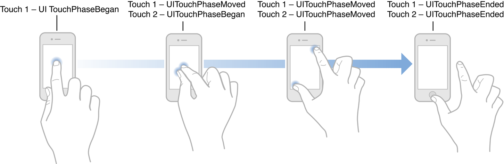
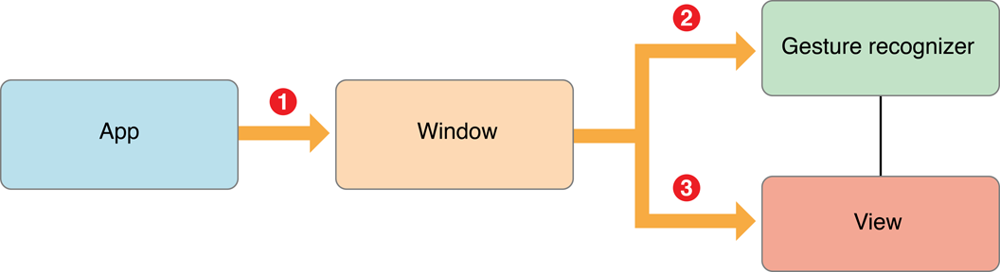
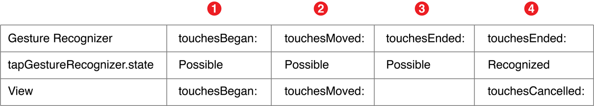
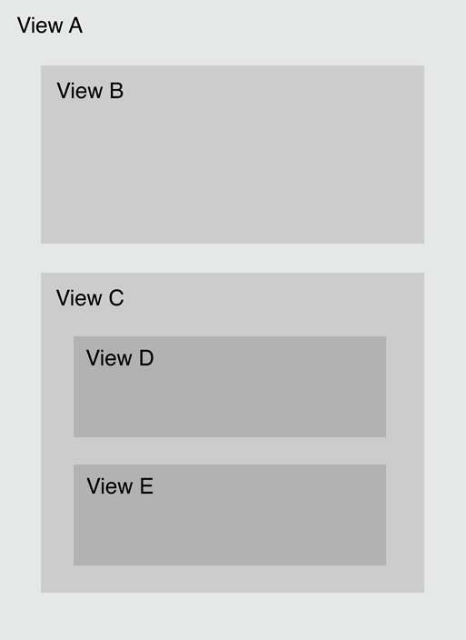

<title>Event Handling Guide for iOS</title>

原文修订日期：2013-01-28

# Introduction #

iOS 中的事件可以有多种形式，如多点触控事件、运动事件 (motion)，以及控制多媒体的事件，最后一种就是所谓的远程控制事件 (remote control event)，因为它可以来自外部附件。

### UIKit Makes It Easy for Your App to Detect Gestures ###

iOS 程序识别各种触摸并以对用户直观的方式响应它们。有些手势很常见，所以被内置在了 UIKit 中。如 UIButton, UISlider 等 UIControl 的子类，可以响应特定的手势——点击按钮或拖动滑块。配置了这些控件后，它们会在触摸事件发生时向 target 对象发送一个 action 消息。通过 gesture recognizer, 还可以在 view 上使用 target-action 机制。View 被附加了 gesture recognizer 后，整个 view 都表现得像个控件了，它可以响应指定的手势。

Gesture recognizer 为复杂的事件处理逻辑提供了一种更高层的抽象，是处理触摸事件的优选方式，因为它们功能强大、可复用、有适应性。可使用内置的 gesture recognizer 并定制其行为，也可自创 gesture recognizer 以识别新手势。

### An Event Travels Along a Specific Path Looking for an Object to Handle It ###

When iOS recognizes an event, it passes the event to the initial object that seems most relevant for handling that event, such as the view where a touch occurred. If the initial object cannot handle the event, iOS continues to pass the event to objects with greater scope until it finds an object with enough context to handle the event. This sequence of objects is known as a **responder chain**, and as iOS passes events along the chain, it also transfers the responsibility of responding to the event. 

这种设计模式使得事件处理是协作的、动态的。

### A UIEvent Encapsulates a Touch, Shake-Motion, or Remote-Control Event ###

许多事件都是 *UIEvent* 类的实例。Each event object has a type—touch, “shaking” motion, or remote control—and a subtype.

### An App Receives Multitouch Events When Users Touch Its Views ###

> As a rule of thumb, you write your own custom touch-event handling when your app’s response to touch is tightly coupled with the view itself, such as drawing under a touch.

对有些程序来说，使用 UIKit 控件和 gesture recognizer 处理触摸事件已足矣。即使有自定义 view, 还可以使用 gesture recognizer. 一个经验法则是，当对触摸事件的响应与 view 自身紧密耦合时（如触摸绘图），（才需要）编写自定义的触摸事件处理逻辑。 这些情况下，你负责底层的事件处理，需要实现触摸方法，在其中分析原始的 (raw) 触摸事件并适当地响应。


### An App Receives Motion Events When Users Move Their Devices ###

运动事件提供有关设备位置、方向及移动的信息。加速度计和陀螺仪数据可使你发现设备的倾斜、旋转及摇动 (tilting, rotating, and shaking).

运动事件有不同的形式，你可以使用不同的 framework 处理之。用户摇动设备时，UIKit 会向程序发出一个 UIEvent 对象。要收到高频率、连贯的加速度计和陀螺仪数据，请使用 Core Motion framework.

### An App Receives Remote Control Events When Users Manipulate Multimedia Controls ###

iOS 控制和外部附件向程序发送远程控制事件，这些事件使用户可以控制音视频，比如通过耳机调整音量。

# Gesture Recognizers #

Gesture recognizer 把底层的事件处理代码转换成高层的行为。它们是附加到 view 上的对象，允许 view 以控件的方式响应用户的行为。Gesture regognizer 解析 touches 并判断它们是否对应于某个特定的手势，如 swipe, pinch, or rotation. 如果识别出了所分派的手势，就向 target 对象发送一个 action 消息，target 对象通常是 view's view controller, 对手势作出响应。这种设计模式简单有效，可动态地决定某个 view 响应何种用户行为，而且无须子类化 view 即可向它添加 gesture recognizer.


## Use Gesture Recognizers to Simplify Event Handling ##

### Built-in Gesture Recognizers Recognize Common Gestures ###

UIKit built-in gesture recognizers:

- Tapping (any number of taps): UITapGestureRecognizer
- Pinching in and out (for zooming a view): UIPinchGestureRecognizer
- Panning or dragging: UIPanGestureRecognizer
- Swiping (in any direction): UISwipeGestureRecognizer
- Rotating (fingers moving in opposite directions): UIRotationGestureRecognizer
- Long press (also known as “touch and hold”): UILongPressGestureRecognizer

应当仅以用户期望的方式响应手势。

### Gesture Recognizers Are Attached to a View ###

Gesture recognizer 与 view 是多对一关系，因为一个 view 可能响应多种手势。触摸发生时，gesture recognizer 比 view 先收到消息，于是前者可代表 (on behalf of) 后者对触摸作出响应。

### Gestures Trigger Action Messages ###

Gesture recognizer 识别手势后，向 target 发送一个 action 消息。要创建一个 gesture recognizer, 请使用一个 target 和一个 action 初始化之。

Discrete and continuous gestures:

- 离散手势，如点击，只发生一次。Gesture recognizer 只向 target 发送一次 action 消息。
- 连续手势，如 pinching, 在一段时间内连续发生。Gesture recognizer 向 target 持续发送 action 消息，直到手势结束。

## Responding to Events with Gesture Recognizers ##

使用内置 gesture recognizer 的 3 个步骤：

1. 创建并配置 gesture recognizer 实例。这一步包括分派一个 target, action, 有时还要设置特定 gesture recognizer 的属性。
1. 把 gesture recognizer 附加到一个 view.
1. 实现 action method 以处理手势。

### Adding a Gesture Recognizer via Interface Builder ###

把 gesture recognizer 从 Object library 拖拽到一个 view, 这样前者就自动附加到后者了。
创建 action/outlet.

``` Objective-C
@interface APLGestureRecognizerViewController ()
@property (nonatomic, strong) IBOutlet UITapGestureRecognizer *tapRecognizer;
@end
 
@implementation
- (IBAction)displayGestureForTapRecognizer:(UITapGestureRecognizer *)recognizer
     // Will implement method later...
}
@end
```

### Adding a Gesture Recognizer Programmatically ###

通常在 `viewDidLoad` 方法中创建 gesture recognizer:

``` Objective-C
- (void)viewDidLoad {
     [super viewDidLoad];
     UITapGestureRecognizer *tapRecognizer = [[UITapGestureRecognizer alloc]
          initWithTarget:self action:@selector(respondToTapGesture:)];
     tapRecognizer.numberOfTapsRequired = 1;
     [self.view addGestureRecognizer:tapRecognizer];
     // Do any additional setup after loading the view, typically from a nib
}
```

### Responding to Discrete Gestures ###

``` Objective-C
- (IBAction)showGestureForTapRecognizer:(UITapGestureRecognizer *)recognizer {       
      CGPoint location = [recognizer locationInView:self.view];       
      [self drawImageForGestureRecognizer:recognizer atPoint:location];
        // Animate the image view so that it fades out
      [UIView animateWithDuration:0.5 animations:^{ self.imageView.alpha = 0.0; }];
}
```

每种 gesture recognizer 都带有关于特定手势的信息，可充分利用这些信息作出特定的响应。

### Responding to Continuous Gestures ###

连续手势允许程序在手势发生的同时作出响应，如 pinching 手势操作缩放。

``` Objective-C 
// Respond to a rotation gesture
- (IBAction)showGestureForRotationRecognizer:(UIRotationGestureRecognizer *)recognizer {          
       self.imageView.transform = CGAffineTransformMakeRotation([recognizer rotation]); 
       // Display an image view at that location
       [self drawImageForGestureRecognizer:recognizer atPoint:[recognizer locationInView:self.view]]; 
      // If the gesture has ended or is canceled, begin the animation
      // back to horizontal and fade out
      if (([recognizer state] == UIGestureRecognizerStateEnded) || ([recognizer state] == UIGestureRecognizerStateCancelled)) {
           [UIView animateWithDuration:0.5 animations:^{
                self.imageView.alpha = 0.0;
                self.imageView.transform = CGAffineTransformIdentity;
           }];
      } 
}
```

## Defining How Gesture Recognizers Interact ##

Oftentimes, as you add gesture recognizers to your app, you need to be specific about how you want the recognizers to interact with each other or any other touch-event handling code in your app. To do this, you first need to understand a little more about how gesture recognizers work.

### Gesture Recognizers Operate in a Finite State Machine ###

Gesture recognizer 发一种预定义的方式从一种状态过渡到另一种状态。在各个状态下，它们根据是否满足某些条件而变到下一个状态。确切的状态机因 gesture recognizer 的离散或连贯而异，如下图所示。所有的 gesture recognizer 都从 Possible 状态开始 (UIGestureRecognizerStatePossible), 它们分析收到的多点触摸序列 (multitouch sequences), 分析结果要么是识别出手势、要么是未识别出，后一种情况将使之过渡到 Failed 状态 (UIGestureRecognizerStateFailed).


离散：识别出手势后就结束。
连贯：手势发生时不断地从 Changed -> Changed. 用户的最后一个手指离开 view 时，过渡到 UIGestureRecognizerStateEnded 状态（与 Recognized 状态同义）。

A recognizer for a continuous gesture can also transition from Changed to Canceled (UIGestureRecognizerStateCancelled) if it decides that the gesture no longer fits the expected pattern.

状态改变时，gesture recognizer 会向其 target 发送一个 action 消息——除非它过渡到 Failed 或 Canceled 状态。如此一来，离散 gesture recognizer 从 Possible 到 Recognized 状态时只发送一个 action 消息，而连贯 gesture recognizer  则会发送许多。

到 Recognized (或者说 Ended) 状态后，gesture recognizer 会把状态重置为 Possible ——这个状态转变不会触发 action 消息。	

### Interacting with Other Gesture Recognizers ###

一个 view 可附加多个 gesture recognizers, 可通过 `UIView.gestureRecognizers` 属性访问。可调用 `addGestureRecognizer:` and `removeGestureRecognizer:` 方法增删，这样就动态地改变了 view 对手势的响应方式。

View 附加了多个 gesture recognizers 时，它们在接收及分析触摸事件时就可能产生竞争。默认情况下，没有规定哪个 gesture recognizer 先收到触摸事件，故每次的顺序都可能不一样。You can override this default behavior to:

- 指定一个 gesture recognizer 应先于另一个分析触摸事件。
- 允许两个 gesture recognizer 同时运作。
- 阻止一个 gesture recognizer 分析某个触摸事件。

Use the UIGestureRecognizer class methods, delegate methods, and methods overridden by subclasses to effect these behaviors.

#### Declaring a Specific Order for Two Gesture Recognizers ####

假如既要识别 swipe 手势（一个离散手势），又要识别 pan 手势（一个连续手势），且希望它们触发不同的行为。默认情况下，用户尝试 swipe 手势时，却会被识别成 pan. 这是因为 swipe 手势在满足被解释为 swipe 的必要条件之前，就满足了被解释为 pan 手势的必要条件。

欲使 view 能同时识别 swipe 和 pan, 就需要让 swipe gesture recognizer 先分析触摸事件。若它判断出是一个 swipe 手势，那 pan gesture recognizer 就无须再分析了； 否则 swipe gesture recognizer 过渡到 Failed 状态，然后让 pan gesture recognizer 接着分析。要在两种 gesture recognizers 之间表示这种关系，请调用欲推迟的 gesture recognizer 的 `requireGestureRecognizerToFail:` 方法，如： 

`[self.panRecognizer requireGestureRecognizerToFail:self.swipeRecognizer];` 

即 swipeRecognizer Fail 之后，panRecognizer 才能开始。在等待 swipeRecognizer 变成 Fail 状态的过程中，panRecognizer 会保持 Possible 状态。接下来：

- 若 swipeRecognizer 变成了 Fail 状态，则 panRecognizer 开始分析触摸事件。
- 若 swipeRecognizer 变成了 Recognized 或 Began 状态，则 panRecognizer 过渡到 Failed 状态。

> Note: If your app recognizes both single and double taps and your single tap gesture recognizer does not require the double tap recognizer to fail, then you should expect to receive single tap actions before double tap actions, even when the user double taps. This behavior is intentional because the best user experience generally enables multiple types of actions.

注意：若同时识别单击和双击，且单击 recognizer 不需要双击 recognizer Fail, 那么你可能希望先收到单击行为，即使用户双击操作时。这一行为是故意的 (intentional), 因为最好的用户体验通常都允许多种行为。

若希望单击和双击是互斥的，那么单击 recognizer 必须要求双击 recognizer Fail. 但这样单击行为可能有些许卡顿，因为单击 recognizer 被推迟了——直到双击 recognizer Fail.

#### Preventing Gesture Recognizers from Analyzing Touches ####

可为 gesture recognizer 指定一个 delegate 对象以修改其行为。`UIGestureRecognizerDelegate` 协议提供了一组阻止 gesture recognizer 分析触摸事件的方法：

``` Swift
optional func gestureRecognizer(_ gestureRecognizer: UIGestureRecognizer, shouldReceiveTouch touch: UITouch) -> Bool
optional func gestureRecognizerShouldBegin(_ gestureRecognizer: UIGestureRecognizer) -> Bool
```

若能在触摸开始时立即决定 gesture recognizer 是否应接收触摸事件，请使用 `gestureRecognizer:shouldReceiveTouch:` 方法。该方法在每次有新的触摸事件时调用，默认返回 YES. 该方法不会修改 gesture recognizer 的状态。

若要尽量推迟决定 gesture recognizer 是否应分析触摸，请使用 `gestureRecognizerShouldBegin:` 方法。使用该方法的常见情形是，自定义的 UIView/UIControl 子类带有自定义的触摸事件处理逻辑，并与 gesture recognizer 产生了竞争。返回 NO 会使 gesture recognizer 立即 Fail, 这样就可以使其他触摸处理逻辑有机会执行了。This method is called when a gesture recognizer attempts to transition out of the Possible state, if the gesture recognition would prevent a view or control from receiving a touch.

You can use the `gestureRecognizerShouldBegin:` UIView method if your view or view controller cannot be the gesture recognizer’s delegate. The method signature and implementation is the same.

#### Permitting Simultaneous Gesture Recognition ####

默认情况下，两个 gesture recognizer 不能同时识别（各自的）手势。但假设希望用户能同时 pinch 及 rotate 一个图片呢？这需要通过实现 `UIGestureRecognizerDelegate` 协议中的以下方法来更改这个默认行为：

``` Swift
optional func gestureRecognizer(_ gestureRecognizer: UIGestureRecognizer, shouldRecognizeSimultaneouslyWithGestureRecognizer otherGestureRecognizer: UIGestureRecognizer) -> Bool
```

该方法在一个 gesture recognizer 对手势的分析会阻塞 (block) 另一个 gesture recognizer 的分析时调用，反之亦然（即二者有交集，会同时分析一个手势）。默认返回值为 NO.

注意：要允许同时识别，只需要实现一个 gesture recognizer 的 delegate, 使该方法返回 YES 即可。但这也意味着返回 NO 未必就会阻止同时识别，因为另一个 gesture recognizer 相应的 delegate 方法可能返回 YES. （译注：即两个 gesture recognizer 的返回值是逻辑“或”的关系，一真即真。）

#### Specifying a One-Way Relationship Between Two Gesture Recognizers ####

如欲控制两个 recognizers 如何交互、又想仅指定一个单向的关系，可 override UIGestureRecognizer 的子类方法 `canPreventGestureRecognizer:` 或 `canBePreventedByGestureRecognizer:` 使之返回 NO（默认返回 YES）。如欲使 rotation 手势阻止 pinch 手势，但不想让 pinch 手势阻止 rotation 手势，可指定：

`[rotationGestureRecognizer canPreventGestureRecognizer:pinchGestureRecognizer];`

并 override rotation gesture recognizer 的子类方法使之返回 NO.

若不允许两个手势互相阻止，请使用 `gestureRecognizer:shouldRecognizeSimultaneouslyWithGestureRecognizer:` 方法。默认情况下，pinch 手势和 rotation 手势是互相阻止的，因为二者不能同时被识别。

### Interacting with Other UI Controls ###

In iOS 6.0 and later, default control actions prevent overlapping gesture recognizer behavior. 如按钮的默认行为是单击，若在按钮的 superview 上附加了单击 gesture recognizer, 则用户单击按钮时，收到触摸事件的是按钮的 action method, 而不是 gesture recognizer. 这仅适于与控件的默认行为有重叠的手势识别，包括：

- A single finger single tap on a UIButton, UISwitch, UIStepper, UISegmentedControl, and UIPageControl.
- A single finger swipe on the knob of a UISlider, in a direction parallel to the slider.
- A single finger pan gesture on the knob of a UISwitch, in a direction parallel to the switch.

若要更改这些控件的自定义子类的默认行为，请把 gesture recognizer 直接附加到控件本身而不是其 superview, 这样 gesture recognizer 就可以先收到触摸事件了。请参阅 iOS Human Interface Guidelines 确保程序提供直观的用户体验，尤其是 override 标准控件的默认行为时。

## Gesture Recognizers Interpret Raw Touch Events ##

So far, you’ve learned about gestures and how your app can recognize and respond to them. However, to create a custom gesture recognizer or to control how gesture recognizers interact with a view’s touch-event handling, you need to think more specifically in terms of touches and events.

### An Event Contains All the Touches for the Current Multitouch Sequence ###

在 iOS 中，触摸是手势在屏幕上的出现 (presence) 或移动，用 `UITouch` 对象表示。一个手势有一个或多个触摸，如 pinch-close （捏合？）手势有两个触摸——两个手指在屏幕上相向移动。

An event encompasses all touches that occur during a multitouch sequence. 一个多点触控序列从一个手势接触屏幕开始，到最后一个手指离开屏幕结束。手指移动时，iOS 会把 UITouch 对象发送给事件对象。多点触控事件用 `UIEventTypeTouches` 类型的 `UIEvent` 对象表示。

一个 `UITouch` 对象仅跟踪一个手指，持续时间与多点触控序列相同。在此序列期间，UIKit 跟踪手指并更新 UITouch 对象的属性，包括触摸的阶段 (phase)、在某个 view 中的位置、之前的位置、及其时间戳。

触摸阶段表明触摸何时开始、是否在移动，以及何时结束，可通过 `UITouch.phase` 属性访问。如下图所示，在触摸的每个阶段，程序都会收到事件：



> Note: A finger is less precise than a mouse pointer. When a user touches the screen, the area of contact is actually elliptical and tends to be slightly lower than the user expects. This “contact patch” varies based on the size and orientation of the finger, the amount of pressure, which finger is used, and other factors. The underlying multitouch system analyzes this information for you and computes a single touch point, so you don’t need to write your own code to do this.

注意：手指不及鼠标指针精确。触摸屏幕时，接触区域实际是椭圆形的，而且一般比用户期望的略小。"Contact patch" 会因手指的大小和方面、压力、使用的是哪个手指等因素而有所不同。底层的多点触控系统会为你分析这些信息并计算出单个触摸点，故你无须再为此编写代码。

### An App Receives Touches in the Touch-Handling Methods ###

During a multitouch sequence, an app sends these messages when there are new or changed touches for a given touch phase; it calls the

- touchesBegan:withEvent: method when one or more fingers touch down on the screen.
- touchesMoved:withEvent: method when one or more fingers move.
- touchesEnded:withEvent: method when one or more fingers lift up from the screen.
- touchesCancelled:withEvent: method when the touch sequence is canceled by a system event, such as an incoming phone call.

以上每个方法都关联到一个触摸阶段，如 `touchesBegan:withEvent:` 关联到 `UITouchPhaseBegan`

注意：这些方法不与 gesture recognizer 的状态关联。Gesture recognizer 状态严格表示 gesture recognizer 自己的阶段，而不是它所识别的 `UITouch` 对象的阶段。

## Regulating the Delivery of Touches to Views ##

有时会希望 view 比 gesture recognizer 先收到触摸，但你需要先理解触摸默认的分发路径。The window first sends touches to any gesture recognizers attached the view where the touches occurred (or to that view’s superviews), before it passes the touch to the view object itself.



### Gesture Recognizers Get the First Opportunity to Recognize a Touch ###

A window delays the delivery of touch objects to the view so that the gesture recognizer can analyze the touch first. During the delay, if the gesture recognizer recognizes a touch gesture, then the window never delivers the touch object to the view, and also cancels any touch objects it previously sent to the view that were part of that recognized sequence.

For example, if you have a gesture recognizer for a discrete gesture that requires a two-fingered touch, this translates to two separate touch objects. As the touches occur, the touch objects are passed from the app object to the window object for the view where the touches occurred, and the following sequence occurs, as depicted in Figure 1-6:



1. The window sends two touch objects in the Began phase—through the touchesBegan:withEvent: method—to the gesture recognizer. The gesture recognizer doesn’t recognize the gesture yet, so its state is Possible. The window sends these same touches to the view that the gesture recognizer is attached to.
1. The window sends two touch objects in the Moved phase—through the touchesMoved:withEvent: method—to the gesture recognizer. The recognizer still doesn’t detect the gesture, and is still in state Possible. The window then sends these touches to the attached view.
1. The window sends one touch object in the Ended phase—through the touchesEnded:withEvent: method—to the gesture recognizer. This touch object doesn’t yield enough information for the gesture, but the window withholds the object from the attached view.
1. The window sends the other touch object in the Ended phase. The gesture recognizer now recognizes its gesture, so it sets its state to Recognized. Just before the first action message is sent, the view calls the touchesCancelled:withEvent: method to invalidate the touch objects previously sent in the Began and Moved phases. The touches in the Ended phase are canceled.

Now assume that the gesture recognizer in the last step decides that this multitouch sequence it’s been analyzing is not its gesture. It sets its state to UIGestureRecognizerStateFailed. Then the window sends the two touch objects in the Ended phase to the attached view in a touchesEnded:withEvent: message.

A gesture recognizer for a continuous gesture follows a similar sequence, except that it is more likely to recognize its gesture before touch objects reach the Ended phase. Upon recognizing its gesture, it sets its state to UIGestureRecognizerStateBegan (not Recognized). The window sends all subsequent touch objects in the multitouch sequence to the gesture recognizer but not to the attached view.

### Affecting the Delivery of Touches to Views ###

You can change the values of several UIGestureRecognizer properties to alter the default delivery path in certain ways. If you change the default values of these properties, you get the following differences in behavior:

- delaysTouchesBegan (default of NO)—Normally, the window sends touch objects in the Began and Moved phases to the view and the gesture recognizer. Setting delaysTouchesBegan to YES prevents the window from delivering touch objects in the Began phase to the view. This ensures that when a gesture recognizer recognizes its gesture, no part of the touch event was delivered to the attached view. Be cautious when setting this property because it can make your interface feel unresponsive. This setting provides a similar behavior to the delaysContentTouches property on UIScrollView; in this case, when scrolling begins soon after the touch begins, subviews of the scroll-view object never receive the touch, so there is no flash of visual feedback.
- delaysTouchesEnded (default of YES)—When this property is set toYES, it ensures that a view does not complete an action that the gesture might want to cancel later. When a gesture recognizer is analyzing a touch event, the window does not deliver touch objects in the Ended phase to the attached view. If a gesture recognizer recognizes its gesture, the touch objects are canceled. If the gesture recognizer does not recognize its gesture, the window delivers these objects to the view through a touchesEnded:withEvent: message. Setting this property to NO allows the view to analyze touch objects in the Ended phase at the same time as the gesture recognizer. Consider, for example, that a view has a tap gesture recognizer that requires two taps, and the user double taps the view. With the property set to YES, the view gets touchesBegan:withEvent:, touchesBegan:withEvent:, touchesCancelled:withEvent:, and touchesCancelled:withEvent:. If this property is set to NO, the view gets the following sequence of messages: touchesBegan:withEvent:, touchesEnded:withEvent:, touchesBegan:withEvent:, and touchesCancelled:withEvent:, which means that in touchesBegan:withEvent:, the view can recognize a double tap.

If a gesture recognizer detects a touch that it determines is not part of its gesture, it can pass the touch directly to its view. To do this, the gesture recognizer calls ignoreTouch:forEvent: on itself, passing in the touch object.

## Creating a Custom Gesture Recognizer ##

TBC...

# Event Delivery: The Responder Chain #

用户产生的事件发生时，UIKit 创建一个包含必要信息的事件对象，放到当前活动程序的事件队列中。触摸事件对象是封装了一系列 `UITouch` 的 `UIEvent` 对象；而运动事件对象则因所用的 framework 和运动事件的类型而异。

事件沿着一个特殊的路径分发，直到到达一个能处理它的对象：

1. 单例 UIApplication 对象从事件队列的顶端取出一个事件；
1. UIApplication 通常会把事件分派给程序的 key window 对象；
1. Key window 把事件传递给一个初始 (initial) 对象作处理。初始对象取决于事件类型：
	- 对于触摸事件，窗口对象首先尝试把事件发送给触摸发生的那个 view, 即所谓的 *hit-test view*. 寻找 hit-test view 的过程称为 *hit-testing*.
	- 运动和远程控件事件。窗口对象把 shaking-motion 或远程控制事件发送给 *first responder*.

事件路径的终极目标是寻找一个可以处理并响应事件的对象，因此 UIKit 会先把事件发送给最适合处理的对象。对于触摸事件，那个对象是 hit-test view; 对于其他事件，那个对象是 first responder.

## Hit-Testing Returns the View Where a Touch Occurred ##

iOS 使用 hit-testing 寻找被触摸的 view, 这涉及判断触摸是否在相关 view 对象的边界之内。如果是，就递归地检查其所有 subview. View hierarchy 中包含触摸点的最低层 (lowest) 的 view 会成为 hit-test view. 找到 hit-test view 后，iOS 把触摸事件传递给它作处理。

图解。假设用户触摸了下图中的 E:



1. The touch is within the bounds of view A, so it checks subviews B and C.
1. The touch is not within the bounds of view B, but it’s within the bounds of view C, so it checks subviews D and E.
1. The touch is not within the bounds of view D, but it’s within the bounds of view E.
1. View E is the lowest view in the view hierarchy that contains the touch, so it becomes the hit-test view.

## The Responder Chain Is Made Up of Responder Objects ##

## The Responder Chain Follows a Specific Delivery Path ##

# Multitouch Events #

# Motion Events #

# Remote Control Events #
