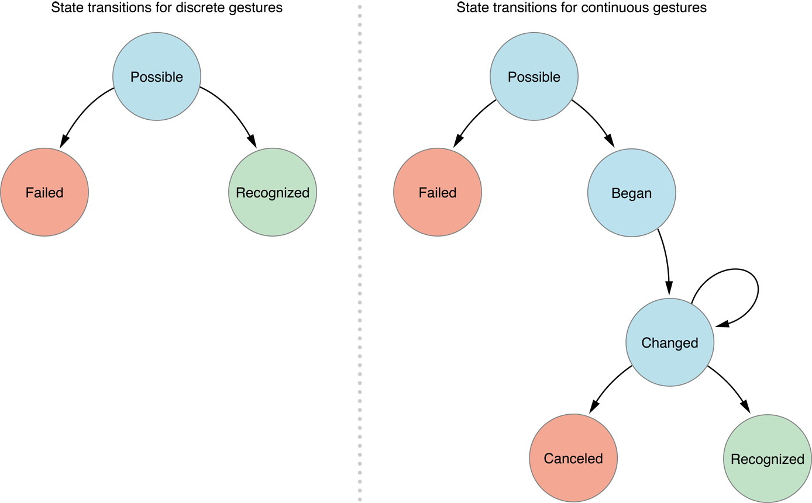

<title>Event Handling Guide for iOS</title>

原文修订日期：2013-01-28

# Introduction #

iOS 中的事件可以有多种形式，如多点触控事件、运动事件 (motion)，以及控制多媒体的事件，最后一种就是所谓的远程控制事件 (remote control event)，因为它可以来自外部附件。

### UIKit Makes It Easy for Your App to Detect Gestures ###

iOS 程序识别各种触摸并以对用户直观的方式响应它们。有些手势很常见，所以被内置在了 UIKit 中。如 UIButton, UISlider 等 UIControl 的子类，可以响应特定的手势——点击按钮或拖动滑块。配置了这些控件后，它们会在触摸事件发生时向 target 对象发送一个 action 消息。通过 gesture recognizer, 还可以在 view 上使用 target-action 机制。View 被附加了 gesture recognizer 后，整个 view 都表现得像个控件了，它可以响应指定的手势。

Gesture recognizer 为复杂的事件处理逻辑提供了一种更高层的抽象，是处理触摸事件的优选方式，因为它们功能强大、可复用、有适应性。可使用内置的 gesture recognizer 并定制其行为，也可自创 gesture recognizer 以识别新手势。

### An Event Travels Along a Specific Path Looking for an Object to Handle It ###

When iOS recognizes an event, it passes the event to the initial object that seems most relevant for handling that event, such as the view where a touch occurred. If the initial object cannot handle the event, iOS continues to pass the event to objects with greater scope until it finds an object with enough context to handle the event. This sequence of objects is known as a **responder chain**, and as iOS passes events along the chain, it also transfers the responsibility of responding to the event. 

这种设计模式使得事件处理是协作的、动态的。

### A UIEvent Encapsulates a Touch, Shake-Motion, or Remote-Control Event ###

许多事件都是 *UIEvent* 类的实例。Each event object has a type—touch, “shaking” motion, or remote control—and a subtype.

### An App Receives Multitouch Events When Users Touch Its Views ###

> As a rule of thumb, you write your own custom touch-event handling when your app’s response to touch is tightly coupled with the view itself, such as drawing under a touch.

对有些程序来说，使用 UIKit 控件和 gesture recognizer 处理触摸事件已足矣。即使有自定义 view, 还可以使用 gesture recognizer. 一个经验法则是，当对触摸事件的响应与 view 自身紧密耦合时（如触摸绘图），（才需要）编写自定义的触摸事件处理逻辑。 这些情况下，你负责底层的事件处理，需要实现触摸方法，在其中分析原始的 (raw) 触摸事件并适当地响应。


### An App Receives Motion Events When Users Move Their Devices ###

运动事件提供有关设备位置、方向及移动的信息。加速度计和陀螺仪数据可使你发现设备的倾斜、旋转及摇动 (tilting, rotating, and shaking).

运动事件有不同的形式，你可以使用不同的 framework 处理之。用户摇动设备时，UIKit 会向程序发出一个 UIEvent 对象。要收到高频率、连贯的加速度计和陀螺仪数据，请使用 Core Motion framework.

### An App Receives Remote Control Events When Users Manipulate Multimedia Controls ###

iOS 控制和外部附件向程序发送远程控制事件，这些事件使用户可以控制音视频，比如通过耳机调整音量。

# Gesture Recognizers #

Gesture recognizer 把底层的事件处理代码转换成高层的行为。它们是附加到 view 上的对象，允许 view 以控件的方式响应用户的行为。Gesture regognizer 解析 touches 并判断它们是否对应于某个特定的手势，如 swipe, pinch, or rotation. 如果识别出了所分派的手势，就向 target 对象发送一个 action 消息，target 对象通常是 view's view controller, 对手势作出响应。这种设计模式简单有效，可动态地决定某个 view 响应何种用户行为，而且无须子类化 view 即可向它添加 gesture recognizer.


## Use Gesture Recognizers to Simplify Event Handling ##

### Built-in Gesture Recognizers Recognize Common Gestures ###

UIKit built-in gesture recognizers:

- Tapping (any number of taps): UITapGestureRecognizer
- Pinching in and out (for zooming a view): UIPinchGestureRecognizer
- Panning or dragging: UIPanGestureRecognizer
- Swiping (in any direction): UISwipeGestureRecognizer
- Rotating (fingers moving in opposite directions): UIRotationGestureRecognizer
- Long press (also known as “touch and hold”): UILongPressGestureRecognizer

应当仅以用户期望的方式响应手势。

### Gesture Recognizers Are Attached to a View ###

Gesture recognizer 与 view 是多对一关系，因为一个 view 可能响应多种手势。触摸发生时，gesture recognizer 比 view 先收到消息，于是前者可代表 (on behalf of) 后者对触摸作出响应。

### Gestures Trigger Action Messages ###

Gesture recognizer 识别手势后，向 target 发送一个 action 消息。要创建一个 gesture recognizer, 请使用一个 target 和一个 action 初始化之。

Discrete and continuous gestures:

- 离散手势，如点击，只发生一次。Gesture recognizer 只向 target 发送一次 action 消息。
- 连续手势，如 pinching, 在一段时间内连续发生。Gesture recognizer 向 target 持续发送 action 消息，直到手势结束。

## Responding to Events with Gesture Recognizers ##

使用内置 gesture recognizer 的 3 个步骤：

1. 创建并配置 gesture recognizer 实例。这一步包括分派一个 target, action, 有时还要设置特定 gesture recognizer 的属性。
1. 把 gesture recognizer 附加到一个 view.
1. 实现 action method 以处理手势。

### Adding a Gesture Recognizer via Interface Builder ###

把 gesture recognizer 从 Object library 拖拽到一个 view, 这样前者就自动附加到后者了。
创建 action/outlet.

``` Objective-C
@interface APLGestureRecognizerViewController ()
@property (nonatomic, strong) IBOutlet UITapGestureRecognizer *tapRecognizer;
@end
 
@implementation
- (IBAction)displayGestureForTapRecognizer:(UITapGestureRecognizer *)recognizer
     // Will implement method later...
}
@end
```

### Adding a Gesture Recognizer Programmatically ###

通常在 `viewDidLoad` 方法中创建 gesture recognizer:

``` Objective-C
- (void)viewDidLoad {
     [super viewDidLoad];
     UITapGestureRecognizer *tapRecognizer = [[UITapGestureRecognizer alloc]
          initWithTarget:self action:@selector(respondToTapGesture:)];
     tapRecognizer.numberOfTapsRequired = 1;
     [self.view addGestureRecognizer:tapRecognizer];
     // Do any additional setup after loading the view, typically from a nib
}
```

### Responding to Discrete Gestures ###

``` Objective-C
- (IBAction)showGestureForTapRecognizer:(UITapGestureRecognizer *)recognizer {       
      CGPoint location = [recognizer locationInView:self.view];       
      [self drawImageForGestureRecognizer:recognizer atPoint:location];
        // Animate the image view so that it fades out
      [UIView animateWithDuration:0.5 animations:^{ self.imageView.alpha = 0.0; }];
}
```

每种 gesture recognizer 都带有关于特定手势的信息，可充分利用这些信息作出特定的响应。

### Responding to Continuous Gestures ###

连续手势允许程序在手势发生的同时作出响应，如 pinching 手势操作缩放。

``` Objective-C 
// Respond to a rotation gesture
- (IBAction)showGestureForRotationRecognizer:(UIRotationGestureRecognizer *)recognizer {          
       self.imageView.transform = CGAffineTransformMakeRotation([recognizer rotation]); 
       // Display an image view at that location
       [self drawImageForGestureRecognizer:recognizer atPoint:[recognizer locationInView:self.view]]; 
      // If the gesture has ended or is canceled, begin the animation
      // back to horizontal and fade out
      if (([recognizer state] == UIGestureRecognizerStateEnded) || ([recognizer state] == UIGestureRecognizerStateCancelled)) {
           [UIView animateWithDuration:0.5 animations:^{
                self.imageView.alpha = 0.0;
                self.imageView.transform = CGAffineTransformIdentity;
           }];
      } 
}
```

## Defining How Gesture Recognizers Interact ##

Oftentimes, as you add gesture recognizers to your app, you need to be specific about how you want the recognizers to interact with each other or any other touch-event handling code in your app. To do this, you first need to understand a little more about how gesture recognizers work.

### Gesture Recognizers Operate in a Finite State Machine ###

Gesture recognizer 发一种预定义的方式从一种状态过渡到另一种状态。在各个状态下，它们根据是否满足某些条件而变到下一个状态。确切的状态机因 gesture recognizer 的离散或连贯而异，如下图所示。所有的 gesture recognizer 都从 Possible 状态开始 (UIGestureRecognizerStatePossible), 它们分析收到的多点触摸序列 (multitouch sequences), 分析结果要么是识别出手势、要么是未识别出，后一种情况将使之过渡到 Failed 状态 (UIGestureRecognizerStateFailed).



离散：识别出手势后就结束。
连贯：手势发生时不断地从 Changed -> Changed. 用户的最后一个手指离开 view 时，过渡到 UIGestureRecognizerStateEnded 状态（与 Recognized 状态同义）。

A recognizer for a continuous gesture can also transition from Changed to Canceled (UIGestureRecognizerStateCancelled) if it decides that the gesture no longer fits the expected pattern.

状态改变时，gesture recognizer 会向其 target 发送一个 action 消息——除非它过渡到 Failed 或 Canceled 状态。如此一来，离散 gesture recognizer 从 Possible 到 Recognized 状态时只发送一个 action 消息，而连贯 gesture recognizer  则会发送许多。

到 Recognized (或者说 Ended) 状态后，gesture recognizer 会把状态重置为 Possible ——这个状态转变不会触发 action 消息。	

### Interacting with Other Gesture Recognizers ###

一个 view 可附加多个 gesture recognizers, 可通过 `UIView.gestureRecognizers` 属性访问。可调用 `addGestureRecognizer:` and `removeGestureRecognizer:` 方法增删，这样就动态地改变了 view 对手势的响应方式。

View 附加了多个 gesture recognizers 时，它们在接收及分析触摸事件时就可能产生竞争。默认情况下，没有规定哪个 gesture recognizer 先收到触摸事件，故每次的顺序都可能不一样。You can override this default behavior to:

- 指定一个 gesture recognizer 应先于另一个分析触摸事件。
- 允许两个 gesture recognizer 同时运作。
- 阻止一个 gesture recognizer 分析某个触摸事件。

Use the UIGestureRecognizer class methods, delegate methods, and methods overridden by subclasses to effect these behaviors.

#### Declaring a Specific Order for Two Gesture Recognizers ####

假如既要识别 swipe 手势（一个离散手势），又要识别 pan 手势（一个连续手势），且希望它们触发不同的行为。默认情况下，用户尝试 swipe 手势时，却会被识别成 pan. 这是因为 swipe 手势在满足被解释为 swipe 的必要条件之前，就满足了被解释为 pan 手势的必要条件。

欲使 view 能同时识别 swipe 和 pan, 就需要让 swipe gesture recognizer 先分析触摸事件。若它判断出是一个 swipe 手势，那 pan gesture recognizer 就无须再分析了； 否则 swipe gesture recognizer 过渡到 Failed 状态，然后让 pan gesture recognizer 接着分析。要在两种 gesture recognizers 之间表示这种关系，请调用欲推迟的 gesture recognizer 的 `requireGestureRecognizerToFail:` 方法，如： 

`[self.panRecognizer requireGestureRecognizerToFail:self.swipeRecognizer];` 

即 swipeRecognizer Fail 之后，panRecognizer 才能开始。在等待 swipeRecognizer 变成 Fail 状态的过程中，panRecognizer 会保持 Possible 状态。接下来：

- 若 swipeRecognizer 变成了 Fail 状态，则 panRecognizer 开始分析触摸事件。
- 若 swipeRecognizer 变成了 Recognized 或 Began 状态，则 panRecognizer 过渡到 Failed 状态。

> Note: If your app recognizes both single and double taps and your single tap gesture recognizer does not require the double tap recognizer to fail, then you should expect to receive single tap actions before double tap actions, even when the user double taps. This behavior is intentional because the best user experience generally enables multiple types of actions.

注意：若同时识别单击和双击，且单击 recognizer 不需要双击 recognizer Fail, 那么你可能希望先收到单击行为，即使用户双击操作时。这一行为是故意的 (intentional), 因为最好的用户体验通常都允许多种行为。

若希望单击和双击是互斥的，那么单击 recognizer 必须要求双击 recognizer Fail. 但这样单击行为可能有些许卡顿，因为单击 recognizer 被推迟了——直到双击 recognizer Fail.

#### Preventing Gesture Recognizers from Analyzing Touches ####

#### Permitting Simultaneous Gesture Recognition ####

#### Specifying a One-Way Relationship Between Two Gesture Recognizers ####

### Interacting with Other UI Controls ###

## Gesture Recognizers Interpret Raw Touch Events ##

## Regulating the Delivery of Touches to Views ##

## Creating a Custom Gesture Recognizer ##


# Event Delivery: The Responder Chain #

# Multitouch Events #

# Motion Events #

# Remote Control Events #
