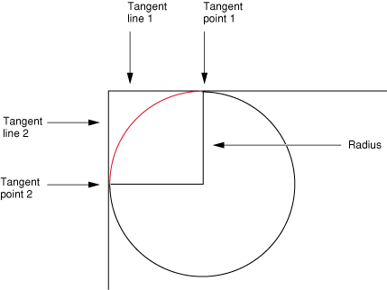

Quartz 2D Programming Guide
Apple Official Documentation

# Introduction #

Quartz 2D 是一个高级 advanced 、轻量的二维绘图引擎。它不依赖于分辨率或设备。Quartz 2D 会尽量地使用图形硬件的性能。

Quartz 2D API 易于使用，提供了对透明图层、基于路径的绘图、offscreen rendering、高级色彩管理、抗锯齿、PDF 文档处理等强大功能。

Quartz 2D API 是 Core Graphics framework 的一部分，故有时候 Quartz 也被称为 Core Graphics, 或者 CG.

本文档适于 iOS 和 OS X 开发者。

# Overview of Quartz 2D #

在 OS X 中，Quartz 2D 可与所有其他图形图像技术协同工作—— Core Image, Core Video, OpenGL, QuickTime. 既可在 Quartz 中从 QuickTime 创建图像，也可把 Quartz 中的图像传递给 Core Image.

类似的，在 iOS 中 Quartz 2D 也可与所有其他可用的图形与动画技术一起工作，如 Core Animation, OpenGL ES, 及 UIKit. 

## The Page ##

Quartz 2D uses the **painter's model** for its imaging. In the painter's model, each successive drawing operation applies a layer of "paint" to an output "canvas", often called a **page**. The paint on the page can be modified by overlaying more paint through additional drawing operations. An object drawn on the page cannot be modified except by overlaying more paint. This model allows you to construct extremely sophisticated images from a small number of powerful primitives.

The page 既可以是一张真实的纸（若输出设备是打印机），也可以是一张虚拟的纸（若输出设备是 PDF 文件），也可以是一个位图。Page 的具体特征取决于你所使用的 graphics context.

在 painter's model 中，绘图的顺序是很重要的。

## Drawing Destinations: The Graphics Context ##

A graphics context is an opaque data type (CGContextRef), 它封装了 Quartz 用以把图像绘制到输出设备所使用的信息。Graphics context 中的信息包括图形绘制参数，and a device-specific representation of the paint on the page. Quartz 中的所有对象都被绘制到（或者说包含于）graphics context 中。

可把 graphics context 想像成 drawing destination, 使用 Quartz 绘图时，所有特定于设备的特性都包含在你所使用的那种 graphics context 中。也就是说，你可以使用同样的绘图例程把同一个图像绘制到不同的设备中，只需要提供不同的 graphics context 即可。Quartz 自会为你处理不同设备的差异。

程序可用的 graphics context 有：

- Bitmap graphics context. 允许把 RGB 色彩、 CMYK 色彩，或灰阶绘制到位图。位图是一个由像素构成的矩形数组（或曰 raster），每个像素表示图像中的一个点。位图图像也被称为取样图像 (sampled images).
- PDF graphics context. 允许创建 PDF 文件。In a PDF file, your drawing is preserved as a sequence of commands. PDF 文件与位置的一些重要区别：
    - PDF 文件可能包含多页；
    - 从 PDF 文件向其他设备绘图时，最终的图像会针对目标设备的显示特性作出优化；
    - PDF 文件与分辨率无关，它们可以以无限大或无限小的尺寸被绘制而不牺牲图像细节。
- Window graphics context. 可用以在窗口中绘图。注意 Quartz 2D 是一个图形引擎而不是一个窗口管理系统，所以你需要使用一个 application framework 来获得一个 window graphics context.
- A layer context (CGLayerRef) is an offscreen drawing destination associated with another graphics context. It is designed for optimal performance when drawing the layer to the graphics context that created it. A layer context can be a much better choice for offscreen drawing than a bitmap graphics context
- 在 OS X 中打印时，你要把内容发送给一个 PostScript graphics context, 后者由 printing framework 管理。

## Quartz 2D Opaque Data Types ##

除了 graphics context, Quartz 2D 还定义了许多 opaque 数据类型。由于 Quartz 2D API 是 Core Graphics framework 的一部分，故这些数据类型和操作这些数据类型的例程使用 CG 前缀。

The opaque data types available in Quartz 2D include the following:

- CGPathRef, used for vector graphics to create paths that you fill or stroke. See Paths.
- CGImageRef, used to represent bitmap images and bitmap image masks based on sample data that you supply. See Bitmap Images and Image Masks.
- CGLayerRef, used to represent a drawing layer that can be used for repeated drawing (such as for backgrounds or patterns) and for offscreen drawing. See Core Graphics Layer Drawing
- CGPatternRef, used for repeated drawing. See Patterns.
- CGShadingRef and CGGradientRef, used to paint gradients. See Gradients.
- CGFunctionRef, used to define callback functions that take an arbitrary number of floating-point arguments. You use this data type when you create gradients for a shading. See Gradients.
- CGColorRef and CGColorSpaceRef, used to inform Quartz how to interpret color. See Color and Color Spaces.
- CGImageSourceRef and CGImageDestinationRef, which you use to move data into and out of Quartz. See Data Management in Quartz 2D and Image I/O Programming Guide.
- CGFontRef, used to draw text. See Text.
- CGPDFDictionaryRef, CGPDFObjectRef, CGPDFPageRef, CGPDFStream, CGPDFStringRef, and CGPDFArrayRef, which provide access to PDF metadata. See PDF Document Creation, Viewing, and Transforming.
- CGPDFScannerRef and CGPDFContentStreamRef, which parse PDF metadata. See PDF Document Parsing.
- CGPSConverterRef, used to convert PostScript to PDF. It is not available in iOS. See PostScript Conversion.

## Graphics States ##

Quartz 根据当前 graphics state 中的参数 (parameters) 修改绘图操作的结果，graphics state 中的参数还会作为绘图例程的参数 (arguments)。向 graphics onctext 中绘图的例程会根据 graphics state 来决定怎样渲染自己的结果。如，调用函数修改填充色时，你就是在修改当前 graphics state 中的一个值。当前 graphics state 中其他常用的还包括线的宽度、当前位置，以及文字字体大小。

The graphics context contains a stack of graphics states. Quartz 创建一个 graphics context 时，该栈是空的；当你保存 graphics state 时 (CGContextSaveGState())，Quartz 把当前 graphics state 的一个副本推入栈；当你恢复 graphics state 时 (CGContextRestoreGState())，Quartz 把 graphics state 从栈顶弹出，当前的 graphics state 被弹出的 graphics state 替代。

不是当前绘图环境的所有方面都属于 graphics state, 如当前路径，因此调用 CGContextSaveGState() 函数时也不会被保存进去。保存的 graphics state 参数包括：

- Current transformation matrix (CTM)
- Clipping area
- Line: width, join, cap, dash, miter limit
- Accuracy of curve estimation (flatness)
- Anti-aliasing setting
- Color: fill and stroke settings
- Alpha value (transparency)
- Rendering intent
- Color space: fill ans stroke settings
- Text: font, font size, character spacing, text drawing mode
- Blend mode

## Quartz 2D Coordinate Systems ##

图形的位置和大小由用户空间的坐标系统指定。由于不同的设备有不同的底层成像能力（如分辨率不同），图形的位置和大小必须以设备无关的方式定义。

Quartz 通过一个独立的坐标系统——用户空间坐标系统——实现设备的独立性。用户空间坐标系统通过 CTM (current transformation matrix) 被映射到输出设备——设备空间坐标系统。矩阵是一个数学概念，用以高效地描述一系列相关的等式。CTM 是一种谓之 affine transform 的特殊矩阵，通过 translation, rotation, and scaling 操作把一个坐标空间中的点映射到另一个坐标空间，这些操作分别对应于坐标系统的 move, rotate and resize 计算。

CTM 还有另一个作用：It allows you to transform how objects are drawn. 如欲以 45 度角旋转后绘制一个框，可在绘图前把 CTM 旋转 45 度，这样 Quartz 就用旋转后的坐标系统绘制到输出设备上。

用户空间的一个点用一个坐标对 (x, y) 表示，原点是 (0, 0), 位于 page 的左下角。其他一些技术则把坐标系统原点放在了左上角：

- OS X 中 override isFlipped 方法并返回 YES 的 NSView 子类；
- iOS 中从 UIView 返回的 drawing context;
- iOS 中调用 UIGraphicsBeginImageContextWithOptions 函数创建的 drawing context.

The reason UIKit returns Quartz drawing contexts with modified coordinate systems is that UIKit uses a different default coordinate convention; it applies the transform to Quartz contexts it creates so that they match its conventions. If your application wants to use the same drawing routines to draw to both a UIView object and a PDF graphics context (which is created by Quartz and uses the default coordinate system), you need to apply a transform so that the PDF graphics context receives the same modified coordinate system. To do this, apply a transform that translates the origin to the upper-left corner of the PDF context and scales the y-coordinate by -1.

Using a scaling transform to negate the y-coordinate alters some conventions in Quartz drawing. For example, if you call CGContextDrawImage to draw an image into the context, the image is modified by the transform when it is drawn into the destination. Similarly, path drawing routines accept parameters that specify whether an arc is drawn in a clockwise or counterclockwise direction in the default coordinate system. If a coordinate system is modified, the result is also modified, as if the image were reflected in a mirror.

It is up to your application to adjust any Quartz calls it makes to a context that has a transform applied to it. For example, if you want an image or PDF to draw correctly into a graphics context, your application may need to temporarily adjust the CTM of the graphics context. In iOS, if you use a UIImage object to wrap a CGImage object you create, you do not need to modify the CTM. The UIImage object automatically compensates for the modified coordinate system applied by UIKit.

Important: The above discussion is essential to understand if you plan to write applications that directly target Quartz on iOS, but it is not sufficient. On iOS 3.2 and later, when UIKit creates a drawing context for your application, it also makes additional changes to the context to match the default UIKIt conventions. In particular, patterns and shadows, which are not affected by the CTM, are adjusted separately so that their conventions match UIKit’s coordinate system. In this case, there is no equivalent mechanism to the CTM that your application can use to change a context created by Quartz to match the behavior for a context provided by UIKit; your application must recognize the what kind of context it is drawing into and adjust its behavior to match the expectations of the context.


## Memory Management: Object Ownership ##
Quartz 使用 Core Foundation 的内存管理模型，in which objects are reference counted. 

以下是几条简单的规则：

- 如果你创建或复制了一个对象，那你就拥有了它，因此最终你必须释放它。即一般通过名字中含有 "Create" 或 "Copy" 的函数获得的对象，使用完后就必须释放，否则就会发生内存泄漏。
- 如果通过名字中不含 "Create" 或 "Copy" 的函数获得对象，你就不拥有该对象的引用，因此你一定不能释放它，而应由其拥有者释放。
- If you do not own an object and you need to keep it around, you must retain it and release it when you’re done with it. You use the Quartz 2D functions specific to an object to retain and release that object. For example, if you receive a reference to a CGColorspace object, you use the functions CGColorSpaceRetain and CGColorSpaceRelease to retain and release the object as needed. You can also use the Core Foundation functions CFRetain and CFRelease, but you must be careful not to pass NULL to these functions.

# Graphics Contexts #

A graphics context represents a drawing destination. 它包含绘图系统所需的绘图参数和所有特定于设备的信息。Graphics context 定义了基本的绘图属性 (attributes), 如绘图时所用的颜色、clipping area、线条宽度和样式、字体、compositing options 等。

You can obtain a graphics context by using Quartz context creation functions or by using higher-level functions provided by one of the Mac OS X frameworks or the UIKit framework in iOS.

## Drawing to a View Graphics Context in iOS ##

在 iOS 程序中向屏幕绘图，设定一个 UIView 对象并实现其 drawRect: 方法来执行绘图。View 的 drawRect: 方法在 view 显现在屏幕上或其内容需要更新时调用。调用该方法之前，view 对象会自动配置好其绘图环境，该配置的一部分就是为当前绘图环境创建一个 graphics context, 可在 drawRect: 方法内调用 CGContextRef context = UIGraphicsGetCurrentContext(); 函数以获得之。

UIkit 所用的默认坐标系统与 Quartz 的坐标系统不同，前者的原点在左上角。

## Creating a Window Graphis Context in OS X ##

在 OS X 中绘图时，需要根据所用的 framework 创建一个适当的 window graphics context. Quartz 2D API 自身未提供获得 window graphics context 的功能。Instead, you use the Cocoa framework to obtain a context for a window created in Cocoa.

You obtain a Quartz graphics context from within the drawRect: routine of a Cocoa application using the following line of code:

    CGContextRef myContext = [[NSGraphicsContext currentContext] graphicsPort];

The method currentContext returns the NSGraphicsContext instance of the current thread. The method graphicsPort returns the low-level, platform-specific graphics context represented by the receiver, which is a Quartz graphics context. (Don't get confused by the method names; they are historical.)

获得 graphics context 后，就可以在 Cocoa 程序中调用任何 Quartz 2D 绘图函数了，也可以混合 Quartz 2D 调用和 Cocoa 绘图调用。

## Creating a PDF Graphics Context ##

在 PDF graphics context 中绘图时，Quartz 把绘图记录成一系列 PDF 绘画命令并写入一个文件。

## Creating a Bitmap Graphics Context ##

Bitmap graphics context 接受一个指向一个内存缓冲区的指针，该内存缓冲区是位置的存储空间。在 bitmap graphics context 中绘图时，该缓冲区就被更新。释放 bitmap graphics context 时，就获得了一个完全更新了的位图。

Note: Bitmap graphics contexts are sometimes used for drawing offscreen. Before you decide to use a bitmap graphics context for this purpose, see Core Graphics Layer Drawing. CGLayer objects (CGLayerRef) are optimized for offscreen drawing because, whenever possible, Quartz caches layers on the video card.

** iOS 程序应使用 UIGraphicsBeginImageContextWithOptions 函数而不是这里讲的 low-level Quartz 函数。** 若你的程序使用 Quartz 创建一个 offscreen 位图，则 bitmap graphics context 所用的坐标系统就是 Quartz 默认的坐标系统。相反地，若你的程序调用 UIGraphicsBeginImageContextWithOptions 函数来创建一个 image context, UIKit 就会对该 context 的坐标系统施加与 UIView 的 graphics context 一样的 transformation. 这允许你的程序使用相同的绘图代码而不必担心坐标系统的不同。尽管你可以自己调整坐标系统来达到相同的效果，但这样做不会获得任何性能收益。

使用 CGBitmapContextCreate 函数来创建一个 bitmap graphics context.

### Supported Pixel Formats ###

### Anti-Aliasing ###

## Obtaining a Graphics Context for Printing ##

# Paths #

A path defines one or more shapes, or subpaths. Subpath 可包含直线、曲线，或二者兼有。Subpath 可以是开放的 (open), 也可以是闭合的 (closed). Subpath 可简单至线条、圆、矩形或星形，也可复杂至山峦的轮廓或抽象的涂鸦。

## Path Creation and Path Painting ##

创建路径和绘制路径是相独立的。首先是创建路径，待需要呈现之时，再请求 Quartz 将之绘出。绘制路径时，即可 stroke 之，亦可填充之，或二者兼有。也可使用路径将对其他对象的绘制限定在该路径的边界之内，实际上这是一个 **clipping area**.

## The Building Blocks ##

Subpath 是由线条、弧和曲线构成的，Quartz 还提供了增加矩形和椭圆的便利函数。点也是构成路径的基本元素，因为点定义形状的起点和终点。

### Points ###

点是由 x 和 y 坐标指定的用户空间的一个位置。调用 CGContextMoveToPoint 函数为一个新的 subpath 指定 **起点**。Quartz 会维护一个当前点 (**current point**), 这是构建路径过程中的最后位置。线条、弧和曲线总是从当前点开始绘制的。

多数情况下，点是通过两个浮点数表示的，分别表示 x 和 y 坐标，有时候是用 CGPoint 结构体表示的。

### Lines ###

线是由其终点定义的，其起点总被假定为当前点，故创建线条时仅需指定其终点即可。调用 CGContextAddLineToPoint 函数向 subpath 附加一条线。调用 void CGContextAddLines ( CGContextRef c, const CGPoint points[], size_t count ); 函数向当前路径添加一系列相互连起来的直线段，points 数组中的第一个点指定的是起始点，Quartz 从这里开始一个新的 subpath.

### Arcs ###

弧是圆周的片段。Quartz 提供了两个创建弧的函数：

- CGContextAddArc
- CGContextAddArcToPoint 尤适于创建矩形的圆角。



若当前路径已包含一个 subpath, 则 Quartz 附加一个从当前点到弧起点的直线段；若当前路径是空的，则 Quartz 在弧的起点处创建一个新 subpath 而不附加直线段。

### Curves ###

二阶和三阶贝塞尔曲线上的点是通过在起点和终点应用一个多项式计算出来的，另外还有若干个控制点。用这种方式定义的形状是矢量图的基础。多项式比一堆比特位存储起来更简洁，且可以任何分辨率重建。

CGContextAddCurveToPoint 从当前点附加一个三阶贝塞尔曲线。

CGContextAddQuadCurveToPoint 从当前点附加一个二阶贝塞尔曲线。

二阶贝塞尔曲线能创建的形状不如三阶贝塞尔曲线丰富，因为它只有一个控制点。

### Closing a Subpath ###

调用 CGContextClosePath 以关闭当前 subpath, 该函数从 subpath 的当前点到起点之前添加一条线段并关闭 subpath. 结束在 subpath 起点的线条、弧和曲线实际上并未关闭 subpath, 必须显式地调用 CGContextClosePath 以关闭之。

关闭 subpath 后，可继续向路径中添加线条、弧线及曲线，Quartz 从刚刚关闭的 subpath 的起点开始一个新的 subpath.

有些 Quartz 函数会把 subpath 视为（被你的程序）关闭的，就好像已调用了 CGContextClosePath 一样。

### Ellipses ###

椭圆是压扁了的圆。椭圆上的点到两个焦点的距离之和总是相等的。

调用 CGContextAddEllipseInRect 以向当前路径添加一个椭圆。参数中提供一个定义了椭圆边界的矩形。Quartz 使用一系列贝塞尔曲线近似计算椭圆。

The ellipse that is added to the path starts with a move-to operation and ends with a close-subpath operation, with all moves oriented in the **clockwise direction**.

### Rectangles ###

调用 CGContextAddRect 以向当前路径添加一个矩形；调用 CGContextAddRects 以添加多个矩形。

The rectangle that is added to the path starts with a move-to operation and ends with a close-subpath operation, with all moves oriented in the **counter-clockwise direction**.

## Creating a Path ##

欲在 graphics context 中构建路径：

1. 调用 CGContextBeginPath 函数以示意 (signal) Quartz. （开始新路径之前调用之）
1. 调用 CGContextMoveToPoint 函数以设定路径中第一个形状或 subpath 的起点 （线条、弧线和曲线从当前点开始绘制，空路径没有当前点）
1. 向路径中添加线条、弧线或曲线
1. 调用  CGContextClosePath 函数以关闭当前 subpath. 即使不显式地指定一个新起点，后续与路径相关的函数调用也用开始一个新的 subpath.

注意：

- 绘制弧线时，Quartz 会在当前点和弧的起点之间添加一条线。
- 添加椭圆或矩形的函数会在路径中添加新的闭合的 subpath.
- 必须调用 painting 函数以填充或 stroke 路径，因为创建路径只是定义了路径，而不会实际把路径绘制出来。

After you paint a path, it is flushed from the graphics context. 你可能不想那么轻易地失去所定义的路径，尤其是欲复用它时。为此，Quartz 提供了两个数据类型：

- CGPathRef
- CGMutablePathRef

You can call the function CGPathCreateMutable to create a mutable CGPath object to which you can add lines, arcs, curves, and rectangles. Quartz provides a set of CGPath functions that parallel the functions discussed in The Building Blocks. The path functions operate on a CGPath object instead of a graphics context. These functions are:

CGPathCreateMutable, which replacesCGContextBeginPath
CGPathMoveToPoint, which replaces CGContextMoveToPoint
CGPathAddLineToPoint, which replaces CGContextAddLineToPoint
CGPathAddCurveToPoint, which replaces CGContextAddCurveToPoint
CGPathAddEllipseInRect, which replaces CGContextAddEllipseInRect
CGPathAddArc, which replaces CGContextAddArc
CGPathAddRect, which replaces CGContextAddRect
CGPathCloseSubpath, which replaces CGContextClosePath
See Quartz 2D Reference Collection for a complete list of the path functions.

调用 CGContextAddPath 以把路径附加 (append) 到某个 graphics context, 该路径会一直存在于该 graphics context, 直到被 paint, 但你还可以再次调用 CGContextAddPath.

Note:  You can replace the path in a graphics context with the stroked version of the path by calling the function CGContextReplacePathWithStrokedPath.

## Painting a Path ##

怎样翻译呢：draw 绘制，paint 着色, stroke 描边？

You can paint the current path by stroking or filling or both:

- Stroking paints a line that straddles the path.
- Filling paints the area contained within the path.

Quartz 提供了对路径描边、填充、或二者兼具的函数。描边线的特征（宽度、颜色等）、填充色，以及用以计算填充区所用的方法，都是 graphics state 的一部分。

### Parameters That Affect Stroking ###

可通过修改以下参数来影响描边，它们都是 graphics state 的一部分：

- Line width: CGContextSetLineWidth, 指线的总体宽度，以用户空间的单位度量。此线跨在路径上，两边各一半宽。
- Line join: CGContextSetLineJoin, 指定怎样 draw 线段的交点。Quartz 支持以下线条交叉样式：
	- Miter join [Default]  延伸两个线段描边的外边缘，直到它们以某个角度相交；若这个角度太锐，就会变成 bevel join. 判断太锐的标准是 (miter length / line width > miter limit) 成立。
	- Round join  在端点处绘一个直径等于线宽的半圆弧，所形成的封闭区域被填充。
	- Bevel join  Quartz finishes the two segments with butt caps. The resulting notch beyond the ends of the segments is filled with a triangle.
- Line cap: CGContextSetLineCap, specifies the method used by CGContextStrokePath to draw the endpoint of the line. Quartz 支持以下 line cap 样式：
	- Butt cap [Default]  Quartz squares off the stroke at the endpoint of the path. There is no projection beyond the end of the path.
	- Round cap  Quartz draws a circle with a diameter equal to the line width around the point where the two segments meet, producing a rounded corner. The enclosed area is filled in.
	- Projecting square cap  Quartz extends the stroke beyond the endpoint of the path for a distance equal to half the line width. The extension is squared off.	
	
	A closed subpath treats the starting point as a junction between connected line segments; the starting point is rendered using the selected line-join method. In contrast, if you close the path by adding a line segment that connects to the starting point, both ends of the path are drawn using the selected line-cap method.
- Miter limit: CGContextSetMiterLimit
- Line dash pattern: CGContextSetLineDash, allows you to draw a segmented line along the stroked path.
- Stroke color space: CGContextSetStrokeColorSpace
- Stroke color: CGContextSetStrokeColorCGContextSetStrokeColorWithColor
- Stroke pattern: CGContextSetStrokePattern

### Stroking a Path ###

Quartz provides the functions shown below for stroking the current path. Some are convenience functions for stroking rectangles or ellipses.

- CGContextStrokePath: Strokes the current path.
- CGContextStrokeRect: Strokes the specified rectangle.
- CGContextStrokeRectWithWidth: Strokes the specified rectangle, using the specified line width.
- CGContextStrokeEllipseInRect: Strokes an ellipse that fits inside the specified rectangle.
- void CGContextStrokeLineSegments(CGContextRef c, const CGPoint points[], size_t count) Strokes a sequence of lines. points 参数指定的点是成对的，每一对指定一条线段的起点和终点。它相当于多次调用 CGContextMoveToPoint 和 CGContextAddLineToPoint.
- CGContextDrawPath: If you pass the constant kCGPathStroke, strokes the current path.

### Filling a Path ###

填充路径时，Quartz 把路径中的所有 subpath 都看作闭合的，然后计算哪些像素点需要填充。椭圆和矩形等简单路径有明确的区域，但若路径有重叠的部分、或路径包含多个 subpaths, 如同心圆，则有两个规则可用以计算填充区域：

- 默认的是 **nonzero winding number rule 非零环绕数规则**。首先定义路径的（绘制）方向。要判断某个点是否需要被着色，从该点画一条穿越图形边界的射线。环绕数初始值为 0，每遇到一个从左到右的路径段加 1，遇到一个从右到左的路径段则减 1. 最终结果是 0，则说明该点在图形外部而不需着色；若结果非 0，则说明该点在图形内部从而需要着色。用这种方法时，路径段的的绘制方向会影响判定结果。
- 另一个是 **even-odd rule 偶奇规则**。要判断某个点是否需要被着色，从该点画一条穿越图形边界的射线。统计该射线穿越的路径段的次数。若结果为偶数，则说明该点在图形外部而不需着色；若结果为奇数，则说明该点在图形内部从而需要着色。路径段的（绘制）方向不会影响判定结果。

Quartz 提供了以下函数来填充当前路径，有些是填充矩形或椭圆的便利函数：

- CGContextEOFillPath: 使用偶奇规则填充当前路径。
- CGContextFillPath: 使用非零环绕数规则填充当前路径。
- CGContextFillRect: 填充单个矩形。
- CGContextFillRects: 填充多个矩形。
- CGContextFillEllipseInRect: 填充一个椭圆。
- CGContextDrawPath: 若传入的参数是 kCGPathFill, 则使用非零环绕数规则填充当前路径；若传入的参数是 kCGPathEOFill, 则使用偶奇规则填充当前路径；若传入的参数是 kCGPathFillStroke 或 kCGPathEOFillStroke, 则填充当前路径并对其描边。

### Blend Modes ###

TBC...

## Cliping to a Path ##

clipping area 裁剪区域

The current clipping area is created from a path that serves as a mask, allowing you to block out the part of the page that you don’t want to paint. For example, if you have a very large bitmap image and want to show only a small portion of it, you could set the clipping area to display only the portion you want to show.

Quartz 仅渲染裁剪区域内的绘图部分，其外的部分是不可见的。Inside/ouside the closed subpaths of the cliping area.

Graphics context 刚创建时，裁剪区域包括 context 内的所有可绘图区域。要修改裁剪区域，请设置当前路径，然后调用裁剪函数（而不是绘图函数）。The clipping function intersects the filled area of the current path with the existing clipping area. Thus, you can intersect the clipping area, shrinking the visible area of the picture, but you cannot increase the area of the clipping area.

裁剪区域是 graphics state 的一部分，保存 -> 修改 -> 恢复。

以下代码建立一个圆形的裁剪区域：

    CGContextBeginPath (context);
    CGContextAddArc (context, w/2, h/2, ((w > h) ? h : w)/2, 0, 2*PI, 0);
    CGContextClosePath (context);
    CGContextClip (context);

Functions that clip the graphics context:

- CGContextClip: Uses the nonzero winding number rule to calculate the intersection of the current path with the current clipping path.
- CGContextEOClip: Uses the even-odd rule to calculate the intersection of the current path with the current clipping path.
- CGContextClipToRect: Sets the clipping area to the area that intersects both the current clipping path and the specified rectangle.
- CGContextClipToRects: Sets the clipping area to the area that intersects both the current clipping path and region within the specified rectangles.
- CGContextClipToMask: Maps a mask into the specified rectangle and intersects it with the current clipping area of the graphics context. Any subsequent path drawing you perform to the graphics context is clipped. (See Masking an Image by Clipping the Context.)

# Color and Color Spaces #

TBC

# Transforms #

transform, transformation 变换; affine transform 仿射变换

transition 过渡 转场

translation 平移

Quartz 2D 绘图模型定义了两个完全独立的坐标空间：

- User space, which represents the document page.
- Device space, which represents the native resolution of a device.

用户空间的坐标是与设备空间的像素密度无关的浮点数。要打印或显示文档时，Quartz 把用户空间坐标映射成设备空间坐标。因此你不必重写程序，或添加额外的代码以适应不同设备的输出。

可操纵 CTM (current transformation matrix) 来修改默认的用户空间。创建 graphics context 后，CTM 是一个单位矩阵 (identity matrix). 可使用 Quartz transformation 函数以修改 CTM，其结果是修改用户空间的绘图。

本章：

- 概述可用以执行 transformations 的函数；
- 展示如何修改 CTM;
- 描述如何创建 affine transform;
- 展示如何判定两个 transforms 是否相等；
- 描述如何获得用户空间到设备空间的 transform;
- 讨论 affine transforms 背后的数学。

## About Quartz Transformation Functions ##

使用 Quartz 2D 内置的变换函数，可轻松地 translate, scale 及 rotate 绘图。每个变换都会更新 CTM. CTM 总是表示用户空间到设备空间的当前映射，此映射保证了程序在任何显示器或打印机上的输出都很好。

Quartz 2D API 提供了 5 个函数以获得和修改 CTM. You can rotate, translate, and scale the CTM, 也可把仿射变换矩阵串接到 CTM. 请参阅 Modifying the CTM.

Quartz 也允许创建仿射变换，仿射变换不操作在用户空间上——直到将其应用于 CTM. 创建仿射变换使用的是另外一族函数，请参阅 Creating Affine Transforms.

## Modifying the CTM ##

绘图前操纵 CTM 以旋转、缩放或平移 page, 这样会变换将要绘制的对象。变换 CTM 前最好保存 graphics state, 这样绘制完成后可将其恢复。

**执行多个变换时，不同的变换顺序可能导致不同的变换结果。**

平移 (translation) 移动坐标空间的原点。

    void CGContextTranslateCTM(CGContextRef c, CGFloat offsetX, CGFloat offsetY);

旋转 (rotation) 沿极坐标系中的角坐标移动指定的角度，角度以弧度为单位，正值表示逆时针旋转。

    void CGContextRotateCTM(CGContextRef c, CGFloat angle);

缩放 (scaling) 更改坐标空间的比例，这样就高效地拉伸或收缩了图像。若传入函数的 x 因子为负数，则可使坐标沿 x 轴翻转；类似地，若传入函数的 y 因子为负数，则可使坐标沿 y 轴翻转。（即负数导致坐标轴正方向反转）

    void CGContextScaleCTM(CGContextRef c, CGFloat factorX, CGFloat factorY);

Concatenation combines two matrices by multiplying them together. You can concatenate several matrices to form a single matrix that contains the cumulative effects of the matrices.

    void CGContextConcatCTM(CGContextRef c, CGAffineTransform transform);

实现累积变换效果的另一种方式是执行多个变换而不恢复 graphics state.

## Creating Affine Transforms ##

Quartz 中的仿射变换函数操作的是（普通意义上的）矩阵，而不是 CTM, 它们抑或操作、抑或返回一个 `CGAffineTransform` 数据结构。用这些函数构建矩阵，然后调用 `CGContextConcatCTM` 函数将其应用到 CTM.

仿射变换函数执行的操作与 CTM 函数相同：平移、旋转、缩放等。以下列出了这些函数，注意每个操作都有两个函数：

- CGAffineTransformMakeTranslation To construct a new translation matrix from x and y values that specify how much to move the origin.
- CGAffineTransformTranslate To apply a translation operation to an existing affine transform.
- CGAffineTransformMakeRotation To construct a new rotation matrix from a value that specifies in radians how much to rotate the coordinate system.
- CGAffineTransformRotate To apply a rotation operation to an existing affine transform.
- CGAffineTransformMakeScale To construct a new scaling matrix from x and y values that specify how much to stretch or shrink coordinates.
- CGAffineTransformScale To apply a scaling operation to an existing affine transform.

Quartz also provides an affine transform function that **inverts** a matrix, `CGAffineTransformInvert`. Inversion is generally used to provide reverse transformation of points within transformed objects. Inversion can be useful when you need to recover a value that has been transformed by a matrix: Invert the matrix, and multiply the value by the inverted matrix, and the result is the original value. You usually don't need to invert transforms because you can reverse the effects of transforming the CTM by saving and restoring the graphics state.

In some situations you might not want to transform the entire space, but just a point or a size:

- 调用 `CGPointApplyAffineTransform` 函数以操作 CGPoint 结构体。
- 调用 `CGSizeApplyAffineTransform` 函数以操作 CGSize 结构体。
- 调用 `CGRectApplyAffineTransform` 函数以只剩 CGRect 结构体。This function returns the smallest rectangle that contains the transformed corner points of the rectangle passed to it. If the affine transform that operates on the rectangle performs only scaling and translation operations, the returned rectangle coincides with the rectangle constructed from the 4 transformed corners.

可调用 `CGAffineTransformMake` 以创建一个新的仿射变换，但与其他创建（特定的）仿射变换的函数不同，该函数要求你提供变换矩阵。要有效地使用此函数，需理解底层的数学知识，请参阅 The Math behind the Matrices.

## Evaluating Affine Transforms ##

`CGAffineTransformEqualToTransform` 函数判断两个仿射变换是否相等。

`CGAffineTransformIsIdentity` 函数判断某个变换是否是恒等变换。恒等变换不执行任何变换。Quartz 常量 `CGAffineTransformIdentity` 表示恒等变换。

## Getting the User to Device Space Transform ##

使用 Quartz 2D 时通常只需在用户空间工作，它自会打理好用户空间与设备空间的映射。若要获得 Quartz 用以在用户空间和设备空间之间转换的那个仿射变换，可调用 `CGContextGetUserSpaceToDeviceSpaceTransform` 函数。

Quartz 提供了一些便利的函数以在用户空间和设备空间之间转换以下几何形状，你会发现这些函数比应用 `CGContextGetUserSpaceToDeviceSpaceTransform` 返回的仿射变换更容易：

- 点。`CGContextConvertPointToDeviceSpace` 和 `CGContextConvertPointToUserSpace` 函数把 CGPoint 类型从一个空间转换到另一个空间。
- 尺寸。`CGContextConvertSizeToDeviceSpace` 和 `CGContextConvertSizeToUserSpace` 函数把 CGSize 类型从一个空间转换到另一个空间。
- 矩形。`CGContextConvertRectToDeviceSpace` 和 `CGContextConvertRectToUserSpace` 函数把 CGRect 类型从一个空间转换到另一个空间。

## The Math behind the Matrices ##

唯一需要理解矩阵的 Quartz 2D 函数是

``` C
CGAffineTransform CGAffineTransformMake (
   CGFloat a, CGFloat b,
   CGFloat c, CGFloat d,
   CGFloat tx, CGFloat ty
);
```

其参数是一个 3 阶方阵：

    [ a  b  0 ]
    [ c  d  0 ]
    [ tx ty 1 ]

第 3 列恒为常数，其作用是使矩阵满足相乘的条件。

一个点 (x, y) 根据此矩阵变换后的点 (x', y') 的计算公式是矩阵相乘：

```
                                   [ a  b  0 ]
   [x', y', 1] = [x, y, 1] x [ c  d  0 ]
                                   [ tx ty 1 ]
   i.e., x' = ax + cy + tx, y' = bx + dy + ty
```

平移变换对应的矩阵是：

    [ 1  0  0 ]
    [ 0  1  0 ]
    [ tx ty 1 ]

缩放变换对应的矩阵是：

    [ sx 0  0 ]
    [ 0  sy 0 ]
    [ 0  0  1 ]

旋转变换对应的矩阵是（逆时针旋转 a 弧度）：

    [ cosa  sina  0 ]
    [ -sina  cosa 0 ]
    [ 0        0      1 ]

两个变换串接时，将其相应的矩阵相乘。由于矩阵乘法是不可交换的，故串接的顺序影响着最终的结果。

矩阵乘以其逆阵，得到的就是单位阵，即恒等变换。

# Patterns #

TBC...

# Shadows #

阴影是一个绘制在图形对象下方、并有一定偏移的图像，这样就模仿了光源照在图形对象上的效果。阴影可使图形看起来更有立体感，或像是飘浮着一样。

阴影有 3 个特征：

- 一个 x 偏移，指定阴影在水平方向上的偏移；
- 一个 y 偏移，指定阴影在垂直方向上的偏移；
- 一个模糊值，指定阴影的边缘是 hard 还是 diffuse.

## How Shadows Work ##

阴影是 graphics state 的一部分。

调用 `void CGContextSetShadow(CGContextRef context, CGSize offset, CGFloat blur);` 函数以设置阴影，此后绘制的所有对象都会带有一个用设备 RGB 色彩空间的 1/3 alpha 的黑色阴影，即阴影的 RGBA 值为 { 0, 0, 0, 1.0/3.0 }.

调用 `void CGContextSetShadowWithColor(CGContextRef context, CGSize offset, CGFloat blur, CGColorRef color);` 函数以设置阴影色彩。

要禁用阴影，既可使用 graphics state 标准的保存/恢复机制，也可调用 `CGContextSetShadowWithColor` 函数把阴影色彩参数设为 NULL.
## Shadow Drawing Conventions Vary Based on the Context ##

上述的偏移用以指定阴影相对于图形的位置：

- 正的 x 偏移表示阴影在图形对象右边。
- 在 OS X 中，正的 y 偏移表示向上错位，这与 Quartz 2D 默认的坐标系统相符。
- 在 iOS 中，若使用 Quartz 2D API 创建 PDF 或位图 context, 则正的 y 偏移表示向上错位。
- 在 iOS 中，若 graphics context 是由 UIKit 创建的，如 UIView 对象创建的 graphics context 或调用 `UIGraphicsBeginImageContextWithOptions` 函数创建的 graphics context, 则正的 y 偏移表示向下错位。这与 UIKit 坐标系统的绘图约定相符。
- 阴影绘图约定不受 CTM 影响。The shadow-drawing convention is not affected by the current transformation matrix.

## Painting with Shadows ##

使用阴影绘图请遵循以下步骤：

1. 保存 graphics state.
1. 调用 `void CGContextSetShadow(CGContextRef context, CGSize offset, CGFloat blur);` 函数。
1. 绘制欲使用阴影的图形。
1. 恢复 graphics state.

使用彩色阴影绘图请遵循以下步骤：

1. 保存 graphics state.
1. 创建一个 `CGColorSpace` 对象以确保 Quartz 正确地解析阴影色彩值。
1. 创建一个 `CGColor` 对象指定阴影色彩。
1. 调用 `void CGContextSetShadowWithColor(CGContextRef context, CGSize offset, CGFloat blur, CGColorRef color);` 函数。
1. 绘制欲使用阴影的图形。
1. 恢复 graphics state.

# Gradients #

Quartz 提供了两个不透明的数据类型来创建渐变——`CGShadingRef` 和 `CGGradientRef`. 可使用任一来创建轴向渐变（亦曰线性渐变）或径向渐变。

渐变不仅可以改变颜色，还可改变其 alpha 值。注意若使用 alpha 值渐变，则绘制到 PDF content 时无法捕获 (capture) 该渐变。由于这一点，这样的渐变也无法打印。若要把渐变绘制到 PDF, 请将 alpha 值设为 1.0.

轴向渐变不仅可指定两个端点的颜色，还可指定轴上某个位置的颜色。

若径向渐变的一个圆全部或部分位于另一个圆之外：

- 若两个圆半径相等，则径向渐变的效果是一个圆柱；
- 若两个圆半径不等，则么向渐变的效果是一个圆锥。

若径向渐变的一个圆的半径为 0 且位于另一个圆之内，则径向渐变的效果是一个发光的球体。

同心圆径向渐变还可创造更复杂的效果。

## A Comparison of CGShading and CGGradient Objects ##

`CGShadingRef` 可让你通过一个 `CGFunctionRef` 对象自由地控制渐变中每个点的颜色。调用 `CGContextDrawShading` 绘制渐变。

CGGradient 是 CGShading 的子集，设计思想是易用。只需提供一个数组，指定一些位置及该位置上的颜色，Quartz 会计算剩余连续位置上的颜色。CGShading 只能指定两个位置，而 CGGradient 可指定多个位置，这是其一个优势。

CGShading vs. CGGradient:

CGGradient                                                 CGShading
可使用同一个对象绘制轴向和径向渐变。   需创建独立的对象绘制轴向和径向渐变。
在绘制时指定渐变的几何位置。                  在对象创建时指定渐变的几何位置。
Quartz 计算渐变中每个点的颜色。             你必须提供一个回调函数以计算渐变中每个点的颜色。
易于定义多于两个位置和颜色。                  Need to design your callback to use more than two locations and colors, so it takes a bit more work on your part.

## Extending Color Beyond the End of a Gradient ##

solid color 纯色

可用纯色填充渐变起点和/或终点之外的空间，所用的填充色是渐变边界处的颜色。CGShading 和 CGGradient 创建的轴向和径向渐变都支持这样填充。

传递给 `CGContextDrawLinearGradient` 或 `CGContextDrawRadialGradient` 的最后一个参数，如 `kCGGradientDrawsAfterEndLocation`.

## Using a CGGradient Object ##

CGGradient 是对渐变的一个抽象定义——它简单地定义了颜色和位置，而未定义几何。

- 由于是抽象的定义，故比 CGShading 更适于复用。
- 由于未定义几何，故可使用同一个 CGGradient 对象绘制颜色定义相同的渐变，从而节约内存。

由于 Quartz 负责计算渐变色，故使用 CGGradient 绘制渐变很直观：

1. 创建一个 CGGradient 对象，提供一个色彩空间、一个色彩成份数组、一个位置数组，以及两个数组各个的大小。
1. 调用以下函数绘制渐变：

``` C
void CGContextDrawLinearGradient (
   CGContextRef context, CGGradientRef gradient,
   CGPoint startPoint, CGPoint endPoint,
   CGGradientDrawingOptions options
);
void CGContextDrawRadialGradient (
   CGContextRef context, CGGradientRef gradient,
   CGPoint startCenter, CGFloat startRadius,
   CGPoint endCenter, CGFloat endRadius,
   CGGradientDrawingOptions options
);
```

1. 不需要时释放 CGGradient 对象。

CGGradient 位置的数据类型为 CGFloat, 取值范围为 [0.0, 1.0]. 0.0 表示轴的起点，1.0 表示轴的终点。至少需要两个位置，若为位置数组传递 NULL, 则两个位置的值默认为 0.0 和 1.0.

CGGradientCreateWithColorComponents, CGGradientCreateWithColors

In iOS, where generic RGB color spaces are not available, your code should call CGColorSpaceCreateDeviceRGB instead.

## Using a CGShading Object ##

``` C
CGShadingRef CGShadingCreateAxial (
   CGColorSpaceRef space,
   CGPoint start, CGPoint end,
   CGFunctionRef function,
   bool extendStart, bool extendEnd
);
CGShadingRef CGShadingCreateRadial (
   CGColorSpaceRef space,
   CGPoint start, CGFloat startRadius,
   CGPoint end, CGFloat endRadius,
   CGFunctionRef function,
   bool extendStart, bool extendEnd
);
```

可调用以下函数创建 `CGFunctionRef`:

``` C
CGFunctionRef CGFunctionCreate (
   void *info,
   size_t domainDimension,
   const CGFloat *domain,
   size_t rangeDimension,
   const CGFloat *range,
   const CGFunctionCallbacks *callbacks
);
```

TBC...

### Painting an Axial Gradient Using a CGShading Object ###


#### Set Up a CGFunction Object to Compute Color Values ####


#### Create a CGShading Object for an Axial Gradient ####


#### Clip the Context ####


#### Paint the Axial Gradient Using a CGShading Object ####


#### Release Objects ####


#### A Complete Routine for an Axial Gradient Using a CGShading Object ####
 

### Painting a Radial Gradient Using a CGShading Object ###


#### Set Up a CGFunction Object to Compute Color Values ####


#### Create a CGShading Object for a Radial Gradient ####


#### Paint a Radial Gradient Using a CGShading Object ####


#### Release Objects ####


#### A Complete Routine for Painting a Radial Gradient Using a CGShading Object ####


## See Also ##


# Transparency Layers #

透明层包含两个或多个对象，它们组合起来形成一个合成的图形，后者被视为单个对象。要把某个效果应用在一组对象上时，透明层尤为有用。

## How Transparency Layers Work ##

Quartz 的透明层类似于许多流行的图形程序里的图层。图层是独立的实体。Quartz 为每个 graphics context 维护了一个透明层的栈，且透明层可以嵌套。由于图层总是栈的一部分，故无法独立地操纵它们。

调用 `void CGContextBeginTransparencyLayer(CGContextRef context, CFDictionaryRef auxiliaryInfo);` 函数标示 (signal) 透明层的开始，auxiliaryInfo 参数现在未被 Quartz 2D API 使用，故调用时为该参数传递 NULL. 调用该函数后，除了以下参数，其他 graphics state 参数都保持不变：

- alpha, 被置为 1.
- 阴影，并关闭。
- 混合模式，被置为正常。
- 其他影响最终合成结果的参数也会被复位。

After you begin a transparency layer, you perform whatever drawing you want to appear in that layer. Drawing operations in the specified context are drawn as a composite into a fully transparent backdrop. This backdrop is treated as a separate destination buffer from the context.

绘图完毕后调用 `void CGContextEndTransparencyLayer(CGContextRef context);` 函数。Quartz 使用 graphics context 全局的 alpha 值和阴影状态把结果合成到 context, 并会把裁剪区域考虑进去。

## Painting to a Transparency Layer ##

在透明层中绘图需要 3 个步骤：

1. 调用 `CGContextBeginTransparencyLayer` 函数；
1. 绘制要在透明层中合成的内容；
1. 调用 `CGContextEndTransparencyLayer` 函数。

# Data Management in Quartz 2D #

每个图形程序都要管理数据，对 Quartz 来说，数据管理指的是为 Quartz 2D 例程提供数据或从 Quartz 2D 例程接收数据。

Quartz 提供了多种用于管理数据的函数，阅读本章后，你应能判断哪个函数最适合自己的程序。

注意：读写图像数据的首选方式是使用 Image I/O framework, 在 iOS 4 和 OS X 10.4 及以后可用。请参阅 Image I/O Programming Guide, 该框架还对访问图像元数据提供了更好的支持。

Quartz recognizes 3 broad categories of data sources and destinations:

- URL. 位置可指定为 URL 的数据，既可作为数据的提供者，也可作为数据的接收者。传递给 Quartz 函数的 URL 数据类型是 CFURLRef.
- CFData. The Core Foundation data types CFDataRef and CFMutableDataRef are data objects that let simple allocated buffers take on the behavior of **Core Foundation** objects. CFData is “toll-free bridged” with its **Cocoa Foundation** counterpart, the NSData class; if you are using Quartz 2D with the Cocoa framework, you can pass an NSData object to any Quartz function that takes a CFData object.
- Raw data. You can provide a pointer to data of any type along with a set of callbacks that take care of basic memory management for the data.

数据本身不管表示为 URL, CFData 对象，还是数据缓冲区，都可以是图像数据或 PDF 数据。图像数据可以是任何类型的文件格式，Quartz 可识别多数常见的图像文件格式。有些 Quartz 数据管理函数只处理特定的图像数据，有些只处理 PDF 数据，而其他一些则更通用，通吃 PDF 和图像数据。

URL, CFData, and raw data sources and destinations 指的是 OS X 或 iOS 图形技术之外的数据，如下图所示。OS X 或 iOS 中的其他图形技术通常提供了自己的一些例程以与 Quartz 通信，如 OS X 程序可把 Quartz 图像发送给 Core Image 使之用复杂的效果修饰图像。


## Moving Data into Quartz 2D ##

以下列出了从数据源获取数据的函数。除了 `CGPDFDocumentCreateWithURL` 之外的其他函数，要么返回 `CGImageSourceRef`, 要么返回 `CGDataProviderRef`. Image sources and data providers 对数据访问作了抽象，且使程序免于通过 raw memory buffer 管理数据。

- CGImageSourceCreateWithDataProvider    To create an image source from a data provider.
- CGImageSourceCreateWithData    To create an image source from a CFData object.
- CGImageSourceCreateWithURL    To create an image source from a URL that specifies the location of image data.
- CGPDFDocumentCreateWithURL    To create a PDF document from data that resides at the specified URL.
- CGDataProviderCreateSequential    To read image or PDF data in a stream. You supply callbacks to handle the data.
- CGDataProviderCreateDirectAccess    To read image or PDF data in a block. You supply callbacks to handle the data.
- CGDataProviderCreateWithData    To read a buffer of image or PDF data supplied by your application. You provide a callback to release the memory you allocated for the data.
- CGDataProviderCreateWithURL    Whenever you can supply a URL that specifies the target for data access to image or PDF data.
- CGDataProviderCreateWithCFData    To read image or PDF data from a CFData object.

Image source 是向 Quartz 移动图像数据的首选方式，可表示多种图像数据，可包含多于一个图像、缩略图、及每个图像和图像文件的属性。使用 `CGImageSourceRef` 可完成以下任务：

- Create images (CGImageRef) using the functions `CGImageSourceCreateImageAtIndex`, `CGImageSourceCreateThumbnailAtIndex`, or `CGImageSourceCreateIncremental`. A `CGImageRef` data type represents a single Quartz image.
- Add content to an image source using the functions `CGImageSourceUpdateData` or `CGImageSourceUpdateDataProvider`.
- Obtain info from an image source using the functions `CGImageSourceGetCount` , `CGImageSourceCopyProperties`, and `CGImageSourceCopyTypeIdentifiers`.

The function CGPDFDocumentCreateWithURL is a convenience function that creates a PDF document from the file located at the specified URL.

Data provider 是一个较旧的机制，功能有限，可用于获得图像或 PDF 数据。You can supply a data provider to:

- An image creation function, such as CGImageCreate, CGImageCreateWithPNGDataProvider, or CGImageCreateWithJPEGDataProvider.
- The PDF document creation function CGPDFDocumentCreateWithProvider.
- The function CGImageSourceUpdateDataProvider to update an existing image source with new data.

## Moving Data out of Quartz 2D ##

以下列出了从 Quartz 2D 移出数据的函数。除了 `CGPDFContextCreateWithURL` 之外的其他函数，要么返回 `CGImageDestinationRef`,  要么返回 `CGDataConsumerRef`. Image destination and data consumers 对写数据作了抽象，使 Quartz 为你处理其中的细节。

- CGImageDestinationCreateWithDataConsumer    To write image data to a data consumer.
- CGImageDestinationCreateWithData    To write image data to a CFData object.
- CGImageDestinationCreateWithURL    Whenever you can supply a URL that specifies where to write the image data.
- CGPDFContextCreateWithURL    Whenever you can supply a URL that specifies where to write PDF data.
- CGDataConsumerCreateWithURL    Whenever you can supply a URL that specifies where to write the image or PDF data.
- CGDataConsumerCreateWithCFData    To write image or PDF data to a CFData object.
- CGDataConsumerCreate    To write image or PDF data using callbacks you supply.

Image destination 是从 Quartz 移出图像数据的首选方式。与 image source 类似，image destination 也可表示多种图像数据：单个图像、多个图像、缩略图，以及每个图像和图像文件的属性。使用 `CGImageDestinationRef` 可完成以下任务：

- Add images (CGImageRef) to a destination using the functions `CGImageDestinationAddImage` or `CGImageDestinationAddImageFromSource`. A `CGImageRef` data type represents a single Quartz image.
- Set properties using the function `CGImageDestinationSetProperties`.
- Obtain information from an image destination using the functions `CGImageDestinationCopyTypeIdentifiers` or `CGImageDestinationGetTypeID`.

The function `CGPDFContextCreateWithURL` is a convenience function that writes PDF data to the location specified by a URL.

Data consumer 是一个较旧的机制，功能有限，可用于写图像或 PDF 数据。You can supply a data consumer to:

- The PDF context creation function `CGPDFContextCreate`. This function returns a graphics context that records your drawing as a sequence of PDF drawing commands that are passed to the data consumer object.
- The function `CGImageDestinationCreateWithDataConsumer` to create an image destination from a data consumer.

注意：处理 raw image data 时，为了获得最好的性能，请使用 vImage framework. 可调用 `vImageBuffer_InitWithCGImage` 函数把图像数据从 CGImageRef 导入 vImage. 请参阅 Accelerate Release Notes  以知详情。

## Moving Data Between Quartz 2D and Core Image in Mac OS X ##

Core Image framework 是 OS X 中的 Objective-C API, 支持图像处理。Core Image 内置的图像滤镜既支持视频，也支持表态的图像，还支持自定义滤镜和将近实时的处理。可将 Core Image 滤镜应用于 Quartz 2D 图像，如使用 Core Image 纠正色彩、使图像的几何特性扭曲、模糊或锐化图像，以及在图像之间创建转场。Core Image also allows you to apply an iterative process to an image—one that feeds back the output of a filter operation to the input. 详情请参阅 Core Image Programming Guide.

Core Image 的方法操作的是 Core Image 格式的图像（`CIImage`），而不直接操作 Quartz 图像（`CGImageRef`）。要对 Quartz 图像应用 Core Image 滤镜，须先将其转换为 Core Image 图像。

Quartz 2D API 未提供任何把 Quartz 转换为 Core Image 图像的方法，但 Core Image 提供了。以下方法从 Quartz 图像或 Quartz 图层（`CGLayerRef`）创建 Core Image 图像，可用以将 Quartz 2D 数据移到 Core Image:

- imageWithCGImage:
- imageWithCGImage:options:
- imageWithCGLayer:
- imageWithCGLayer:options:

以下 Core Image 方法从 Core Image 图像返回 Quartz 图像，可用以将处理好的图像移回 Quartz 2D:

- createCGImage:fromRect:
- createCGLayerWithSize:info:

# Bitmap Images and Image Masks #

Bitmap images and image masks are like any drawing primitive in Quartz. 在 Quartz 中，二者都用 `CGImageRef` 数据类型表示。在 Quartz 中，不管如何创建位图图像，都可将其绘制到任何 graphics context 中。Keep in mind that a bitmap image is an array of bits at a specific resolution. 若把位图图像绘制到与分辨率无关的 graphics context 中（如 PDF graphics context），则其（分辨率）会被限制为创建时的分辨率。

There is one way to create a Quartz image mask—by calling the function `CGImageMaskCreate`. You’ll see how to create one in Creating an Image Mask. Applying an image mask is not the only way to mask drawing. The sections Masking an Image with Color, Masking an Image with an Image Mask, and Masking an Image by Clipping the Context discuss all the masking methods available in Quartz.

## About Bitmap Images and Image Masks ##

位图图像（或采样图像）是一组像素（或样本），每个像素表示图像中的一个点。JPEG, TIFF, PNG 都是位图图像，程序图标也是位图图像。位图图像被限制为矩形形状，但使用 alpha 后可以以各种形状出现，还可以被旋转或剪切。

位图中的每个样本都包含一个或多个 color components (in a specified color space), 加上一个额外的 component, 指定 alpha 值。每个 component 可以是 [1, 32] 比特，OS X 中 Quartz 还支持浮点 components. OS X 和 iOS 中支持的格式描述在 "Pixel formats supported for bitmap graphics contexts". ColorSync 为位图图像提供了色彩空间支持。

Quartz also supports **image masks**. An image mask is a bitmap that specifies an area to paint, but not the color. In effect, an image mask acts as a stencil to specify where to place color on the page. Quartz uses the current fill color to paint an image mask. An image mask can have a depth of 1 to 8 bits.

## Bitmap Image Information ##

Quartz supports a wide variety of image formats and has built-in knowledge of several popular formats. In iOS, the formats include JPEG, GIF, PNG, TIF, ICO, GMP, XBM, and CUR. Other bitmap image formats or proprietary formats require that you specify details about the image format to Quartz in order to ensure that images are interpreted correctly. The image data you supply to the function CGImageCreate must be interleaved on a per pixel, not a per scan line, basis. Quartz does not support planar data.

This section describes the information associated with a bitmap image. When you create and work with Quartz images (which use the CGImageRef data type), you’ll see that some Quartz image-creation functions require you to specify all this information, while other functions require a subset of this information. What you provide depends on the encoding used for the bitmap data, and whether the bitmap represents an image or an image mask.

注意：处理 raw image data 时，为了获得最好的性能，请使用 vImage framework. 可调用 `vImageBuffer_InitWithCGImage` 函数把图像数据从 CGImageRef 导入 vImage. 请参阅 Accelerate Release Notes  以知详情。

创建位图图像（CGImageRef）时，Quartz 使用以下信息：

- A bitmap data source, which can be a Quartz data provider or a Quartz image source. Data Management in Quartz 2D describes both.
- An optional decode array.
- An interpolation setting, 一个布尔值，指定调整图像大小时是否使用插值算法。
- A rendering intent that specifies how to map colors that are located within the destination color space of a graphics context. This information is not needed for image masks.
- The image dimensions.
- The pixel format, which includes bits per component, bits per pixel, and bytes per row.
- For images, color spaces and bitmap layout information to describe the location of alpha and whether the bitmap uses floating-point values. Image masks don't require this information.

### Decode Array ###

解码数组把图像的色彩值映射为其他色彩值，在减淡或反色时（desaturating an image or inverting the colors）很有用。该数组为每个色彩分量包含一对数字。渲染图像时，Quartz 施加一个线性变换，把原来的分量值映射为适于目标色彩空间里指定范围内的一个相对数值。如 RGB 色彩空间下图像的解码数组包含 6 项，红、绿、蓝每个色彩分量各一对。

> A decode array maps the image color values to other color values, which is useful for such tasks as desaturating an image or inverting the colors. The array contains a pair of numbers for each color component. When Quartz renders the image, it applies a linear transform to map the original component value to a relative number within the designated range appropriate for the destination color space. For example, the decode array for an image in the RGB color space contains 6 entries, one pair for each red, green, and blue color component.

### Pixel Format ###

像素格式包含以下信息：

- Bits per component, which is the number of bits in each individual color component in a pixel. For an image mask, this value is the number of significant masking bits in a source pixel. For example, if the source image is an 8-bit mask, specify 8 bits per component.
- Bits per pixel, which is the total number of bits in a source pixel. This value must be at least the number of bits per component times the number of components per pixel.
- Bytes per row. The number of bytes per horizontal row in the image. 图像里每个水平行的字节数。

### Color Spaces and Bitmap Layout ###

为了使 Quartz 能正确地解释每个像素的比特，你必须指定：

- 位图是否包含 alpha 通道。Quartz 支持 RGB、CMYK 和灰阶色彩空间，也支持 alpha 通道（透明），尽管并非所有位图图像格式都有 alpha 信息。当有 alpha 信息时，alpha 分量可在最高有效位或最低有效位中定位到（译注：the alpha component can be located in either the most significant bits of a pixel or the least significant bits. 由于是复数，可知最高有效位或最低有效位不止一位。中文没有复数形式，故加此注。下同）。
- 对于有 alpha 分量的位图，色彩分量是否已与 alpha 值相乘。**Premultiplied alpha** 说的是源色彩分量已经与 alpha 值相乘，这样每个色彩分量都避免了额外的乘法操作，故可加快图像的渲染。
- 样本的数据格式——整数还是浮点数。

使用以下函数创建图像时，其中的 bitmapInfo 参数指定位图的布局信息（译注：如通道的相对顺序）：

``` C
CGImageRef CGImageCreate (
   size_t width, size_t height,
   size_t bitsPerComponent,
   size_t bitsPerPixel,
   size_t bytesPerRow,
   CGColorSpaceRef space,
   CGBitmapInfo bitmapInfo,
   CGDataProviderRef provider,
   const CGFloat decode[],
   bool shouldInterpolate,
   CGColorRenderingIntent intent
);
```

以下常量指定 alpha 分量的位置，以及色彩分量是否已预相乘：

- kCGImageAlphaLast— alpha 分量存储在每个像素的最低有效位里，如 RGBA.
- kCGImageAlphaFirst— alpha 分量存储在每个像素的最高有效位里，如 ARGB.
- kCGImageAlphaPremultipliedLast— alpha 分量存储在每个像素的最低有效位里，且色彩分量已与该 alpha 值相乘。
- kCGImageAlphaPremultipliedFirst— alpha 分量存储在每个像素的最高有效位里，且色彩分量已与该 alpha 值相乘。
- kCGImageAlphaNoneSkipLast— 无 alpha 分量。若像素的总大小大于色彩空间中色彩分量所需要的空间，则忽略最低有效位。There is no alpha component. If the total size of the pixel is greater than the space required for the number of color components in the color space, the least significant bits are ignored.
- kCGImageAlphaNoneSkipFirst— 无 alpha 分量。若像素的总大小大于色彩空间中色彩分量所需要的空间，则忽略最高有效位。
- kCGImageAlphaNone— 等价于 kCGImageAlphaNoneSkipLast.

使用 `kCGBitmapFloatComponents` 常量指示使用浮点值的位图格式。对于使用浮点值的位图格式，将该常量与以上某个常量逻辑 OR, 如 `kCGImageAlphaPremultipliedLast | kCGBitmapFloatComponents`.


## Creating Images ##

以下列出了 Quartz 提供的创建 CGImage 对象的函数，选择使用哪个取决于图像数据的来源。

- CGImageCreate    一个灵活的函数，但你必须指定 "Bitmap Image Information" 一节所讲的所有位图信息。
- CGImageSourceCreateImageAtIndex    从 image source 创建图像，image source 可包含多于一个图像。关于 image source, 请参阅 Data Management in Quartz 2D.
- CGImageSourceCreateThumbnailAtIndex    Creates a thumbnail image of an image that is associated with an image source.
- CGBitmapContextCreateImage    Creates an image by copying the bits from a bitmap graphics context.
- CGImageCreateWithImageInRect    Creates an image from the data contained within a sub-rectangle of an image.
- CGImageCreateCopy    A utility function that creates a copy of an image.
- CGImageCreateCopyWithColorSpace    A utility function that creates a copy of an image and replaces its color space.

If you want to create a CGImage object from an image file that uses a standard image format such as PNG or JPEG, the easiest solution is to call the function CGImageSourceCreateWithURL to create an image source and then call the function CGImageSourceCreateImageAtIndex to create an image from the image data at a specific index in the image source. If the original image file contains only one image, then provide 0 as the index. If the image file format supports files that contain multiple images, you need to supply the index to the appropriate image, keeping in mind that the index values start at 0.

If you’ve drawn content to a bitmap graphics context and want to capture that drawing to a CGImage object, call the function CGBitmapContextCreateImage.

Several functions are utilities that operate on existing images, either to make a copy, create a thumbnail, or create an image from a portion of a larger one. Regardless of how you create a CGImage object, you use the function CGContextDrawImage to draw the image to a graphics context. Keep in mind that CGImage objects are immutable. When you no longer need a CGImage object, release it by calling the function CGImageRelease.

### Creating an Image From Part of a Larger Image ###


### Creating an Image from a Bitmap Graphics Context ###


## Creating an Image Mask ##


## Masking Images ##


## Using Blend Modes with Images ##


# Core Graphics Layer Drawing #

# PDF Document Creation, Viewing, and Transforming #

# PDF Document Parsing #

# PostScript Conversion #

# Text #

# Terminology #

Color component 色彩分量
