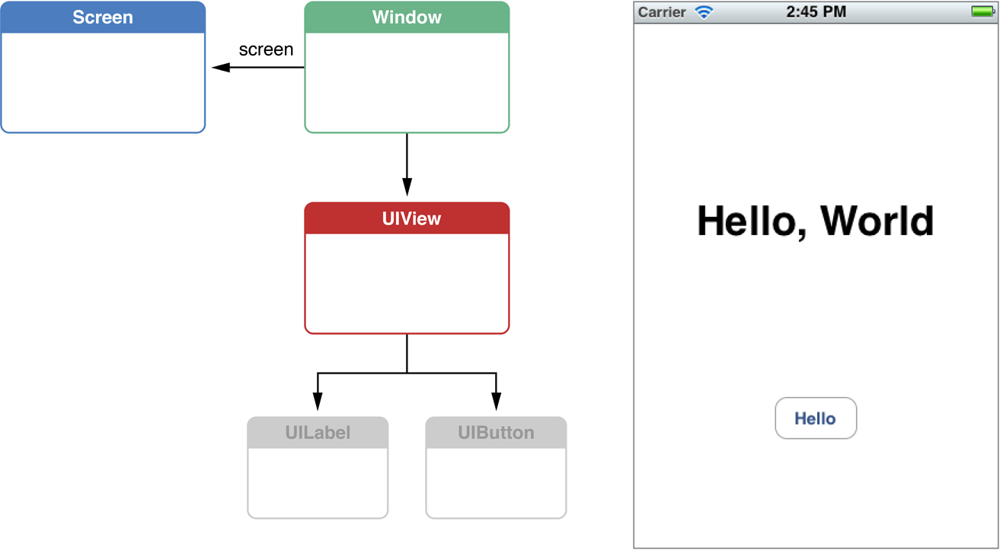
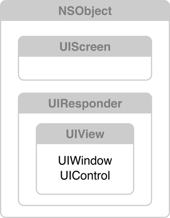
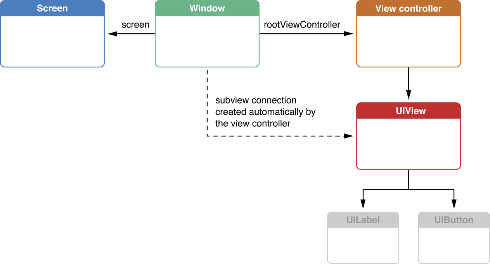

<title>View Controller Programming Guide for iOS</title>

Apple Official Documentation

原文修订日期：2012 年 12 月 13 日

# About View Controllers #

View controller 是数据与视觉外观之间的一个关键连接。无论何时 iOS 程序显示用户界面时，所显示的内容都是由一个 view controller 或一组互相协作的 view controller 控制的。因此，view controller 提供了程序的骨架。

iOS 提供了许多内置的 view controller 类，支持标准的 UI, 如导航栏和 tab 栏。作为程序开发的一部分，你也会实现若干个自定义的 view controller 以显示自己特定的内容。

## At a Glance ##

View controller 是 MVC 设计模式中传统的控制器对象，但又可以做得更多。View controller 为 iOS 程序提供了许多常见的行为，这些行为通常内置在（view controller 的）基类中。对有些行为，基类只实现了一部分，子类中的自定义代码实现剩余的部分。如旋转设备时，标准的实现会尝试旋转 UI; 然而你的子类决定是否应旋转 UI, 如果要旋转，其中的 views 在新方向下应如何变化。Thus, the combination of a structured base class and specific subclassing hooks make it easy for you to customize your app’s behavior while conforming to the platform design guidelines.

### A View Controller Manages a Set of Views ###

一个 view controller 管理一部分 UI. 需要时，它提供一个可以显示或交互的 view, 这个 view 通常是一个更复杂的 view hierarchy 的根。The view controller acts as the central coordinating agent for this view hierarchy, handling exchanges between the views and any relevant controller or data objects.

## You Manage Your Content Using Content View Controllers ##

要显示程序特定的内容，请实现自己的 content view controller, 继承自 UIViewController 或 UITableViewController, 实现必要的方法。

### Container View Controllers Manage Other View Controllers ###

Container view controller 显示其他 view controller 拥有的内容，后者显式地关联前者，形成一个父子关系。二老的结合创造了一个带有一个根的 view controller 对象的 hierarchy.

Each type of container defines its own interface to manage its children. The container’s methods sometimes define specific navigational relationships between the children. A container can also set specific restrictions on the types of view controllers that can be its children. It may also expect the view controllers that are its children to provide additional content used to configure the container.

### Presenting a View Controller Temporarily Brings Its View Onscreen ###

有时候 view controller 希望向用户显示额外的信息，或希望用户提供额外的信息。然而 iOS 设备的屏幕空间是有限的，可能没有足够的空间一次显示全部 UI 元素。权宜之计是临时显示另外一个 view 供用户交互，后者只会在需要时才会显示出来。

为了简化实现这样的界面，iOS 允许一个 view controller **呈现**另一个 view controller 的内容。呈现后，后者的内容被显示在屏幕的一个区域——其实通常是整个屏幕。用户与之交互完毕后，后者告诉前者，前者 dismiss 掉后者，把屏幕恢复原状。

Presentation behavior must be included in a view controller's design in order for it to be presented by another view controller.

### Storyboards Link User Interface Elements into an App Interface ###

UI 设计可以非常复杂。每个 view controller 引用多个 views, gesture recognizers, 及其他 UI 对象；反过来，这些对象也维护到 view controller 的引用，或为响应用户行为而执行特定的代码。And view controllers rarely act in isolation. 多个 view controllers 间的协作也定义了程序中的其他关系。简而言之，创建 UI 意味着实例化和配置许多对象，并建立其间的关系，这是耗时又易错的。

请使用 Interface Builder 来创建 storyboard, 后者包含预配置的 view controller 实例及其相关对象。对象的属性及其间的关系都可通过 Interface Builder 来配置。

在运行时，程序加载 storyboard 并用以驱动程序的 UI. 对象从 storyboard 加载后，被恢复至所配置的状态。UIKit 还提供了一些可 override 的方法，以自定义无法在 Interface Builder 中直接配置的行为。

# View Controller Basics #

iOS 程序的屏幕空间有限，故在如何向用户呈现信息方面必须有所创新。有大量信息要显示的程序，一开始只能显示一部分，之后随着用户的交互而动态地显示或隐藏一些内容。View controller 提供了一些基础设施以管理内容、及协调其显示或隐藏。让不同类型的 view controller 控制 UI 的不同部分，就把 UI 的实现分解成了较小、较易管理的单元。

使用 view controller 前，需要了解 iOS 中用以显示内容的主要类，包括窗口和 view. View controller 的实现的一个关键部分是管理用以显示其内容的 views, 然而管理 views 不是 view controller 的唯一任务。转场发生时，多数 view controller 还与其他 view controller 通信和协作。由于 view controller 管理了如此多了关联 (connections), 请既要向里留意 view 及相关对象，也要向外留意到其他 view controller. 有时候理解对象之间的关联是困难的，故请使用 Interface Builder 创建 storyboard, 后者使关系可视化，且极大地简化了运行时初始化对象所需的工作。

## Screens, Windows, and Views Create Visual Interfaces ##

下图左侧是组成该界面的对象。

这里有 3 个主要对象：

- 一个 UIScreen 对象，标识连接到设备上的一个物理屏幕。
- 一个 UIWindow 对象，为屏幕提供绘图支持。
- 一系列 UIView 对象，执行绘图。这些 views 附加到窗口上，并在后者要求时绘制自己的内容。

下图显示了这些类在 UIKit 中的定义：

为了理解 view controller, 尽管无须理解有关 view 的一切，但理解其以下主要特性还是很有裨益的：

- 一个 view 表示一个 UI 元素。每个 view 覆盖一个特定的区域，在此区域内，它显示内容及响应用户事件。
- View 可以在 hierarchy 中嵌套。Subviews are positioned and drawn relative to their superview. 故 subviews 会随着 superview 移动。通过把一组相关的 subviews 放在一个共同的 superview 中，就很容易地它们汇集在了一起。
- Views can animate their property values. When a change to a property value is animated, the value gradually changes over a defined period of time until it reaches the new value. Changes to multiple properties across multiple views can be coordinated in a single animation.
- View 极少理解自己在程序中的角色。如控件可以响应用户的交互，但它们不知道它们控制着什么，只是向程序中的其他对象发送消息。这种灵活性允许使用一个类（如 UIButton）为多种（如）按钮提供实现，只须让每个按钮触发不同的行为。

复杂的程序需要许多 views, 通常汇集成 view hierarchies. 以动画的形式把这些 views 的子集显示在屏幕上、或从屏幕上移除，让用户觉得所面对的是单个、较大的界面。为了使 view 类可复用，view 不需要知道自己在程序中的角色，因此程序的逻辑——即大脑——需要放在其他方。View controllers 就是把 views 联系在一起的大脑。 

## View Controllers Manage Views ##

每个 view controller 组织并控制着一个 view, 通常是一个 view hierarchy 的根。View controller 是 MVC 模式中的控制器对象，但 view controller 还执行另外一些特殊的任务，这些任务由 UIViewController 类定义。所有 view controllers 都执行 view 和资源管理的任务，其他的任务则取决于如何使用 view controller.

下图显示了上一小节图片所示对象间的接口，但此处使用的是 view controller. 永不需要直接把 view 赋给窗口，而是把 view controller 赋给窗口，它会自动把自己的 view 添加到窗口中。

View controller 负责（仅）在需要时加载自己的 view, 某些条件下还可释放之。因此 view controller 在资源管理方面举足轻重。

A view controller is the natural place to coordinate actions of its connected views.

Usually, each view controller instantiated by your app sees only a subset of your app's data. It knows how to display that particular set of data, without needing to know about other kinds of data. Thus, an app's data model, UI design, and the view controllers you create are all influenced by each other.

- Every view is controlled by only one view controller. When a view is assigned to the view controller’s view property, the view controller owns it. If the view is a subview, it might be controlled by the same view controller or a different view controller. You’ll learn more about how to use multiple view controllers to organize a single view hierarchy when you learn about container view controllers.
- Each view controller interacts with a subset of your app’s data. For example, the Photo controller needs to know only the photo to be displayed.
- Because each view controller provides only a subset of the user experience, the view controllers must communicate with each other to make this experience seamless. They may also communicate with other controllers, such as data controllers or document objects.

## A Taxonomy of View Controllers ##
## View Controller’s Content Can Be Displayed in Many Ways ##
## View Controllers Work Together to Create an App’s Interface ##
## Storyboards Help You Design Your UI ##

# Using View Controllers in Your App #

# Creating Custom Content View Controllers #

# Resource Management in View Controllers #

# Responding to Display-Related Notifications #

# Resizing the View Controller's Views #

# Using View Controllers in the Responder Chain #

# Supporting Multiple Interface Orientations #

# Accessibility from the View Controller's Perspective #

# Presenting View Controllers from Other View Controller #

# Coordinating Efforts between View Controllers #

# Enabling Edit Mode in a View Controller #

# Creating Custom Segues #

# Creating Custom Container View Controllers #
