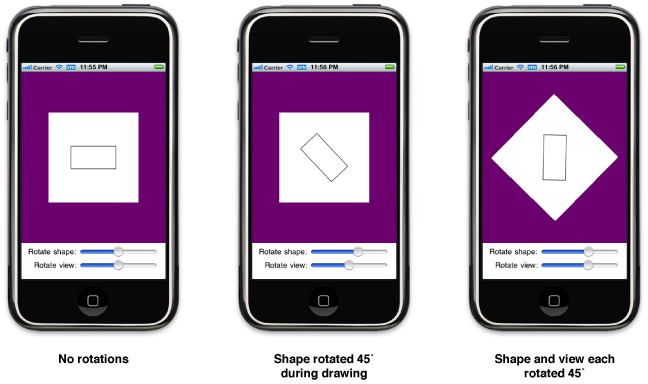
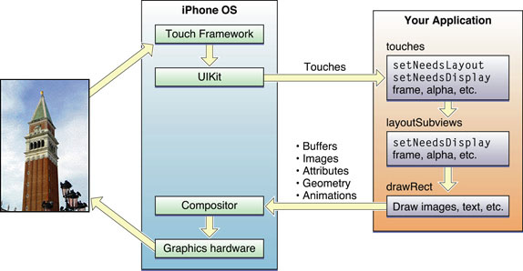
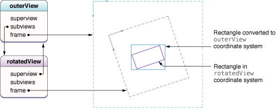
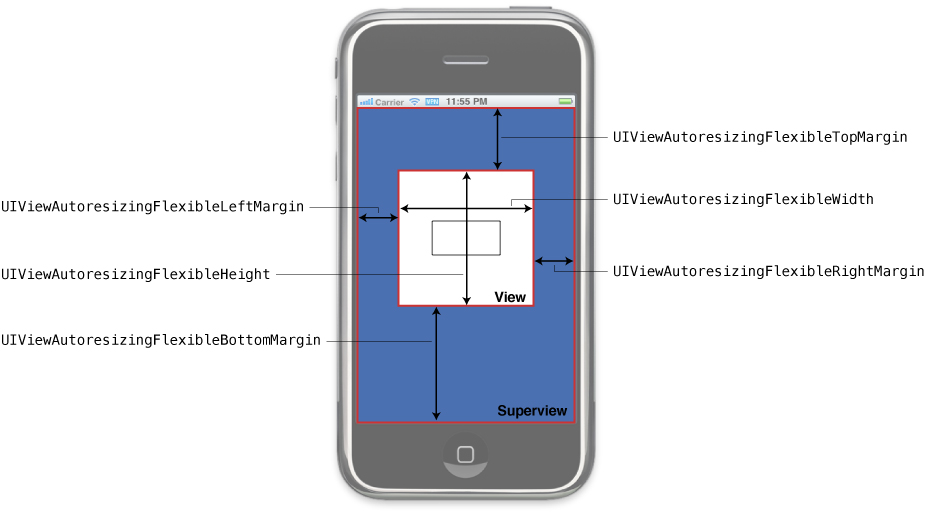

View programming Guide for iOS

Apple Official Documentation

原文最后修订日期：2014.9.17


在 iOS 中使用窗口和 view 在屏幕上展示程序的内容。窗口本身没有任何可见的内容，但为 view 提供了基本的容器；View 定义了窗口的一部分，可用以填充具体的内容。

每个程序至少有一个窗口和一个 view, 以展示其内容。UIKit 和一些其他系统框架提供了预定义好的 view, 简至按钮、文本标签，繁至表格、picker, scroll 等。若预定义的 view 不能满足需要，还可自定义 view 并自己处理绘图和事件。

## 内容一瞥 ##

### Views Manage Your App's Visual Content ###

View 是 UIView （或其子类）的实例，管理程序窗口中的一块矩形区域。View 负责绘制内容、处理多点解控事件、管理 subview 的布局：

- 绘图涉及使用诸如 Core Graphics, OpenGL ES, 或 UIKit 等图形技术在 view 的矩形区域内绘制形状、图像、或文本。
- View 通过 gesture recognizer 或直接处理触摸事件以对触摸事件作出响应。
- 在 view hierarchy 中，父级 view 负责放置 subview 及调整其大小，且可动态地实现这些操作。动态地修改 subview 可使之适应不断变化的因素，如界面旋转或动画。

可把 view 想像成构造用户界面的积木，通常需要若干个 view 来构成一个 view hierarchy, 而不是使用单个 view 来呈现内容。View hierarchy 中的每个 view 呈现一部分特定的用户界面，且通常为某种特定的内容作了优化。如 UIKit 中的 UILabel 展示小段文字、UIImageView 展示图片等。

### Windows Coordinate the Display of Your Views ###

窗口是 UIWindow 的实例，它处理程序用户界面整体的总体呈现。窗口与 view （及其所属的 view controller）一起管理（用户）与 view hierarchy 的交互、以及对其所作的修改。多数情况下，程序的窗口是不会改变的，创建后它就保持不变，变的只是由它呈现的那些 view. 每个程序至少有一个在设备主屏幕上展示程序界面的窗口。若设备外接了显示器，程序还可创建第二个窗口来展示程序内容。

### Animations Provide the User with Visible Feedback for Interface Changes ###

动画为用户提供 view hierarchy 变化的可视化反馈。虽然系统提供了呈现模块 view 及在不同 view group 间过渡的标准动画，但也可对 view 的许多 attribute 直接应用动画，如 view 的透明度、位置、大小、背景色等。若直接操纵 view 的底层 Core Animation layer 对象，还可执行更多动画。

### The Role of Interface Builder ###

Interface Builder 是一个以图形化方式构建及配置程序窗口和 view 的程序。Using Interface Builder, you assemble your views and place them in a nib file, which is a resource file that stores a freeze-dried version of your views and other objects. When you load a nib file at runtime, the objects inside it are reconstituted into actual objects that your code can then manipulate programmatically.

Related: Interface Builder User Guide. View Controller Programming Guide.

# View and Window Architecture #

不管使用系统预置的 view 还是自定义 view, 都应理解 UIView 和 UIWindow 类提供的基础设施 (infrastructure)。

## View Architecture Fundamentals ##

以可视方式完成的多数事情都是通过 UIView 的实例完成的。View 对象定义屏幕上的一块矩形区域，并处理其中的绘图和触摸事件。View 也可作为其他 view (subview) 的父级，并协调其位置和大小。

View 与 Core Animation layer 配合完成 view 内容的渲染和动画。UIKit 中的每个 view 都由一个 layer 对象（通常是 **CALayer** 对象的实例）作为后台支撑，后者管理 view 的后台存储及处理与 view 相关的动画 (manages the backing store for the view and handles view-related animations). 你执行的多数操作都应通过 UIView 编程接口，但需要对 view 的渲染和动画行为有更多控制时，则可直接操作其 layer 对象。

要理解 view 和 layer 间的关系，举一个例子会大有裨益。下图程序包含一个窗口（它也是一个 view, UIWindow 继承自 UIView）、一个通用的作为容器的 UIView 对象、一个 UIImageView 对象、一个用以显示控件的工具栏，和一个 bar button item （它自身不是一个 view, 但它内部管理着一个 view）。每个 view 都有一个相应的 layer 对象，可通过 **UIView.layer** 属性访问。（由于 bar button item 不是一个 view, 故不能直接访问其 layer）Behind those layer objects are Core Animation rendering objects and ultimately the hardware buffers used to manage the actual bits on the screen.


Core Animation layer 对象的使用对性能有重大的影响。View 对象的实际绘图代码会被尽可能少地调用，且调用时其结果会被 Core Animation 缓存，以便以后尽可能地复用。复用已渲染好的内容可省去代价高昂的绘图周期，这在动画期间尤为重要，比创建新内容要节约得多。

### View Hierarchies and Subview Management ###

除了提供内容，view 还可作为其他 view 的容器。一个 view 包含另一个 view 时，二者之间就建立了父子关系，分别为 superview 和 subview. 这种关系既影响程序的外观，也影响程序的行为。

在视觉上，subview 的内容隐晦 (obscure) 了 superview 的相应区域：

- 若 subview 完全不透明，则它完全遮罩了 superview 的相应区域；
- 若 subview 半透明，则二者的内容在呈现在屏幕上之前会被混合。

Superview 把其 subview 存储在一个有序数组中，这个顺序影响着每个 suview 的可见性。若两个兄弟 subview 互相重叠，则后加入的（或被移到数组末尾的）会显示在另一个的上层。

View 的父子关系也影响着其若干行为。更改 superview 的大小会产生涟漪效应 (ripple effect 连锁反应)，可导致任何 subview 的大小和位置也产生变化。 When you change the size of a parent view, you can control the resizing behavior of each subview by configuring the view appropriately. 其他会影响到 subview 的变化包括：隐藏 superview、更改 superview 的 alpha （透明度）、对 superview 的坐标系统施加数学变换。

View 在 view hierarchy 中的组织关系还决定着程序如何响应事件。当触摸发生在某个 view 内时，系统直接向该 view 发送一个含有触摸信息的事件，让它进行处理。View 若不处理某个特定的触摸事件，则可将其传递给自己的 superview. 若 superview 也不处理该事件，则可将其传递给自己的 superview……这样沿着 responder chain 向上传递。Specific views can also pass the event object to an intervening responder object, such as a view controller. 若没有对象处理该事件，它最终会到达 Application 对象，后者一般会将其丢弃。

### The View Drawing Cycle ###

UIView 类使用按需绘图模型来呈现内容。Vew 对象首次出现在屏幕上时，系统会要求它绘制自己的内容。系统捕获此内容的快照并将其用于该 view 的视觉呈现。若不再更改该 view 的内容，那么它的绘图代码就不会被再次调用，这个快照图像会用在关于该 view 的多数操作中。 If you do change the content, you notify the system that the view has changed. The view then repeats the process of drawing the view and capturing a snapshot of the new results.

View 的内容变化时，你不是直接重绘这些变化，而是调用 setNeedsDisplay 或 setNeedsDisplayInRect: 方法使 view 失效 (invalidate)。These methods tell the system that the contents of the view changed and need to be redrawn at the next opportunity. 系统会一直等到当前 run loop 结束，才会发出绘图操作。这样一个延迟使你得以一次性 invalidate 多个 view, 或将其从 hierarchy 中移除、隐藏之、调整其大小、归位 (reposition)。这些改变会同时反映出来。

注意：改变 view 的几何特性不会自动导致系统重绘 view 的内容。UIView.contentMode 属性决定着如何处理 view 几何特性的变化。多数 content modes 只是在 view 的 boundaries 内拉伸或归位 (reposition)已有的快照，而不是创建一个新的。请参阅 [Content Modes](#Content Modes) 一节。

渲染 view 的内容时，确切的绘图过程会因 view 及其配置而异。System view 通常实现私有绘图方法以渲染其内容，同时也会提供一些接口以使你可以配置其实际外观。对自定义的 UIView 子类，通常是 override drawRect: 方法，在这里绘制 view 的内容。还有其他一些途径可提供 view 的内容，如直接设置底层 layer 的内容，但 override drawRect: 方法是最常用的。

### Content Modes ###

每个 view 都有一个 content mode, 控制着 view 的几何特性变化时是否 recycle 其内容、怎样 recycle 其内容。View 首次显示时，它正常地渲染自己的内容，渲染的结果被捕获到一个 underlying 位图中。之后，对 view 的几何特性的更改并不总是导致该位图被重建：**contentMode** 属性的值决定着该位图应被缩放以适应新的边界、还是简单地固定在 view 的一角或一边。

The content mode of a view is applied whenever you do the following:

- Change the width or height of the view's frame or bounds rectangles.
- Assign a transform that includes a scaling factor to the view's transform property.

多数 view 的 contentMode 属性默认为 UIViewContentModeScaleToFill, 意思是缩放 view 的内容使之适应新的 frame 大小。下图展示了一些 contentMode 的结果，从中可见不是所有的 contentMode 都会导致 view 的 bounds 被完全填充。


Content modes 益于 recycle view 的内容，但你也可以将其设为 UIViewContentModeRedraw, 这会在几何特性变化时强制系统调用 drawRect: 方法重绘。一般来说，应尽可能避免使用这个值，对标准的 system views 当然就更不应使用这个值了。

### Stretchable Views ###

可把 view 的一部分指定为可拉伸的 (stretchable), 这样 view 的大小改变时，只有可拉伸部分的内容会受到影响。You typically use stretchable areas for buttons or other views where part of the view defines a repeatable pattern. The stretchable area you specify can allow for stretching along one or both axes of the view. Of course, when stretching a view along two axes, the edges of the view must also define a repeatable pattern to avoid any distortion. The figure below shows how this distortion manifests itself in a view. The color from each of the view's original pixels is replicated to fill the corresponding area in the larger view.


使用 **contentStretch** 属性指定可拉伸区域，它接受一个矩形，矩形的值被规整 (normalize) 为范围 [0.0, 1.0]. 拉伸 view 时，系统把这些规整后的值乘以 view 的当前 bounds 和 scale factor, 来决定哪些像素需要被拉伸。使用规整值减少了每次 view's bounds 变化时更新 contentStretch 属性的必要。

You specify the stretchable area of a view using the contentStretch property. This property accepts a
rectangle whose values are normalized to the range 0.0 to 1.0. When stretching the view, the system multiplies
these normalized values by the view's current bounds and scale factor to determine which pixel or pixels need
to be stretched. The use of normalized values alleviates the need for you to update the contentStretch
property every time the bounds of your view change.

View's content mode 也决定着怎样使用可拉伸区域。仅当 content mode 会导致 view 的内容被缩放时，可拉伸区域才有效。这意味着只有在 UIViewContentModeScaleToFill,
UIViewContentModeScaleAspectFit, and UIViewContentModeScaleAspectFill 内容模式下，可拉伸区域才会被支持。若指定了一个把 view 的内容固定在一角或一边的内容模式（这样就不会缩放 view 的内容），view 就会忽略可拉伸区域。

注意：指定 view 的背景时，推荐使用 contentStretch 属性，而不是创建一个可拉伸的 UIImage 对象。可拉伸的 view 完全在 Core Animation layer 中处理，这通常可获得更好的性能。

### Built-In Animation Support ###

每个 view 背后都有一个 layer 对象的一个好处是，可以轻易地以动画形式展现许多与 view 有关的变化。动画是与用户沟通的一种有用方式。UIView 类的许多属性都支持动画，即半自动支持动画地从一个变到另一个值。要对这些支持动画的属性执行动画，你需要：

1. 告诉 UIKit 你想要执行动画；
1. 修改属性值。

UIView 对象支持动画的属性：

frame - Use this to animate position and size changes for the view.
bounds - Use this to animate changes to the size of the view.
center - Use this to animate the position of the view.
transform - Use this to rotate or scale the view.
alpha - Use this to change the transparency of the view.
backgroundColor - Use this to change the background color of the view.
contentStretch - Use this to change how the view's contents stretch.

动画很重要的一个场合是，从一个 view 集合过渡到另一个 view 集合。通常使用 view controller 管理与用户界面重大改变相关的动画，如使用 navigation controller 管理从 higher-level 信息到 lower-level 信息的过渡。但也可使用动画来创建两个 view 集合之间的过渡，而不使用 view controller——标准的 view controller 动画不能满足你的需求时，就可使用这样用。

除了使用 UIKit 类创建动画，还可使用 Core Animation layer, 后者可对动画的时间和属性有更多的控制。

## View Geometry and Coordinate Systems ##

UIKit 的默认坐标系统中，原点位于左上角。坐标值用浮点数表示，这允许对内容精确布局和定位，而无关底层屏幕分辨率。屏幕、窗口和 view 都定义了自己的局部 (local) 坐标系统，允许相对于 view 原点或窗口原点指定坐标，而不仅是相对于屏幕原点。

由于 view 的窗口都定义了自己的局部坐标系统，在 view 中绘图或更改其几何特性时，都是相对于某个坐标系统的，因此你需要明确任何情况下哪个坐标系统有效。几何变化的坐标是相对于 superview 的坐标系统指定的。UIWindow 和 UIView 都提供了从一个坐标系统转换到另一个坐标系统的方法。

重要：有些 iOS 技术的坐标原点和正方向与 UIKIt 的不同，如 Core Graphics 和 OpenGL ES 的坐标原点位于左下角。

### The Relationship of the Frame, Bounds, and Center Properties ###

UIView 对象使用 frame, bounds 和 center 属性跟踪自己的大小和位置：

- frame 属性包含矩形框 (frame rectangle), 后者以 superview 的坐标系统指定 view 的大小和位置。
- bounds 属性包含边界矩形 (bounds rectangle), 后者以 view 自己的局部坐标系统指定 view 的大小及其内容原点，默认原点坐标为 (0, 0).
- center 属性以 superview 的坐标系统表示 view 的中心点。

center 和 frame 属性主要用于操纵 view 的几何特性，如在运行时更改 view 的位置和大小。若只更改位置而不更改大小，则优选 center 属性。

- center 属性的值总是有效的——即使在 UIView.transform 中加入了缩放或旋转。
- frame 属性就不然了，if the view's transform is not equal to the identity transform (恒等变换), frame 属性的值就被认为是无效的。

bounds 属性主要用于绘图。其默认大小与 frame rectangle 相符。

下图展示了一个 UIImageView 的 frame 和 bounds 间的关系。UIImageView 的左上角通过 superview 坐标系统的 (40, 40) 点定位，大小为 240 x 380. 对于 bounds rectangle, 其原点为 (0, 0), 大小亦为 240 x 380.


尽管可单独修改 frame, bounds 和 center 属性，但对其中一个的修改也会以以下方式影响到另一个：

- 设置 frame 属性时，bounds.size 会随之变化以匹配 frame rectangle 的新尺寸，center 属性也会随之更新以反映 frame rectangle 的新中心点。
- 设置 center 属性时，frame.origin 会相应地变化。
- 设置 bounds.size 时，frame.size 会随之变化以匹配 bounds rectangle 的新尺寸。

默认情况下，view's frame 不会被裁剪到其 superview's frame 之内，即超出 superview's frame 的部分仍可完整显示。而如果设置 UIView.clipsToBounds = YES 则超出边界的部分将不会显示。不管 subview 在视觉上是否被裁，Regardless of whether or not subviews are clipped visually, touch events always respect the bounds rectangle of the target view's superview. In other words, touch events occurring in a part of a view that lies outside of its superview's bounds rectangle are not delivered to that view.

### Coordinate System Transformations ###

坐标系统变换提供了一种快速、简便地修改 view （及其内容）的方式。仿射变换 (affine transform) 是一个数学矩阵，它指定怎样把一个坐标系统中的点映射到另一个坐标系统。可把仿射变换施加到整个 view 上以改变其尺寸、位置及相对于 superview 的方向，也可在绘图代码中使用仿射变换以对部分内容执行同类操作。因此怎样施加仿射变换取决于环境上下文 (context)：

- 要修改整个 view, 请修改 UIView.transform 属性；
- 要在 drawRect: 方法中修改特定部分的内容，请修改当前 graphics context 的仿射变换。

通常在需要实现动画时修改 transform 属性，如可通过该属性创建一个沿着 view 中心点旋转的动画。但不使用它对 view 作永久性的修改，如在 superview 的坐标空间内修改其位置或尺寸，这种修改应使用 frame rectangle.

注意：修改 UIView.transform 属性时，所有的变换都是相对于 view 的中心点的。

在 drawRect: 方法中，使用仿射变换来定位和定向 (position and orient) 要绘制的东西。相对于某个固定点（通常是原点）来创建对象，然后在绘图前使用 transform 来放置其位置，这要比把对象固定在 view 中的某个位置要简单。若对象在 view 中的位置发生了变化，只需修改 transform 即可，这比在新位置重建对象快速、节约得多。调用 CGContextGetCTM 函数获得 graphics context 的仿射变换，绘图过程中还可调用相关的 Core Graphics 函数以设置或修改该 transform.

CTM 是在某个给定时刻所用的仿射变换：

操纵整个 view 的几何特性时，CTM 就是存储在 transform 属性中的那个仿射变换。
而在 drawRect: 方法中，CTM 是与当前 graphics context 关联的那个仿射变换。

Subview 的坐标系统是基于其祖先的坐标系统构建的 (build on), 因此修改 view's transform 属性时，同时会影响它自己和它所有的 subview. 但这些变化只影响 views 在屏幕上的最终渲染结果，因为 view 是相对于自己的边界绘制其内容、以及布局其 subview 的，在绘图和布局过程中它可以忽略 superview's transform.
The coordinate system of each subview builds upon the coordinate systems of its ancestors. So when you
modify a view’s transform property, that change affects the view and all of its subviews. However, these
changes affect only the final rendering of the views on the screen. Because each view draws its content and
lays out its subviews relative to its own bounds, it can ignore its superview’s transform during drawing and
layout.

下图演示了渲染时两个旋转因子是如何在视觉上合并起来的。在 view's drawRect: 方法中，对形状施加一个 45 度的旋转因子，使之看起来旋转了 45 度。再对 view 施加另一个 45 度旋转因子，使形状看起来像是旋转了 90 度。相对于 view 而言，形状仍只旋转了 45 度，但 view 的旋转使之看起来像是旋转了 90 度。



重要：若 UIView.transform 属性不是恒等变换，则 UIView.frame 属性的值就是未定义的，且必须被忽略。对 view 施加 transform 时，必须使用其 bounds 和 center 属性来获得其位置和尺寸。但任何 subview 的 frame rectangle 仍然有效，因为它们是相对于 view's bounds 的。

关于如何在运行时修改 view's transform 属性，请参阅 [Translating, Scaling, and
Rotating Views](#Translating, Scaling, and
Rotating Views). 关于如何在绘图过程中使用 transforms 来定位内容，请参阅 Drawing and Printing Guide for iOS.

### Points Versus Pixels ###

在 iOS 中，所有的坐标和距离都是用浮点值表示的，单位为点。点的可测大小因设备而异。The main thing to understand about points is that they provide a fixed frame of reference for drawing.

以下是以点为单位时一些 iOS 设备的维度：

- 3.5 英寸 iPhone 和 iPod Touch: 320 x 480
- 4 英寸带视网膜显示屏的 iPhone 和 iPod Touch: 320 x 568
- iPad: 768 x 1024

用于各种设备的基于点的测量系统定义了所谓的用户坐标空间，这是几乎你的所有代码中所用的标准坐标空间，如操纵 view 的几何特性或调用 Core Graphics 函数绘图时，使用的都是点和用户坐标空间。尽管有时候用户坐标空间的点直接映射为设备屏幕上的像素，但你永远不要假定一直都会是这样。请谨记：**一个点未必会映射成屏幕上的一个像素。**在设备层面，view 中所指定的所有坐标都必须在某一时刻被转换为像素，不过用户坐标空间点到设备坐标空间像素的映射通常是由系统处理的。UIKit 和 Core Graphics 都使用了一个主要基于向量的绘图模型，其中所有的坐标值都是用点指定的。这样，使用（如） Core Graphics 绘图时，可以为图像指定相同的值而无须关心设备的屏幕分辨率。

当需要处理图像或其他诸如 OpenGL ES 等基于像素的技术时，iOS 提供了关于处理这些像素的帮助。对于作为资源存储在 app bundle 中的静态图像文件，iOS defines conventions for specifying your images at different pixel densities and for loading the image that best matches the current screen resolution. View 也提供了有关 current scale factor 的信息，这样你就可以手工调整任何基于像素的绘图代码，以适应高分辨率屏幕。关于在不同屏幕分辨率上处理基于像素的内容，请参阅 Drawing and Printing Guide for iOS - Supporting High-Resolution Screens in Views.

## The Runtime Interaction Model for Views ##

用户与界面交互时，或你的代码以编程方式更改了什么东西时，UIKit 中就发生一系列复杂的事件，以处理这些交互。在这些事件中的某个特定点，UIKit call out 你的 view 类，使之得以以程序的身份作出响应。理解这些 callout 点对于理解 view 怎样融入程序是至关重要的。下图显示了一些基本的事件，始于用户触摸屏幕，终于图形系统更新屏幕内容。对于以编程方式发起的动作，同样的事件也会发生。



以下是对上图中事件的分解：

1. 用户触摸屏幕。
1. 硬件把触摸事件报告给 UIKit framework.
1. UIKit framework 把触摸打包成一个 UIEvent 对象，并分派给适当的 view. 关于 UIKit 如何把事件分发给 view, 请参阅 Event Handling Guide for iOS.
1. View 中的事件处理代码响应该事件，如代码可以：
	- 更改 view 或其 subview 的属性 (frame, bounds, alpha, etc.);
	- 调用 setNeedsLayout 方法以表明该 view 或其 subview 需要更新布局；
	- 调用 setNeedsDisplay 或 setNeedsDisplayInRect: 方法以表明该 view 或其 subview 需要被重绘；
	- 通知 controller 某些数据发生了改变。
	- 当然，具体该如何响应取决于你。
1. 若 view 的几何特性发生了改变，UIKit 根据以下规则更新其 subview:
    - 若为 view 配置了 autoresizing 规则，UIKit 根据这些规则调整每个 view. 关于 autoresizing rules, 请参阅 Handling Layout Changes Automatically Using Autoresizing Rules.
    - 若 view 实现了 layoutSubviews 方法，则 UIKit 调用之。你可以在自定义的 view 中 override 此方法以调整 subview 的位置和尺寸。For example, a view that provides a large scrollable area would need to use several subviews as “tiles” rather than create one large view, which is not likely to fit in memory anyway. In its implementation of this method, the view would hide any subviews that are now offscreen or reposition them and use them to draw newly exposed content. As part of this process, the view’s layout code can also invalidate any views that need to be redrawn.
1. 若任何一个 view 的任何一部分被标记为需要重绘，UIKit 就要求该 view 重绘自己。对于显式地定义了 drawRect: 方法的自定义 view, UIKit 会调用该方法。对该方法的实现应尽可能快地重绘指定的区域，不要做其他工作。此时不要做额外的布局更新，也不要修改程序的数据模型。该方法的目的仅仅是更新 view 的可见内容。Standard system views typically do not implement a drawRect: method but instead manage their drawing at this time.
1. 更新的 view 与其他可见内容合成 (composite), 然后送往图形硬件。
1. 图形硬件把渲染后的内容传递给屏幕。

注意：以上更新模型主要适于使用标准 system view 和绘图技术的程序。使用 OpenGL ES 绘图的程序通常配置单个全屏的 view, 并在与之相关联的 OpenGL ES graphics context 中直接绘图。这种情况下，view 可能仍然处理触摸事件，但由于它是全屏的，故无须布局 subview.

In the preceding set of steps, the primary integration points for your own custom views are:

- The event-handling methods:
	- touchesBegan:withEvent:
	- touchesMoved:withEvent:
	- touchesEnded:withEvent:
	- touchesCancelled:withEvent:
- The layoutSubviews method
- The drawRect: method

这些是最常见的 overridden 方法，但可能不必全部 override 它们。若使用 gesture recognizer 处理事件，则无须 override 任何这些事件处理方法。类似地，若 view 不包含 subview 或其尺寸不会改变，则无须 override layoutSubviews 方法。最后，仅当 view 的内容会在运行时改变，且使用诸如 UIKit 或 Core Graphics 等 native 技术绘图时，才需要 override drawRect: 方法。

注意以上是主要的 integration points, 但不是全部。Several methods of the UIView class are designed to be override points for subclasses. You should look at the method descriptions in UIView Class Reference to see which methods might be appropriate for you to override in your custom implementations.

## Tips for Using Views Effectively ##

你需要负责自定义的 view 的性能。UIKit 尽其最大努力优化了与 view 相关的行为，并帮助你在自定义 view 中达到良好的性能。然而你仍可在以下方面帮助 UIKit.

重要：优化绘图代码前，应先收集当前的性能数据。衡量当前的性能可让你确认是否真的有问题存在，若有，可作为基准，以与优化后的性能作对比。

### Views Do Not Always Have a Corresponding View Controller ###

View 和 view controller 很少有一一对应关系。View controller 的责任是管理 view hierarchy, 后者通常包含多个 view 以实现独立的功能 (self-contained feature). iPhone 程序的 view hierarchy 通常会充满整个屏幕，而 iPad 程序的 view hierarchy 可能只占据屏幕的一部分。

设计程序界面时，要考虑 view controller 的角色。View controller 提供了许多重要行为，如协调 view 在屏幕上的展示和移除，释放内存以响应低内存警告，旋转 view 以响应界面方向的变化。Circumventing these behaviors could cause your application to behave incorrectly or in unexpected ways.

### Minimize Custom Drawing ###

尽管有时候自定义绘图是必要的，但它也是你应该尽量避免的。仅当已有的 system view 类未提供你想要的外观或能力时，才真的需要自定义绘图。要展示的内容可通过已有的 view 组合起来时，最好的方法就是把它们组合到一个自定义的 view hierarchy 中。

### Take Advantage of Content Modes ####

内容模式把重绘 view 的时间降到了最低。View 默认使用 UIViewContentModeScaleToFill 内容模式，即缩放 view 已有的内容以适应 view's frame rectangle. 可根据需要更改内容模式，但应尽量避免 UIViewContentModeRedraw 模式。不管使用何种内容模式，总可通过调用 setNeedsDisplay or setNeedsDisplayInRect: 以强制内容重绘。

### Declare Views as Opaque Whenever Possible ###

UIKit 使用 UIView.opaque 属性决定某个 view 是否可优化合成 (compositing) 操作。把该属性的值设为 YES 相当于告诉 UIKit, 在该 view 后面不需要渲染任何内容，减少渲染可提高绘图代码的性能。当然，置 `UIView.opaque = YES` 的话，必须用完全不透明的内容完整地填充其 bounds rectangle.

### Adjust Your View's Drawing Behavior When Scrolling ###

滚动会在短时间内引起 view 的许多更新，若 view 的绘图代码未适当地调整，滚动起来就可能卡顿。Rather than trying to ensure that your view's content is pristine at all times, consider changing your view's behavior when a scrolling operation begins. 如滚动期间临时降低内容的渲染品质，或更改内容模式；滚动结束后，把 view 恢复到原状态，（如有需要）并更新其内容。

### Do Not Customize Controls by Embedding Subviews ###

尽管技术上可以把 subview 添加到标准的系统控件（继承自 UIControl 的对象）里，但你永远不要这样自定义 view. 支持自定义的控件是通过 UIControl 类自己的显式接口实现的，如 UIButton 类有设置 title 和背景图片的方法。使用定义好的 customization points 可使你的代码总能正常工作，而通过在按钮中嵌入一个自定义图片或标签以规避 (circumvent) 这些方法，则一旦按钮的实现发生改变，就可能导致程序行为失常。

# Windows #

每个 iOS 程序都需要至少一个窗口——一个 UIWindow 类的实例——而有些程序则有多个窗口。窗口对象有以下职责：

- 包含程序的可见内容；
- 在把触摸事件分发给 view 或其他程序对象过程中扮演着重要角色；
- It works with your application's view controllers to facilitate orientation changes.

iOS 的窗口没有标题栏、关闭框，或其他视觉装饰。窗口总是一个空的容器，容纳若干个 view. 程序也不通过显示新窗口来改变内容，而是通过改变窗口中最前端的 view 来改变所显示的内容。

多数 iOS 程序在其生命周期内只创建和使用一个窗口，这个窗口跨越设备的整个主屏幕，在程序生命的早期从主 nib 文件中加载（或以编程方式创建）。但若程序支持使用外接显示器作视频输出，还可创建额外的窗口以在外接显示器上显示内容。所有其他窗口通常都是由系统为响应特定的事件——如呼入的电话——而创建的。

## Tasks that Involve Windows ##

对许多程序来说，唯一需要与窗口交互的是启动时创建窗口。其实还可使用程序的窗口对象执行若干任务：

- 使用窗口对象把点或矩形转换成、或转换自窗口的本地 (local) 坐标系统。
- 使用窗口通知跟踪与窗口相关的变化。窗口在显示、隐藏、接受或放弃 key status 时都会产生通知。可利用这些通知在程序的其他部分执行一些操作。

## Creating and Configuring a Window ##

可以编程方式创建及配置程序的主窗口，也可使用 Interface Builder. 不管哪种方式，都应在程序启动时创建之，并 retain 它，以及在 App Delegate 中存储对它的引用。若需创建额外的窗口，就请让程序在需要时才惰性地创建之。例如，程序支持外接显示器，它应等到显示器接入时才创建相应的窗口。而对于主窗口，不管程序被启动到前端还是后端 (foreground or background), 它都应在启动时被创建。创建及配置窗口对程序自己来说不是一个代价高昂的操作，但它若直接被启动到后端，那就要避免使窗口可见——直到程序进入前端。

### Creating Windows in Interface Builder ###

使用 Interface Builder 可轻而易举地创建程序主窗口，因为 Xcode project 模板已为你搞定了。每个 Xcode 应用程序工程都包含一个主 nib 文件（通常名为 MainWindow.xib 或其变形），其中就包含了程序的主窗口。此外，这些模板还在 App Delegate 对象中为主窗口定义了 outlet, 可用以在代码中访问窗口对象。

重要：在 Interface Builder 中创建窗口时，推荐在 Attributes Inspector 中启用 "Full Screen at Launch" 选项。若该选项未启用，而窗口又比目标设备的屏幕小，某些 view 就可能收不到触摸事件。这是因为窗口（像所有的 view 一样）不接收其边界矩形之外的触摸事件，而 view 默认又未被裁到窗口边界，因此虽然这些 view 仍然可见，但事件不会到达它们。启用 "Full Screen at Launch" 选项可使窗口针对当前屏幕适当地调整。

若是使用 Interface Builder 改造一个 project, 创建窗口就是简单地向 nib 文件中拖拽一个窗口对象。当然，你还应该：

要在运行时访问窗口，请为窗口连接一个 outlet, 通常定义在 App Delegate 中，或 nib 文件的 File's Owner 中。
若要把新 nib 文件作为程序的主 nib 文件，请把 Info.plist 中 NSMainNibFile 键的值改为该 nib 文件名。这可以确保 App Delegate 对象的 `application:didFinishLaunchingWithOptions:` 方法被调用时，nib 文件已被加载并可用。关于创建及配置 nib 文件，请参阅 Interface Builder User Guide. 关于怎样在运行时把 nib 文件载入程序，请参阅 Nib Files in Resource Programming Guide.

### Creating a Window Programmatically ###

若偏好于以编程方式创建程序的主窗口，请在 App Delegate 对象的 application:didFinishLaunchingWithOptions: 方法中包含类似以下的代码：

``` Objective-C
self.window = [[[UIWindow alloc] initWithFrame:[[UIScreen mainScreen] bounds]] autorelease];
```

其中 `self.window` 是 App Delegate 中一个已声明的属性，用以保存窗口对象。若是为外部显示器创建窗口，则应将其赋给另一个变量，并指定表示该显示器的非主 UIScreen 对象的边界。

创建窗口时，总应把窗口的尺寸设置为屏幕的全部边界，不要为适应状态栏若其他项目而减小窗口的大小。状态栏总是浮在窗口之上，故唯一要收缩以适应状态栏的是放在窗口里的 view. 若使用 view controller， 则 view controller 应自动调整 view 的尺寸。

### Adding Content to Your Window ###

每个窗口通常只有一个 root view 对象（由一个相应的 view controller 管理），后者包含其他所有呈现内容的 view. 使用单个 root view 简化了更改界面的流程：要显示新内容，只需替换 root view 即可；要在窗口中安置新的 view, 调用 `addSubview:` 方法即可。如安置由 view controller 管理的 view, 可使用类似以下代码：

``` Objective-C
[window addSubview:viewController.view];
```

除了以上代码，还可在 nib 文件中配置窗口对象的 `rootViewController` 属性，该属性利用 nib 文件提供了一种配置 root view 的便捷方式而无须编程。若该属性在窗口从 nib 文件中加载时被设置，UIKit 会自动把 view controller 相关联的 view 安置为窗口的 root view. 该属性仅用于安置 root view, 而未被窗口用于与 view controller 通信。

可使用任何 view 作为窗口的 root view, 如作为其他 subview 的容器的通用 UIView 对象，或标准的 system view, 或自定义的 view. 常用作 root view 的标准 system view 如 scroll view, table view, image view.

配置窗口的 root view 时，由你负责设置它在窗口中的初始尺寸和位置：

- 对于不包含状态栏、或显示半透明状态栏的程序，请把 root view 的尺寸设置得与窗口尺寸相符。
- 对于显示不透明的状态栏程序，请把 root view 置于状态栏下面，并适当减小其尺寸。从 root view 的高度中减去状态栏的高度可避免 root view 的顶部被遮挡。

注意：若窗口的 root view 由 container view controller 提供（如 tab bar controller, navigation controller, split-view controller），则无须自己设置其初始尺寸和位置。Container view controller 会根据状态栏是否可见自动设置之。

#### Changing the Window Level ####

每个 UIWindow 对象都有一个可配置的 windowLevel 属性，决定着该窗口相对于其他窗口如何放置。多数情况下，你无须更改它，新窗口在创建时会被自动赋予 normal window level, 表示该窗口呈现的是与程序相关的内容。高一些的 window levels 保留给需要浮在程序内容之上的信息，如系统状态栏或警告消息。尽管可自己为窗口赋予这些 levels, 但系统通常会在你使用特定的界面时自动为你配置好这些。如显示/隐藏状态栏，或显示警告消息时，系统会自动创建必要的窗口以显示之。

## Monitoring Window Changes ##

可使用以下与窗口相关的通知，跟踪窗口的显现与消失：

- UIWindowDidBecomeVisibleNotification
- UIWindowDidBecomeHiddenNotification
- UIWindowDidBecomeKeyNotification
- UIWindowDidResignKeyNotification

These notifications are delivered in response to programmatic changes in your application's windows. 程序显示或隐藏窗口时，UIWindowDidBecomeVisibleNotification and UIWindowDidBecomeHiddenNotification 通知会相应地被发出。但转入后台运行状态时，这些通知不会被发出。程序在后台时，即使窗口未显示在屏幕上，它在程序的上下文 (context) 中也仍被认为是可见的。

IWindowDidBecomeKeyNotification and UIWindowDidResignKeyNotification 通知助你跟踪哪个窗口是 key window —— 即当前接收键盘事件及其他非触摸相关事件的窗口。触摸事件被分派到触摸发生的那个窗口，而没有相关坐标的事件则被分派到 key window. 某一时刻只能有一个 key window. 

## Displaying Content on an External Display ##

要在外部显示器上显示内容，必须创建一个额外的窗口，并将其关联到表示外部显示器的 screen 对象。新窗口通常默认关联到设备的主屏幕，更改窗口相关联的 screen 对象会使该窗口的内容被重定向 (reroute) 到相应的显示器。窗口被关联到正确的 screen 后，就可以像主 screen 一样向其中添加及显示 view 了。

UIScreen 类维护一个 screen 对象列表，表示可用的硬件显示器。通常只有一个 screen 对象，表示着 iOS 设备的主显示器，但支持外接显示器的设备还可以有额外的 screen 对象。支持外接显示器的设备包括带视网膜显示屏的 iPhone, iPod Touch 和 iPad. 较旧的设备，如 iPhone 3GS, 不支持外接显示器。

注意：由于外部显示器实质上只是一个视频输出，故不要期望关联到外部显示器的窗口会有触摸事件。另外，程序需负责更新外部显示器窗口的内容，故要镜像主窗口，需要为外部显示器窗口创建与主窗口一样的 view 副本，并随着主窗口一起更新。

在外部显示器上显示内容的步骤可总结为：

1. 在程序启动时注册屏幕连接与断开的通知。
1. 要在外部显示器上显示内容时，创建并配置一个窗口。
	- 使用 `UIScreen.screens` 属性获得外部显示器的 screen 对象。
	- 创建一个 UIWindow 对象，并根据屏幕或内容适当调整其大小。
	- Assign the UIScreen object for the external display to the screen property of the window.
	- 按需调整 screen 对象的分辨率。
	- 向窗口中增加适当的 view.
1. 正常显示及更新该窗口。

### Handling Screen Connection and Disconnection Notifications ###

屏幕连接与断开通知对优雅地处理外部显示器变化是很关键的。用户连接或断开显示器时，系统会向程序发送适当的通知，使用这些通知更新程序状态，以及创建或释放与外部显示器关联的窗口。

连接与断开通知可以发生在任何时刻，即使是程序在后台挂起 (suspended in the background) 时。因此最好在一个存在于程序整个运行时的对象中观测这些通知，如 App Delegate. 若程序被挂起，这些消息会排除等候 (queued)，直到程序退出挂起状态并启动到前端或后端。

以下代码展示了注册连接与断开通知的方法，它由 App Delegate 在初始化时调用，但你也可以在其他地方注册这些通知。

``` Objective-C
- (void)setupScreenConnectionNotificationHandlers
{
    NSNotificationCenter* center = [NSNotificationCenter defaultCenter];
    [center addObserver:self selector:@selector(handleScreenConnectNotification:) name:UIScreenDidConnectNotification object:nil];
    [center addObserver:self selector:@selector(handleScreenDisconnectNotification:) name:UIScreenDidDisconnectNotification object:nil];
}

// handler methods below:

- (void)handleScreenConnectNotification:(NSNotification*)aNotification
{
    UIScreen* newScreen = [aNotification object];
    CGRect screenBounds = newScreen.bounds; 
    if (!_secondWindow) {
        _secondWindow = [[UIWindow alloc] initWithFrame:screenBounds];
        _secondWindow.screen = newScreen; 
        // Set the initial UI for the window.
        [viewController displaySelectionInSecondaryWindow:_secondWindow];
    }
}
 
- (void)handleScreenDisconnectNotification:(NSNotification*)aNotification
{
    if (_secondWindow) {
        // Hide and then delete the window.
        _secondWindow.hidden = YES;
        [_secondWindow release];
        _secondWindow = nil; 
        // Update the main screen based on what is showing here.
        [viewController displaySelectionOnMainScreen];
    } 
}
```

若外部显示器接入设备时程序处于活动状态，应（立即）为它创建一个窗口并显示一些内容——不必是最终要显示的内容，比如若程序尚未准备好使用此外部显示器，可只暂时只显示一些点位符。若不为该屏幕创建窗口，或创建了窗口但不显示它，则外部显示器将黑屏 (displays a black field).

### Configuring a Window for an External Display ###

要把窗口显示在外部显示器上，必须为它关联正确的 screen 对象，这一过程涉及定位到适当的 UIScreen 对象并将其赋给窗口的 `screen` 属性。可调用 `[UIScreen screens]` 类方法获得 screen 对象数组，该数组总是包含至少一个 screen 对象，表示主屏幕。若还有第二个对象，则表示的是外接显示器。

以下代码通过 `UIWindow.hidden = NO` 显示窗口，而不是调用 `makeKeyAndVisible`, 这是因为该窗口只包含静态内容，且未被用于处理事件。

``` Objective-C
// called at app startup
- (void)checkForExistingScreenAndInitializeIfPresent
{
    if ([[UIScreen screens] count] > 1)
    {        
        // The main screen is always at index 0.
        UIScreen* secondScreen = [[UIScreen screens] objectAtIndex:1];
        CGRect screenBounds = secondScreen.bounds; 
        _secondWindow = [[UIWindow alloc] initWithFrame:screenBounds];
        _secondWindow.screen = secondScreen;
 
        // Add a white background to the window
        UIView* whiteField = [[UIView alloc] initWithFrame:screenBounds];
        whiteField.backgroundColor = [UIColor whiteColor]; 
        [_secondWindow addSubview:whiteField];
        [whiteField release];
 
        // Center a label in the view.
        NSString* noContentString = [NSString stringWithFormat:@"<no content>"];
        CGSize stringSize = [noContentString sizeWithFont:[UIFont systemFontOfSize:18]]; 
        CGRect labelSize = CGRectMake((screenBounds.size.width - stringSize.width) / 2.0, (screenBounds.size.height - stringSize.height) / 2.0, stringSize.width, stringSize.height);
        UILabel* noContentLabel = [[UILabel alloc] initWithFrame:labelSize];
        noContentLabel.text = noContentString;
        noContentLabel.font = [UIFont systemFontOfSize:18];
        [whiteField addSubview:noContentLabel];
 
        // Go ahead and show the window.
        _secondWindow.hidden = NO;
    }
}
```

重要：显示窗口之前，总是应先为其关联一个屏幕。尽管可以更改当前可见窗口的屏幕，但这是一个高昂的操作，应当避免。

一旦外部屏幕的窗口显示了，就可以像其他任何窗口一样更新它了。

### Configuring the Screen Mode of an External Display ###

根据窗口的内容不同，在把窗口关联到屏幕之前，可能需要更改屏幕模式。许多屏幕支持多种分辨率，有些还使用不同的像素宽高比。Screen 对象默认使用最常用的屏幕模式，但你可以更改便之适配内容。如使用 OpenGL ES 实现游戏，其 textures 是为 640 x 480 像素的屏幕设计的，你可能会更改默认具有较高分辨率的屏幕的模式。更改屏幕模式需要在把 UIScreen 对象关联到窗口之前完成。UIScreenMode 类定义了单个屏幕模式的一些 attributes. 可遍历 UIScreen.availableModes 属性以寻找一个满足需求的屏幕模式。

# Views #

由于 view 对象是程序与用户互动的主要方式，故它们有许多责任，如：

- Layout and subview management
    - A view defines its own default resizing behaviors in relation to its parent view.
    - A view can manage a list of subviews.
    - A view can override the size and position of its subviews as needed.
    - A view can convert points in its coordinate system to the coordinate systems of other views or the window.
- Drawing and animation
    - A view draws content in its rectangular area.
    - Some view properties can be animated to new values.
- Event handling
    - A view can receive touch events.
    - A view participates in the responder chain.

本章专注于创建、管理、绘制 view, 以及 view hierarchy 的布局和管理。关于如何处理触摸事件（及其他事件），请参阅 Event Handling for iOS.

## Creating and Configuring View Objects ##

You create views as self-contained objects either programmatically or using Interface Builder, and then you
assemble them into view hierarchies for use.

### Creating View Objects Using Interface Builder ###

创建 view 最简单的方式是图形化的 Interface Builder. Because Interface Builder uses live view objects — that is, actual instances of the view classes — what you see at design time is what you get at runtime. 把这些 live 对象存储在一个 nib 文件里，后者是一个资源文件，保存对象的状态和配置。

通常用 nib 文件存储一个 view controller 的整个 view hierarchy. The top level of the nib file usually contains a single view object that represents your view controller's view (view controller 自己通常由 File's Owner 对象表示). Top-level view 的尺寸应针对目标设备作适当的调整，它还包含着所有其他要显示的 view. 很少使用 nib 只存储 view controller's view hierarchy 的一部分。

使用 nib 文件时，只需使用 nib 文件信息初始化 view controller, 后者会在适当的时机加载及卸载 view 对象。若 nib 文件未与 view controller 关联，可使用 NSBundle 或 NINib 对象手工加载其内容，它们会使用 nib 文件中的数据重建 view 对象。

关于怎样使用 Interface Builder, 请参阅 Interface Builder User Guide. 关于 view controller 怎样加载及管理 nib 文件，请参阅 View Controller Programming Guide for iOS 中的 Creating Custom Content View Controllers. 关于怎样以编程方式从 nib 文件中加载 view, 请参阅 Resource Programming Guide 中的 Nib Files.

### Creating View Objects Programmatically ###

也可使用标准的 allocation/initialization 模式以编程方式创建 view. View 默认的初始化方法是 `initWithFrame:`, 它相对于（即将与之建立起关系的）superview 设置了该 view 的初始尺寸和位置。以下代码创建一个通用的 UIView 对象：

``` Objective-C
UIView* myView = [[UIView alloc] initWithFrame:CGRectMake(0, 0, 100, 100)];
```

注意：尽管所有的 view 都支持 `initWithFrame:` 方法，但有些可能有更优先的初始化方法，请参阅相应类的文档。

创建 view 之后，在其可见之前必须将其添加到一个窗口或窗口中的另一个 view. 请参阅 [Addig and Removing Subviews](#Addig and Removing Subviews).

### Setting the Properties of a View ###

UIView 类有若干 declared properties, 控制 view 的外观和行为，这些属性都有适当的默认值，可通过 Interface Builder 的 Inspector 窗口配置。以下是这些属性中最常用的一些（以及一些方法）：

- alpha, hidden, opaque: 这些属性影响 view 的不透明度/透明度。`alpha` 和 `hidden` 直接更改 view 的透明度。`opacity` 属性告诉系统怎样合成 (composite) view. 若 view 完全不透明，请置 `UIView.opaque = YES`, 这样它下面的内容就完全不会显现出来，还可以避免一些不必要的合成操作，从而提高性能。
- bounds, frame, center, transform: 这些属性影响 view 的尺寸和位置。`center` 和 `frame` 属性相对于 superview 表示 view 的位置，`frame` 还包括其尺寸。`bounds` 属性以 view 自己的坐标系统定义其可见内容区域。`transform` 属性以复杂的方式动画或移动整个 view. 若当前 transform 不是恒等变换，则 `frame` 属性的值是未定义的，需要忽略。
- autoresizingMask, autoresizesSubviews: 这些属性影响 view 及其 subview 自动调整尺寸的行为。`autoresizingMask` 属性控制 view 如何影响其 superview 边界的变化。`autoresizesSubviews` 属性控制当前 view's subviews 是否会被调整大小。
- contentMode, contentStretch, contentScaleFactor: 这些属性影响 view 中内容的渲染行为。`contentMode` 和 `contentStretch` 属性决定 view 的宽或高变化时其中的内容应如何对待。仅当欲自定义 view 在高分辨率屏幕上的绘图行为时才使用 `contentScaleFactor` 属性。
- gestureRecognizers, userInteractionEnabled, multipleTouchEnabled, exclusiveTouch: 这些属性影响 view 怎样处理触摸事件。`gestureRecognizers` 属性包含附加到该 view 上的 gesture recognizers. 其他属性控制该 view 支持什么触摸事件。
- backgroundColor, subviews, drawRect: method, layer, (layerClass method): 这些属性和方法帮助你管理 view 的实际内容。对简单的 view, 可设置背景色及添加若干个 subview. `subviews` 属性包含了 subview 的只读列表，还有一些添加及组织 subview 的方法。对于带自定义绘图行为的 view, 必须 override `drawRect:` 方法。对于更高级的内容，可直接操作 view's Core Animation layer. 要为 view 指定一个完全不同的 layer 类型，必须 override `layerClass` 方法。 

### Tagging Views for Future Identification ###

利用 `UIView.tag` 属性为其标记一个整数值，可用以唯一地标识 view hierarchy 中的某个 view、以及在运行时执行搜索（基于 tag 的搜索比遍历 view hierarchy 要快得多）。该属性的默认值是 0.

`- (UIView *)viewWithTag:(NSInteger)tag` 方法在消息接收者及其 subview 中深度优先搜索匹配指定 tag 的 view, 不搜索 superview 及 view hierarchy 中的其他部分。

## Creating and Managing a View Hierarchy ##

View 的组织结构既影响程序的视觉效果，也影响它如何响应变化和事件。如 view hierarchy 中的父子关系决定哪个对象可能处理某种触摸事件，也定义了每个 view 如何响应界面方向的变化。

在时钟程序中，The tab bar and navigation views 是 UITabBarController 和 UINavigationController 提供的特殊 view hierarchies, 它们管理整体 UI 的一部分。  这两个栏之间的则属于时钟程序提供的自定义 view hierarchy.

可以用 Interface Builder 以图形方式创建 view hierarchy, 也可以以编程方式创建。


### Adding and Removing Subviews ###

- `- (void)addSubview:(UIView *)view` 方法向消息接收者的 subviews 列表末尾添加一个 subview.
- `- insertSubview:atIndex:`, `- insertSubview:aboveSubview:`, `- insertSubview:belowSubview:` 在 subviews 列表中间添加一个 subview.
- `- bringSubviewToFront:`, `- sendSubviewToBack:`, `- exchangeSubviewAtIndex:withSubviewAtIndex:` 更改在 subviews 列表中的相对顺序。这些方法比移除再重新插入快。
- `- (void)removeFromSuperview` 把自己从 superview 中移除。

把 subview 添加到 superview 时，subview 当前的 frame rectangle 表示了它在 supview 中的初始位置。如果它在 superview 的可视化边界之外，默认是不会被裁剪的，除非明确地置 superview 的属性 `clipsToBounds = YES`.

When you add a subview to another view, UIKit notifies both the parent and child views of the change. If you implement custom views, you can intercept these notifications by overriding one or more of the `willMoveToSuperview:, willMoveToWindow:, willRemoveSubview:, didAddSubview:, didMoveToSuperview, or didMoveToWindow` methods. You can use these notifications to update any state information related to your view hierarchy or to perform additional tasks.

After creating a view hierarchy, you can navigate it programmatically using the `superview` and `subviews` properties of your views. `UIView.window` 属性表示 view 当前显示在哪个窗口（若有）。由于 view hierarchy 的 root view 没有父级，其 `superview` 属性的值为 nil. For views that are currently onscreen, the window object is the root view of the view hierarchy.

### Hiding Views ###

要在视觉上隐藏 view, 可置 `UIView.hidden = YES` 或 `UIView.alpha = 0.0`. 隐藏的 view 不再接收触摸事件，但仍参与 autoresizing 及 view hierarchy 中的其他布局操作。需要在某一时刻再次显示 view 时，将其隐藏是个不错的操作。

注意：如果被隐藏的 view 是当前的 first responder, 该 view 不会自动放弃 first responder 状态，针对 first responder 的事件仍会被分发给它。为避免这一点，你应在隐藏 view 是强制它放弃 first responder 状态。

欲以动画方式实现 view 从可见到隐藏的过渡（反之亦然），必须使用其 `alpha` 属性——`UIView.hidden` 不是一个可以动画的属性。

### Locating Views in a View Hierarchy ###

定位 view hierarchy 中的 view:

- 在适当位置（如目标 view 所在的 view controller）存储指向相关 view 的指针，这是较常用的方式。如对于 Interface Builder 创建的 view, 可用 outlet; 对于编程创建的 view, 可用私有成员变量存储对其引用。Whether you use outlets or private member variables, you are responsible for retaining the views as needed and then releasing them as well. The best way to ensure objects are retained and released properly is to use declared properties.
- 为目标 view 的 `tag` 属性赋予一个唯一的整数，使用 `viewWithTag:` 方法定位之。这样可减少 hard-coded 依赖，是一种更动态、更灵活的方式。

### Translating, Scaling, and Rotating Views ###

transform 变换，translate 平移，scale 缩放，rotate 旋转，identity transform 恒等变换

每个 view 都有一个相关联的仿射变换，可用以平移、缩放或旋转 view 的内容。View transform 修改 view 的最终外观，常用以实现滚动、动画，及其他视觉效果。

UIView 有一个 `@property(nonatomic) CGAffineTransform transform` 属性，默认值为恒等变换。可在任意时刻为其赋予一个新值。增加多个变换时，增加的顺序影响着最终变换结果。所有的变换都相对于 view 的中心点，如缩放改变的是其宽和高，但不改变其中心点。

### Converting Coordinates in the View Hierarchy ###

触摸事件中的位置是用窗口的坐标系统表示的，而 view 通常需要用其自己的局部坐标系统表示这些信息。UIView 类定义了以下方法来转换坐标：

- - (CGPoint)convertPoint:(CGPoint)point fromView:(UIView *)view
- - (CGRect)convertRect:(CGRect)rect fromView:(UIView *)view
- - (CGPoint)convertPoint:(CGPoint)point toView:(UIView *)view
- - (CGRect)convertRect:(CGRect)rect toView:(UIView *)view

以上方法的名字就有自解释性。如果把其中的 `view` 参数指定为 nil, 则转换自/转换至（被调用这些方法的那个） view 所属窗口的坐标系统。

此外 UIWindow 类也定义了一些类似的转换方法：

- convertPoint:fromWindow:
- convertRect:fromWindow:
- convertPoint:toWindow:
- convertRect:toWindow:

When converting coordinates in rotated views, UIKit converts rectangles under the assumption that you want the returned rectangle to reflect the screen area covered by the source rectangle. Figure 3-3 shows an example of how rotations can cause the size of the rectangle to change during a conversion. In the figure, an outer parent view contains a rotated subview. Converting a rectangle in the subview’s coordinate system to the parent’s coordinate system yields a rectangle that is physically larger. This larger rectangle is actually the smallest rectangle in the bounds of outerView that completely encloses the rotated rectangle.



## Adjusting the Size and Position of Views at Runtime ##

每当 view 的大小发生改变时，其 subview 的位置和大小也必然相应地改变。UIView 类既支持对 view hierarchy 中的 view:

- 使用自动布局，为每个 view 设置一些规则，然后就不用手工管理调整大小的操作了
- 使用手动布局，则需在需要时手动调整位置和大小。

### Being Prepared for Layout Changes ###

Layout changes can occur whenever any of the following events happens in a view:

- The size of a view’s bounds rectangle changes.
- An interface orientation change occurs, which usually triggers a change in the root view’s bounds rectangle.
- The set of Core Animation sublayers associated with the view's layer changes and requires layout.
- Your application forces layout to occur by calling the `setNeedsLayout` or `layoutIfNeeded` method of a view.
- Your application forces layout by calling the `setNeedsLayout` method of the view's underlying layer object.

### Handling Layout Changes Automatically Using Autoresizing Rules ###

Superview 的大小发生变化时，其 subview 的位置和大小通常也需要配合着发生改变，是否改变由 superview 的 `autoresizesSubviews` 属性决定。若该属性值为 YES, 则各个 subview 的 `autoresizingMask` 属性决定着其位置和大小应如何变化。Subview 的变化同样也会触发它自己的 subview 的类似变化……

以下是 `autoresizingMask` 的一些可能取值，多个值用按位“或”连接起来。若使用 Interface Builder, 则可用 Autoresizing Inspector 设置。

- UIViewAutoresizingNone: The view does not autoresize. (This is the default value.)
- UIViewAutoresizingFlexibleHeight: The view’s height changes when the superview’s height changes. If this constant is not included, the view’s height does not change.
- UIViewAutoresizingFlexibleWidth: The view’s width changes when the superview's width changes. If this constant is not included, the view’s width does not change.
- UIViewAutoresizingFlexibleLeftMargin: The distance between the view’s left edge and the superview’s left edge grows or shrinks as needed. If this constant is not included, the view’s left edge remains a fixed distance from the left edge of the superview.
- UIViewAutoresizingFlexibleRightMargin: The distance between the view’s right edge and the superview’s right edge grows or shrinks as needed. If this constant is not included, the view’s right edge remains a fixed distance from the right edge of the superview.
- UIViewAutoresizingFlexibleBottomMargin: The distance between the view’s bottom edge and the superview’s bottom edge grows or shrinks as needed. If this constant is not included, the view’s bottom edge remains a fixed distance from the bottom edge of the superview.
- UIViewAutoresizingFlexibleTopMargin: The distance between the view’s top edge and the superview’s top edge grows or shrinks as needed. If this constant is not included, the view’s top edge remains a fixed distance from the top edge of the superview.

Figure 3-4 shows a graphical representation of how the options in the autoresizing mask apply to a view. The presence of a given constant indicates that the specified aspect of the view is flexible and may change when the superview’s bounds change. The absence of a constant indicates that the view’s layout is fixed in that aspect. When you configure a view that has more than one flexible attribute along a single axis, UIKit distributes any size changes evenly among the corresponding spaces.

The easiest way to configure autoresizing rules is using the Autosizing controls in the Size inspector of Interface Builder. The flexible width and height constants from the preceding figure have the same behavior as the width and size indicators in the Autosizing controls diagram. However, the behavior and use of margin indicators is effectively reversed. In Interface Builder, the presence of a margin indicator means that the margin has a fixed size and the absence of the indicator means the margin has a flexible size. Fortunately, Interface Builder provides an animation to show you how changes to the autoresizing behaviors affect your view.

Important: If a view’s transform property does not contain the identity transform, the frame of that view is undefined and so are the results of its autoresizing behaviors.

After the automatic autoresizing rules for all affected views have been applied, UIKit goes back and gives each view a chance to make any necessary manual adjustments to its superview. For more information about how to manage the layout of views manually, see Tweaking the Layout of Your Views Manually.



### Tweaking the Layout of Your Views Manually ###

## Modifying Views at Runtime ##

## Interacting with Core Animation Layers ##

### Changing the Layer Class Associated with a View ###

### Embedding Layer Objects in a View ###

## Defining a Custom View ##

### Checklist for Implementing a Custom View ###

### Initializing Your Custom View ###

### Implementing Your Drawing Code ###

### Responding to Events ###

### Cleaning Up After Your View ###

# Animations #   
本章讲的动画技术都是 Core Animation 内置的，你要做的就是触发动画，对每一帧的渲染就是 Core Animation 的事了。

## What Can Be Animated? ##
UIKit 和 Core Animation 都提供了对动画的支持，但二者所支持的 level 不同。UIkit 中的动画是使用 UIView 对象执行的，view 支持一些基本、常用的动画。如你可以用动画呈现对 view 的属性的改变，或以 transition animation 的形式替换一部分 view.

UIView 类可以施加动画效果的属性，即对动画有内置支持的属性：

- frame: 修改 view 的位置和大小（相对于 superview 的坐标系统）；
- bounds: 修改 view 的大小；
- center: 修改 view 的位置（相对于 superview 的坐标系统）；
- transform: scale, rotate, or translate the view relative to its center point. 使用该属性的 transformations 总是在 2D 空间内执行，要执行 3D transformations, 必须使用 Core Animation 操纵 view 的 layer object.
- alpha: 修改 view 的透明度；
- backgroundColor: 修改 view 的背景色；
- contentStretch: 修改 view 的内容以怎样的方式填充可用空间。

可施加动画并不意味着动画会自动发生，对这些属性的普通修改仅仅是立即更新了这些属性而无动画效果。要产生动画效果，需要在 animation block 中修改这些属性值。

要执行更复杂的动画，或 UIView 类不支持的动画，就要使用 Core Animation 及 view's underlying layer 了。 View 和 layer 对象紧密关联，对 view's layer 的修改会影响支 view 自身。使用 Core Animation 可对 view's layer 执行以下类型的动画：

- Layer 的大小和位置；
- 执行 transformations 时所使用的中心点；
- 在 3D 空间内对 layer 或其 sub layers 执行 transformations;
- 从 layer hierarchy 中增加或删除一个 layer;
- Layer 相对于其他 sibling layers 的 Z-index;
- Layer's shadow;
- Layer's border (including whether the layer's corners are rounded);
- The portion of the layer that stretches during resizing operations
- The layer's opacity
- The clipping behavior for sub layers that lie outside the layer's bounds
- Layer 的当前内容
- The rasterization behavior of the layer

Note: If your view hosts custom layer objects—that is, layer objects without an associated view—you must use Core Animation to animate any changes to them.

## Animating Property Changes in a View ##
把对 UIView 属性的改变放在 animation block 中。The term animation block is used in the generic sense to refer to any code that designates animatable changes. 在 iOS 4 + 中使用 block 对象创建 animation block, 在较早版本中则用 UIView 的特殊类方法 (+beginAnimations:context:, +commitAnimations) 标记 animation block 的开始和结束。

注：Apple 推荐使用块对象来创建 animation block, 故本章省略 +beginAnimations:context:, +commitAnimations 类方法。

### Starting Animations Using the Block-Based Mehthods ###

Class methods for iOS 4 +:

- animateWithDuration:animations:
- animateWithDuration:animations:completion:
- animateWithDuration:delay:options:animations:completion:

以上动画方法是在另一个独立的线程上执行的，这样可避免阻塞当前线程或主线程。可以在 completion handler 参数中通知程序动画已完成，或串联另一个动画。

若动画修改了属性 A 的值且正在执行中，此时又再修改属性 A 的值不会使动画停止，而是把属性 A 动画呈现到新赋的值。 

Important: Changing the value of a property while an animation involving that property is already in progress does not stop the current animation. Instead, the current animation continues and animates to the new value you just assigned to the property.

### Nesting Animation Blocks ###

嵌套动画 vs. 串联动画：嵌套动画把新定义的动画放在 animations: 参数中，而串联动画把新定义的动画放在 completion 参数中。

串联的动画与它所在的父级动画同时开始，且继承了父级动画的配置参数，但这些参数可以被 overridden. 如：

    [UIView animateWithDuration:1.0
                          delay:0.3
                        options:UIViewAnimationOptionCurveEaseOut
                     animations:^{
                                   aView.alpha = 0.0;     
                                   // Create a nested animation that has a different
                                   // duration, timing curve, and configuration.
                                   [UIView animateWithDuration:0.20
                                                         delay:0.0
                                                       options:UIViewAnimationOptionOverrideInheritedCurve |
                                                               UIViewAnimationOptionCurveLinear |
                                                               UIViewAnimationOptionOverrideInheritedDuration |
                                                               UIViewAnimationOptionRepeat |
                                                               UIViewAnimationOptionAutoreverse
                                                    animations:^{
                                                                 [UIView setAnimationRepeatCount:2.5];
                                                                 anotherView.alpha = 0.0;
                                                                }
                                                    completion:nil];     
                                 }
                     completion:nil];

### Implementing Animations That Reverse Themselves ###

When creating reversible animations in conjunction with a repeat count, consider specifying a non integer value for the repeat count. For an auto-reversing animation, each complete cycle of the animation involves animating from the original value to the new value and back again. If you want your animation to end on the new value, adding 0.5 to the repeat count causes the animation to complete the extra half cycle needed to end at the new value. If you do not include this half step, your animation will animate to the original value and then snap quickly to the new value, which may not be the visual effect you want.

## Creating Animated Transitions Between Views ##

Animated view transitions are a way for you to make changes to your view hierarchy beyond those offered by view controllers. Although you should use view controllers to manage succinct view hierarchies, there may be times when you want to replace all or part of a view hierarchy. In those situations, you can use view-based transitions to animate the addition and removal of your views.

View transitions help you hide sudden changes associated with adding, removing, hiding, or showing views in your view hierarchy. You use view transitions to implement the following types of changes:

- **Change the visible subviews of an existing view.** You typically choose this option when you want to make relatively small changes to an existing view.
- **Replace one view in your view hierarchy with a different view.** You typically choose this option when you want to replace a view hierarchy that spans all or most of the screen.

不要把 view transitions 与 view controller 发起的 (initiated) transitions 混淆，后者如 modal view controller 展示内容，或新的 view controller 推入 navigation stack. View transitions 只影响 view hierarchy, 而 view controller transitions 还改变当前活跃的 view controller.

### Changing the Subviews of a View ###

    class func transitionWithView(_ view: UIView,
                         duration duration: NSTimeInterval,
                          options options: UIViewAnimationOptions,
                       animations animations: () -> Void,
                       completion completion: ((Bool) -> Void)?)

TBC...

### Replacing a View with a Different View ###

欲使界面有显著变化时，可尝试替换 views. 该技术仅交换 views 而不交换 view controllers, 故你需负责适当地设计程序的 controller 对象。该技术是使用一些标准 transitions 快速呈现新 views 的方法。

    // iOS 4 +, to transition between two views
    class func transitionFromView(_ fromView: UIView,
                           toView toView: UIView,
                         duration duration: NSTimeInterval,
                          options options: UIViewAnimationOptions,
                       completion completion: ((Bool) -> Void)?)

该方法实际会把第一个 view 从 hierarchy 中移除、并插入第二个，故若要保留第一个，则要确保拥有对其引用。若只是想把 view 隐藏而不是将其从 hierarchy 中移除，请在 options 参数中加入 UIViewAnimationOptionShowHideTransitionViews.

以下代码在单个 view controller 的两个 subviews (primaryView, secondaryView) 之间切换（注：除了切换，view controller 还需管理这两个 subviews 的加载与卸载）： 

    - (IBAction)toggleMainViews:(id)sender {
        [UIView transitionFromView:(displayingPrimary ? primaryView : secondaryView)
                            toView:(displayingPrimary ? secondaryView : primaryView)
                          duration:1.0
                           options:(displayingPrimary ? UIViewAnimationOptionTransitionFlipFromRight :
                                   UIViewAnimationOptionTransitionFlipFromLeft)
                        completion:^(BOOL finished) {
                                      if (finished)
                                          displayingPrimary = !displayingPrimary;                                      
                                   }];
    }

## Animating View and Layer Changes Together ##

可自由地混合基于 view 和 基于 layer 的动画代码，但配置动画参数的过程取决于 layer 的拥有者。
更改 view-owned layer 与更改 view 自身一样，且施加于 layer' properties 的动画遵循当前 view-based animation block 的动画参数。但这对自己创建的 layer 不成立，自定义的 layer 对象会忽略 view-based animation block 参数并使用默认的 Core Animation 参数。

Applications can freely mix view-based and layer-based animation code as needed but the process for configuring your animation parameters depends on who owns the layer. Changing a view-owned layer is the same as changing the view itself, and any animations you apply to the layer’s properties respect the animation parameters of the current view-based animation block. The same is not true for layers that you create yourself. Custom layer objects ignore view-based animation block parameters and use the default Core Animation parameters instead.

若要为自己创建的 layer 自定义动画参数，必须直接使用 Core Animation. 使用 Core Animation 通常要创建 CAAnimation 的子类对象，然后将其加到相应的 layer. 可以在 view-based animation block 之内或之外施加这样的动画。

以下代码同时对一个 view 和一个自定义 layer 施加动画。
Listing 4-9 shows an animation that modifies a view and a custom layer at the same time. The view in this example contains a custom CALayer object at the center of its bounds. The animation rotates the view counter clockwise while rotating the layer clockwise. Because the rotations are in opposite directions, the layer maintains its original orientation relative to the screen and does not appear to rotate significantly. However, the view beneath that layer spins 360 degrees and returns to its original orientation. This example is presented primarily to demonstrate how you can mix view and layer animations. This type of mixing should not be used in situations where precise timing is needed.

    [UIView animateWithDuration:1.0
                          delay:0.0
                        options: UIViewAnimationOptionCurveLinear
                     animations:^{
                        // Animate the first half of the view rotation.
                        CGAffineTransform  xform = CGAffineTransformMakeRotation(DEGREES_TO_RADIANS(-180));
                        backingView.transform = xform;
     
                        // Rotate the embedded CALayer in the opposite direction.
                        CABasicAnimation*layerAnimation = [CABasicAnimation animationWithKeyPath:@"transform"];
                        layerAnimation.duration = 2.0;
                        layerAnimation.beginTime = 0; //CACurrentMediaTime() + 1;
                        layerAnimation.valueFunction = [CAValueFunction functionWithName:kCAValueFunctionRotateZ];
                        layerAnimation.timingFunction = [CAMediaTimingFunction
                        functionWithName:kCAMediaTimingFunctionLinear];
                        layerAnimation.fromValue = [NSNumber numberWithFloat:0.0];
                        layerAnimation.toValue = [NSNumber numberWithFloat:DEGREES_TO_RADIANS(360.0)];
                        layerAnimation.byValue = [NSNumber numberWithFloat:DEGREES_TO_RADIANS(180.0)];
                        [manLayer addAnimation:layerAnimation forKey:@"layerAnimation"];
                     }
                   completion:^(BOOL finished){
                   // Now do the second half of the view rotation.
                   [UIView animateWithDuration:1.0
                                         delay: 0.0
                                       options: UIViewAnimationOptionCurveLinear
                                    animations:^{
                                                 CGAffineTransform  xform = CGAffineTransformMakeRotation(DEGREES_TO_RADIANS(-359));
                                                 backingView.transform = xform;
                                             }
                                    completion:^(BOOL finished)
                                       backingView.transform = CGAffineTransformIdentity;
                   ];
    }];

You could also create and apply the CABasicAnimation object outside of the view-based animation block to achieve the same results. All of the animations ultimately rely on Core Animation for their execution. Thus, if they are submitted at approximately the same time, they run together.

If precise timing between your view and layer based animations is required, it is recommended that you create all of the animations using Core Animation. You may find that some animations are easier to perform using Core Animation anyway. For example, the view-based rotation in Listing 4-9 requires a multistep sequence for rotations of more than 180 degrees, whereas the Core Animation portion uses a rotation value function that rotates from start to finish through a middle value.