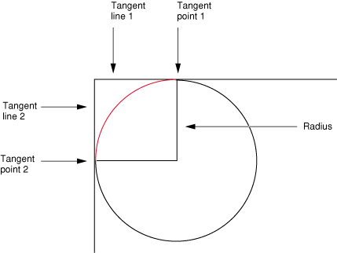
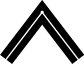
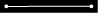

Quartz 2D Programming Guide
Apple Official Documentation

# Introduction #

Quartz 2D 是一个高级、轻量的二维绘图引擎。它不依赖于分辨率或设备。Quartz 2D 会尽量地使用图形硬件的性能。

Quartz 2D API 易于使用，提供了对透明图层、基于路径的绘图、offscreen rendering、高级色彩管理、抗锯齿、PDF 文档处理等强大功能。

Quartz 2D API 是 Core Graphics framework 的一部分，故有时候 Quartz 也被称为 Core Graphics, 或者 CG.

本文档适于 iOS 和 OS X 开发者。

# Overview of Quartz 2D #

在 OS X 中，Quartz 2D 可与所有其他图形图像技术协同工作—— Core Image, Core Video, OpenGL, QuickTime. 既可在 Quartz 中从 QuickTime 创建图像，也可把 Quartz 中的图像传递给 Core Image.

类似的，在 iOS 中 Quartz 2D 也可与所有其他可用的图形与动画技术一起工作，如 Core Animation, OpenGL ES, 及 UIKit. 

## The Page ##

Quartz 2D uses the **painter's model** for its imaging. In the painter's model, each successive drawing operation applies a layer of "paint" to an output "canvas", often called a **page**. The paint on the page can be modified by overlaying more paint through additional drawing operations. An object drawn on the page cannot be modified except by overlaying more paint. This model allows you to construct extremely sophisticated images from a small number of powerful primitives.

The page 既可以是一张真实的纸（若输出设备是打印机），也可以是一张虚拟的纸（若输出设备是 PDF 文件），也可以是一个位图。Page 的具体特征取决于你所使用的 graphics context.

在 painter's model 中，绘图的顺序是很重要的。

## Drawing Destinations: The Graphics Context ##

A graphics context is an opaque data type (CGContextRef), 它封装了 Quartz 用以把图像绘制到输出设备所使用的信息。Graphics context 中的信息包括图形绘制参数，and a device-specific representation of the paint on the page. Quartz 中的所有对象都被绘制到（或者说包含于）graphics context 中。

可把 graphics context 想像成 drawing destination, 使用 Quartz 绘图时，所有特定于设备的特性都包含在你所使用的那种 graphics context 中。也就是说，你可以使用同样的绘图例程把同一个图像绘制到不同的设备中，只需要提供不同的 graphics context 即可。Quartz 自会为你处理不同设备的差异。

程序可用的 graphics context 有：

- Bitmap graphics context. 允许把 RGB 色彩、 CMYK 色彩，或灰阶绘制到位图。位图是一个由像素构成的矩形数组（或曰 raster），每个像素表示图像中的一个点。位图图像也被称为取样图像 (sampled images).
- PDF graphics context. 允许创建 PDF 文件。In a PDF file, your drawing is preserved as a sequence of commands. PDF 文件与位置的一些重要区别：
    - PDF 文件可能包含多页；
    - 从 PDF 文件向其他设备绘图时，最终的图像会针对目标设备的显示特性作出优化；
    - PDF 文件与分辨率无关，它们可以以无限大或无限小的尺寸被绘制而不牺牲图像细节。
- Window graphics context. 可用以在窗口中绘图。注意 Quartz 2D 是一个图形引擎而不是一个窗口管理系统，所以你需要使用一个 application framework 来获得一个 window graphics context.
- A layer context (CGLayerRef) is an offscreen drawing destination associated with another graphics context. It is designed for optimal performance when drawing the layer to the graphics context that created it. A layer context can be a much better choice for offscreen drawing than a bitmap graphics context
- 在 OS X 中打印时，你要把内容发送给一个 PostScript graphics context, 后者由 printing framework 管理。

## Quartz 2D Opaque Data Types ##

除了 graphics context, Quartz 2D 还定义了许多 opaque 数据类型。由于 Quartz 2D API 是 Core Graphics framework 的一部分，故这些数据类型和操作这些数据类型的例程使用 CG 前缀。

The opaque data types available in Quartz 2D include the following:

- CGPathRef, used for vector graphics to create paths that you fill or stroke. See Paths.
- CGImageRef, used to represent bitmap images and bitmap image masks based on sample data that you supply. See Bitmap Images and Image Masks.
- CGLayerRef, used to represent a drawing layer that can be used for repeated drawing (such as for backgrounds or patterns) and for offscreen drawing. See Core Graphics Layer Drawing
- CGPatternRef, used for repeated drawing. See Patterns.
- CGShadingRef and CGGradientRef, used to paint gradients. See Gradients.
- CGFunctionRef, used to define callback functions that take an arbitrary number of floating-point arguments. You use this data type when you create gradients for a shading. See Gradients.
- CGColorRef and CGColorSpaceRef, used to inform Quartz how to interpret color. See Color and Color Spaces.
- CGImageSourceRef and CGImageDestinationRef, which you use to move data into and out of Quartz. See Data Management in Quartz 2D and Image I/O Programming Guide.
- CGFontRef, used to draw text. See Text.
- CGPDFDictionaryRef, CGPDFObjectRef, CGPDFPageRef, CGPDFStream, CGPDFStringRef, and CGPDFArrayRef, which provide access to PDF metadata. See PDF Document Creation, Viewing, and Transforming.
- CGPDFScannerRef and CGPDFContentStreamRef, which parse PDF metadata. See PDF Document Parsing.
- CGPSConverterRef, used to convert PostScript to PDF. It is not available in iOS. See PostScript Conversion.

## Graphics States ##

Quartz 根据当前 graphics state 中的参数 (parameters) 修改绘图操作的结果，graphics state 中的参数还会作为绘图例程的参数 (arguments)。向 graphics onctext 中绘图的例程会根据 graphics state 来决定怎样渲染自己的结果。如，调用函数修改填充色时，你就是在修改当前 graphics state 中的一个值。当前 graphics state 中其他常用的还包括线的宽度、当前位置，以及文字字体大小。

The graphics context contains a stack of graphics states. Quartz 创建一个 graphics context 时，该栈是空的；当你保存 graphics state 时 (CGContextSaveGState())，Quartz 把当前 graphics state 的一个副本推入栈；当你恢复 graphics state 时 (CGContextRestoreGState())，Quartz 把 graphics state 从栈顶弹出，当前的 graphics state 被弹出的 graphics state 替代。

不是当前绘图环境的所有方面都属于 graphics state, 如当前路径就不是 graphics state 的一部分，因此调用 CGContextSaveGState() 函数时也不会被保存进去。保存的 graphics state 参数包括：

- Current transformation matrix (CTM)
- Clipping area
- Line: width, join, cap, dash, miter limit
- Accuracy of curve estimation (flatness)
- Anti-aliasing setting
- Color: fill and stroke settings
- Alpha value (transparency)
- Rendering intent
- Color space: fill ans stroke settings
- Text: font, font size, character spacing, text drawing mode
- Blend mode

## Quartz 2D Coordinate Systems ##

在用户空间的坐标系统中指定图形的位置和大小。由于不同的设备有不同的底层成像能力（如分辨率不同），图形的位置和大小必须以设备无关的方式定义。

Quartz 通过一个独立的坐标系统——用户空间坐标系统——实现设备的独立性。用户空间坐标系统通过 CTM (current transformation matrix) 被映射到输出设备——设备空间坐标系统。矩阵是一个数学概念，用以高效地描述一系列相关的等式。CTM 是一种谓之 affine transform 的特殊矩阵，通过 translation, rotation, and scaling 操作把一个坐标空间中的点映射到另一个坐标空间，这些操作分别对应于坐标系统的 move, rotate and resize 计算。

CTM 还有另一个作用：It allows you to transform how objects are drawn. 如欲以 45 度角旋转后绘制一个框，可在绘图前把 CTM 旋转 45 度，这样 Quartz 就用旋转后的坐标系统绘制到输出设备上。

用户空间的一个点用一个坐标对 (x, y) 表示，原点是 (0, 0), 位于 page 的左下角。其他一些技术则把坐标系统原点放在了左上角：

- OS X 中 override isFlipped 方法并返回 YES 的 NSView 子类；
- iOS 中从 UIView 返回的 drawing context;
- iOS 中调用 UIGraphicsBeginImageContextWithOptions 函数创建的 drawing context.

The reason UIKit returns Quartz drawing contexts with modified coordinate systems is that UIKit uses a different default coordinate convention; it applies the transform to Quartz contexts it creates so that they match its conventions. If your application wants to use the same drawing routines to draw to both a UIView object and a PDF graphics context (which is created by Quartz and uses the default coordinate system), you need to apply a transform so that the PDF graphics context receives the same modified coordinate system. To do this, apply a transform that translates the origin to the upper-left corner of the PDF context and scales the y-coordinate by -1.

Using a scaling transform to negate the y-coordinate alters some conventions in Quartz drawing. For example, if you call CGContextDrawImage to draw an image into the context, the image is modified by the transform when it is drawn into the destination. Similarly, path drawing routines accept parameters that specify whether an arc is drawn in a clockwise or counterclockwise direction in the default coordinate system. If a coordinate system is modified, the result is also modified, as if the image were reflected in a mirror.

It is up to your application to adjust any Quartz calls it makes to a context that has a transform applied to it. For example, if you want an image or PDF to draw correctly into a graphics context, your application may need to temporarily adjust the CTM of the graphics context. In iOS, if you use a UIImage object to wrap a CGImage object you create, you do not need to modify the CTM. The UIImage object automatically compensates for the modified coordinate system applied by UIKit.

Important: The above discussion is essential to understand if you plan to write applications that directly target Quartz on iOS, but it is not sufficient. On iOS 3.2 and later, when UIKit creates a drawing context for your application, it also makes additional changes to the context to match the default UIKIt conventions. In particular, patterns and shadows, which are not affected by the CTM, are adjusted separately so that their conventions match UIKit’s coordinate system. In this case, there is no equivalent mechanism to the CTM that your application can use to change a context created by Quartz to match the behavior for a context provided by UIKit; your application must recognize the what kind of context it is drawing into and adjust its behavior to match the expectations of the context.

## Memory Management: Object Ownership ##
Quartz 使用 Core Foundation 的内存管理模型，in which objects are reference counted. 

以下是几条简单的规则：

- 如果你创建或复制了一个对象，那你就拥有了它，因此最终你必须释放它。即一般通过名字中含有 "Create" 或 "Copy" 的函数获得的对象，使用完后就必须释放，否则就会发生内存泄漏。
- 如果通过名字中不含 "Create" 或 "Copy" 的函数获得对象，你就不拥有该对象的引用，因此你一定不能释放它，而应由其拥有者释放。
- If you do not own an object and you need to keep it around, you must retain it and release it when you’re done with it. You use the Quartz 2D functions specific to an object to retain and release that object. For example, if you receive a reference to a CGColorspace object, you use the functions CGColorSpaceRetain and CGColorSpaceRelease to retain and release the object as needed. You can also use the Core Foundation functions CFRetain and CFRelease, but you must be careful not to pass NULL to these functions.

# Graphics Contexts #

A graphics context represents a drawing destination. 它包含绘图系统所需的绘图参数和所有特定于设备的信息。Graphics context 定义了基本的绘图属性 (attributes), 如绘图时所用的颜色、clipping area、线条宽度和样式、字体、compositing options 等。

You can obtain a graphics context by using Quartz context creation functions or by using higher-level functions provided by one of the Mac OS X frameworks or the UIKit framework in iOS.

## Drawing to a View Graphics Context is iOS ##

在 iOS 程序中向屏幕绘图，设定一个 UIView 对象并实现其 drawRect: 方法来执行绘图。View 的 drawRect: 方法在 view 显现在屏幕上或其内容需要更新时调用。调用该方法之前，view 对象会自动配置好其绘图环境，该配置的一部分就是为当前绘图环境创建一个 graphics context, 可在 drawRect: 方法内调用 CGContextRef context = UIGraphicsGetCurrentContext(); 函数以获得之。

UIkit 所用的默认坐标系统与 Quartz 的坐标系统不同，前者的原点在左上角。

## Creating a Window Graphis Context is OS X ##

在 OS X 中绘图时，需要根据所用的 framework 创建一个适当的 window graphics context. Quartz 2D API 自身未提供获得 window graphics context 的功能。Instead, you use the Cocoa framework to obtain a context for a window created in Cocoa.

You obtain a Quartz graphics context from within the drawRect: routine of a Cocoa application using the following line of code:

    CGContextRef myContext = [[NSGraphicsContext currentContext] graphicsPort];

The method currentContext returns the NSGraphicsContext instance of the current thread. The method graphicsPort returns the low-level, platform-specific graphics context represented by the receiver, which is a Quartz graphics context. (Don't get confused by the method names; they are historical.)

获得 graphics context 后，就可以在 Cocoa 程序中调用任何 Quartz 2D 绘图函数了，也可以混合 Quartz 2D 调用和 Cocoa 绘图调用。

## Creating a PDF Graphics Context ##

在 PDF graphics context 中绘图时，Quartz 把绘图记录成一系列 PDF 绘画命令并写入一个文件。

## Creating a Bitmap Graphics Context ##

Bitmap graphics context 接受一个指向一个内存缓冲区的指针，该内存缓冲区是位置的存储空间。在 bitmap graphics context 中绘图时，该缓冲区就被更新。释放 bitmap graphics context 时，就获得了一个完全更新了的位图。

Note: Bitmap graphics contexts are sometimes used for drawing offscreen. Before you decide to use a bitmap graphics context for this purpose, see Core Graphics Layer Drawing. CGLayer objects (CGLayerRef) are optimized for offscreen drawing because, whenever possible, Quartz caches layers on the video card.

** iOS 程序应使用 UIGraphicsBeginImageContextWithOptions 函数而不是这里讲的 low-level Quartz 函数。** 若你的程序使用 Quartz 创建一个 offscreen 位图，则 bitmap graphics context 所用的坐标系统就是 Quartz 默认的坐标系统。相反地，若你的程序调用 UIGraphicsBeginImageContextWithOptions 函数来创建一个 image context, UIKit 就会对该 context 的坐标系统施加与 UIView 的 graphics context 一样的 transformation. 这允许你的程序使用相同的绘图代码而不必担心坐标系统的不同。尽管你可以自己调整坐标系统来达到相同的效果，但这样做不会获得任何性能收益。

使用 CGBitmapContextCreate 函数来创建一个 bitmap graphics context.

### Supported Pixel Formats ###

### Anti-Aliasing ###

## Obtaining a Graphics Context for Printing ##

# Paths #

A path defines one or more shapes, or subpaths. Subpath 可包含直线、曲线，或二者兼有。Subpath 可以是开放的 (open), 也可以是闭合的 (closed). Subpath 可简单至线条、圆、矩形或星形，也可复杂至山峦的轮廓或抽象的涂鸦。

## Path Creation and Path Painting ##

创建路径和绘制路径是相独立的。首先是创建路径，待需要呈现之时，再请求 Quartz 将之绘出。绘制路径时，即可 stroke 之，亦可填充之，或二者兼有。也可使用路径将对其他对象的绘制限定在该路径的边界之内，实际上这是一个 **clipping area**.

## The Building Blocks ##

Subpath 是由线条、弧和曲线构成的，Quartz 还提供了增加矩形和椭圆的便利函数。点也是构成路径的基本元素，因为点定义形状的起点和终点。

### Points ###

点是由 x 和 y 坐标指定的用户空间的一个位置。调用 CGContextMoveToPoint 函数为一个新的 subpath 指定 **起点**。Quartz 会维护一个当前点 (**current point**), 这是构建路径过程中的最后位置。线条、弧和曲线总是从当前点开始绘制的。

多数情况下，点是通过两个浮点数表示的，分别表示 x 和 y 坐标，有时候是用 CGPoint 结构体表示的。

### Lines ###

线是由其终点定义的，其起点总被假定为当前点，故创建线条时仅需指定其终点即可。调用 CGContextAddLineToPoint 函数向 subpath 附加一条线。调用 void CGContextAddLines ( CGContextRef c, const CGPoint points[], size_t count ); 函数向当前路径添加一系列相互连起来的直线段，points 数组中的第一个点指定的是起始点，Quartz 从这里开始一个新的 subpath.

### Arcs ###

弧是圆周的片段。Quartz 提供了两个创建弧的函数：

- CGContextAddArc
- CGContextAddArcToPoint 尤适于创建矩形的圆角。

若当前路径已包含一个 subpath, 则 Quartz 附加一个从当前点到弧起点的直线段；若当前路径是空的，则 Quartz 在弧的起点处创建一个新 subpath 而不附加直线段。

### Curves ###

二阶和三阶贝塞尔曲线上的点是通过在起点和终点应用一个多项式计算出来的，另外还有若干个控制点。用这种方式定义的形状是矢量图的基础。多项式比一堆比特位存储起来更简洁，且可以任何分辨率重建。

CGContextAddCurveToPoint 从当前点附加一个三阶贝塞尔曲线。

CGContextAddQuadCurveToPoint 从当前点附加一个二阶贝塞尔曲线。

二阶贝塞尔曲线能创建的形状不如三阶贝塞尔曲线丰富，因为它只有一个控制点。

### Closing a Subpath ###

调用 CGContextClosePath 以关闭当前 subpath, 该函数从 subpath 的当前点到起点之前添加一条线段并关闭 subpath. 结束在 subpath 起点的线条、弧和曲线实际上并未关闭 subpath, 必须显式地调用 CGContextClosePath 以关闭之。

关闭 subpath 后，可继续向路径中添加线条、弧线及曲线，Quartz 从刚刚关闭的 subpath 的起点开始一个新的 subpath.

有些 Quartz 函数会把 subpath 视为（被你的程序）关闭的，就好像已调用了 CGContextClosePath 一样。

### Ellipses ###

椭圆是压扁了的圆。椭圆上的点到两个焦点的距离之和总是相等的。

调用 CGContextAddEllipseInRect 以向当前路径添加一个椭圆。参数中提供一个定义了椭圆边界的矩形。Quartz 使用一系列贝塞尔曲线近似计算椭圆。

The ellipse that is added to the path starts with a move-to operation and ends with a close-subpath operation, with all moves oriented in the **clockwise direction**.

### Rectangles ###

调用 CGContextAddRect 以向当前路径添加一个矩形；调用 CGContextAddRects 以添加多个矩形。

The rectangle that is added to the path starts with a move-to operation and ends with a close-subpath operation, with all moves oriented in the **counter-clockwise direction**.

## Creating a Path ##

欲在 graphics context 中构建路径：

1. 调用 CGContextBeginPath 函数以示意 (signal) Quartz. （开始新路径之前调用之）
1. 调用 CGContextMoveToPoint 函数以设定路径中第一个形状或 subpath 的起点 （线条、弧线和曲线从当前点开始绘制，空路径没有当前点）
1. 向路径中添加线条、弧线或曲线
1. 调用  CGContextClosePath 函数以关闭当前 subpath. 即使不显式地指定一个新起点，后续与路径相关的函数调用也用开始一个新的 subpath.

注意：

- 绘制弧线时，Quartz 会在当前点和弧的起点之间添加一条线。
- 添加椭圆或矩形的函数会在路径中添加新的闭合的 subpath.
- 必须调用 painting 函数以填充或 stroke 路径，因为创建路径只是定义了路径，而不会实际把路径绘制出来。

After you paint a path, it is flushed from the graphics context. 你可能不想那么轻易地失去所定义的路径，尤其是欲复用它时。为此，Quartz 提供了两个数据类型：

- CGPathRef
- CGMutablePathRef

You can call the function CGPathCreateMutable to create a mutable CGPath object to which you can add lines, arcs, curves, and rectangles. Quartz provides a set of CGPath functions that parallel the functions discussed in The Building Blocks. The path functions operate on a CGPath object instead of a graphics context. These functions are:

CGPathCreateMutable, which replacesCGContextBeginPath
CGPathMoveToPoint, which replaces CGContextMoveToPoint
CGPathAddLineToPoint, which replaces CGContextAddLineToPoint
CGPathAddCurveToPoint, which replaces CGContextAddCurveToPoint
CGPathAddEllipseInRect, which replaces CGContextAddEllipseInRect
CGPathAddArc, which replaces CGContextAddArc
CGPathAddRect, which replaces CGContextAddRect
CGPathCloseSubpath, which replaces CGContextClosePath
See Quartz 2D Reference Collection for a complete list of the path functions.

调用 CGContextAddPath 以把路径附加 (append) 到某个 graphics context, 该路径会一直存在于该 graphics context, 直到被 paint, 但你还可以再次调用 CGContextAddPath.

Note:  You can replace the path in a graphics context with the stroked version of the path by calling the function CGContextReplacePathWithStrokedPath.

## Painting a Path ##

怎样翻译呢：draw 绘制，paint 着色, stroke 描边？

You can paint the current path by stroking or filling or both:

- Stroking paints a line that straddles the path.
- Filling paints the area contained within the path.

Quartz 提供了对路径描边、填充、或二者兼具的函数。描边线的特征（宽度、颜色等）、填充色，以及用以计算填充区所用的方法，都是 graphics state 的一部分。

### Parameters That Affect Stroking ###

可通过修改以下参数来影响描边，它们都是 graphics state 的一部分：

- Line width: CGContextSetLineWidth, 指线的总体宽度，以用户空间的单位度量。此线跨在路径上，两边各一半宽。
- Line join: CGContextSetLineJoin, 指定怎样 draw 线段的交点。Quartz 支持以下线条交叉样式：
	- Miter join [Default]  延伸两个线段描边的外边缘，直到它们以某个角度相交；若这个角度太锐，就会变成 bevel join. 判断太锐的标准是 (miter length / line width > miter limit) 成立。
	- Round join  在端点处绘一个直径等于线宽的半圆弧，所形成的封闭区域被填充。
	- Bevel join  Quartz finishes the two segments with butt caps. The resulting notch beyond the ends of the segments is filled with a triangle.
- Line cap: CGContextSetLineCap, specifies the method used by CGContextStrokePath to draw the endpoint of the line. Quartz 支持以下 line cap 样式：
	- Butt cap [Default]  Quartz squares off the stroke at the endpoint of the path. There is no projection beyond the end of the path.
	- Round cap  Quartz draws a circle with a diameter equal to the line width around the point where the two segments meet, producing a rounded corner. The enclosed area is filled in.
	- Projecting square cap  Quartz extends the stroke beyond the endpoint of the path for a distance equal to half the line width. The extension is squared off.	
	
	A closed subpath treats the starting point as a junction between connected line segments; the starting point is rendered using the selected line-join method. In contrast, if you close the path by adding a line segment that connects to the starting point, both ends of the path are drawn using the selected line-cap method.
- Miter limit: CGContextSetMiterLimit
- Line dash pattern: CGContextSetLineDash, allows you to draw a segmented line along the stroked path.
- Stroke color space: CGContextSetStrokeColorSpace
- Stroke color: CGContextSetStrokeColorCGContextSetStrokeColorWithColor
- Stroke pattern: CGContextSetStrokePattern

### Stroking a Path ###

Quartz provides the functions shown below for stroking the current path. Some are convenience functions for stroking rectangles or ellipses.

- CGContextStrokePath: Strokes the current path.
- CGContextStrokeRect: Strokes the specified rectangle.
- CGContextStrokeRectWithWidth: Strokes the specified rectangle, using the specified line width.
- CGContextStrokeEllipseInRect: Strokes an ellipse that fits inside the specified rectangle.
- void CGContextStrokeLineSegments(CGContextRef c, const CGPoint points[], size_t count) Strokes a sequence of lines. points 参数指定的点是成对的，每一对指定一条线段的起点和终点。它相当于多次调用 CGContextMoveToPoint 和 CGContextAddLineToPoint.
- CGContextDrawPath: If you pass the constant kCGPathStroke, strokes the current path.

### Filling a Path ###

填充路径时，Quartz 把路径中的所有 subpath 都看作闭合的，然后计算哪些像素点需要填充。椭圆和矩形等简单路径有明确的区域，但若路径有重叠的部分、或路径包含多个 subpaths, 如同心圆，则有两个规则可用以计算填充区域：

- 默认的是 **nonzero winding number rule 非零环绕数规则**。首先定义路径的（绘制）方向。要判断某个点是否需要被着色，从该点画一条穿越图形边界的射线。环绕数初始值为 0，每遇到一个从左到右的路径段加 1，遇到一个从右到左的路径段则减 1. 最终结果是 0，则说明该点在图形外部而不需着色；若结果非 0，则说明该点在图形内部从而需要着色。用这种方法时，路径段的的绘制方向会影响判定结果。
- 另一个是 **even-odd rule 偶奇规则**。要判断某个点是否需要被着色，从该点画一条穿越图形边界的射线。统计该射线穿越的路径段的次数。若结果为偶数，则说明该点在图形外部而不需着色；若结果为奇数，则说明该点在图形内部从而需要着色。路径段的（绘制）方向不会影响判定结果。

Quartz 提供了以下函数来填充当前路径，有些是填充矩形或椭圆的便利函数：

- CGContextEOFillPath: 使用偶奇规则填充当前路径。
- CGContextFillPath: 使用非零环绕数规则填充当前路径。
- CGContextFillRect: 填充单个矩形。
- CGContextFillRects: 填充多个矩形。
- CGContextFillEllipseInRect: 填充一个椭圆。
- CGContextDrawPath: 若传入的参数是 kCGPathFill, 则使用非零环绕数规则填充当前路径；若传入的参数是 kCGPathEOFill, 则使用偶奇规则填充当前路径；若传入的参数是 kCGPathFillStroke 或 kCGPathEOFillStroke, 则填充当前路径并对其描边。

### Blend Modes ###

TBC...

## Cliping to a Path ##

The current clipping area is created from a path that serves as a mask, allowing you to block out the part of the page that you don’t want to paint. For example, if you have a very large bitmap image and want to show only a small portion of it, you could set the clipping area to display only the portion you want to show.

When you paint, Quartz renders paint only within the clipping area. Drawing that occurs inside the closed subpaths of the clipping area is visible; drawing that occurs outside the closed subpaths of the clipping area is not.

When the graphics context is initially created, the clipping area includes all of the paintable area of the context (for example, the media box of a PDF context). You alter the clipping area by setting the current path and then using a clipping function instead of a drawing function. The clipping function intersects the filled area of the current path with the existing clipping area. Thus, you can intersect the clipping area, shrinking the visible area of the picture, but you cannot increase the area of the clipping area.

The clipping area is part of the graphics state. To restore the clipping area to a previous state, you can save the graphics state before you clip, and restore the graphics state after you’re done with clipped drawing.

Listing 3-1 shows a code fragment that sets up a clipping area in the shape of a circle. This code causes drawing to be clipped, similar to what’s shown in Figure 3-3. (For another example, see Clip the Context in the chapter Gradients.)

    CGContextBeginPath (context);
    CGContextAddArc (context, w/2, h/2, ((w>h) ? h : w)/2, 0, 2*PI, 0);
    CGContextClosePath (context);
    CGContextClip (context);

Functions that clip the graphics context:

- CGContextClip: Uses the nonzero winding number rule to calculate the intersection of the current path with the current clipping path.
- CGContextEOClip: Uses the even-odd rule to calculate the intersection of the current path with the current clipping path.
- CGContextClipToRect: Sets the clipping area to the area that intersects both the current clipping path and the specified rectangle.
- CGContextClipToRects: Sets the clipping area to the area that intersects both the current clipping path and region within the specified rectangles.
- CGContextClipToMask: Maps a mask into the specified rectangle and intersects it with the current clipping area of the graphics context. Any subsequent path drawing you perform to the graphics context is clipped. (See Masking an Image by Clipping the Context.)

# Color and Color Spaces #

TBC

# Transforms #

transform, transformation 变换; affine transform 仿射变换

transition 过渡 转场

translation 平移

Quartz 2D 绘图模型定义了两个完全独立的坐标空间：

- User space, which represents the document page.
- Device space, which represents the native resolution of a device.

用户空间的坐标是与设备空间的像素密度无关的浮点数。要打印或显示文档时，Quartz 把用户空间坐标映射成设备空间坐标。因此你不必重写程序，或添加额外的代码以适应不同设备的输出。

可操纵 CTM (current transformation matrix) 来修改默认的用户空间。创建 graphics context 后，CTM 是一个单位矩阵 (identity matrix). 可使用 Quartz transformation 函数以修改 CTM，其结果是修改用户空间的绘图。

本章：

- 概述可用以执行 transformations 的函数；
- 展示如何修改 CTM;
- 描述如何创建 affine transform;
- 展示如何判定两个 transforms 是否相等；
- 描述如何获得用户空间到设备空间的 transform;
- 讨论 affine transforms 背后的数学。

## About Quartz Transformation Functions ##

使用 Quartz 2D 内置的变换函数，可轻松地 translate, scale 及 rotate 绘图。每个变换都会更新 CTM. CTM 总是表示用户空间到设备空间的当前映射，此映射保证了程序在任何显示器或打印机上的输出都完好。

The Quartz 2D API provides five functions that allow you to obtain and modify the CTM. You can rotate, translate, and scale the CTM, and you can concatenate an affine transformation matrix with the CTM. See Modifying the Current Transformation Matrix.

Quartz also allows you to create affine transforms that don’t operate on user space until you decide to apply the transform to the CTM. You use another set of functions to create affine transforms, which can then be concatenated with the CTM. See Creating Affine Transforms.

You can use either set of functions without understanding anything about matrix math. However if you want to understand what Quartz does when you call one of the transform functions, read The Math Behind the Matrices.

## Modifying the CTM ##

绘图前操纵 CTM 以旋转、缩放或平移 page, 这样会变换将要绘制的对象。变换 CTM 前最好保存 graphics state, 这样绘制完成后可将其恢复。也可把 CTM 与仿射变换拼接 (concatenate) 起来。

**执行多个变换时，不同的变换顺序可能导致不同的变换结果。**

平移 (translation) 移动坐标空间的原点。

    void CGContextTranslateCTM(CGContextRef c, CGFloat offsetX, CGFloat offsetY);

旋转 (rotation) 沿极坐标系中的角坐标移动指定的角度，角度以弧度为单位，正值表示逆时针旋转。

    void CGContextRotateCTM(CGContextRef c, CGFloat angle);

缩放 (scaling) 更改坐标空间的比例，这样就高效地拉伸或收缩了图像。若传入函数的 x 因子为负数，则可使坐标沿 x 轴翻转；类似地，若传入函数的 y 因子为负数，则可使坐标沿 y 轴翻转。（即负数导致坐标轴正方向反转）

    void CGContextScaleCTM(CGContextRef c, CGFloat factorX, CGFloat factorY);

Concatenation combines two matrices by multiplying them together. You can concatenate several matrices to form a single matrix that contains the cumulative effects of the matrices.

    void CGContextConcatCTM(CGContextRef c, CGAffineTransform transform);

Another way to achieve a cumulative effect is to perform two or more transformations without restoring the graphics state between transformation calls.

## Creating Affine Transforms ##

Quartz 中的仿射变换函数操作的是 matrices, 而不是 CTM. 用这些函数构建一个 matrix, 然后调用 CGContextConcatCTM 函数将其应用到 CTM. 

## Evaluating Affine Transforms ##

## Getting the User to Device Space Transform ##

## The Math behind the Matrices ##

# Patterns #

# Shadows #

# Gradients #

# Transparency Layers #

# Data Management in Quartz 2D #

# Bitmap Images and Image Masks #

# Core Graphics Layer Drawing #

# PDF Document Creation, Viewing, and Transforming #

# PDF Document Parsing #

# PostScript Conversion #

# Text #
