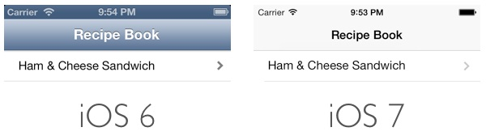
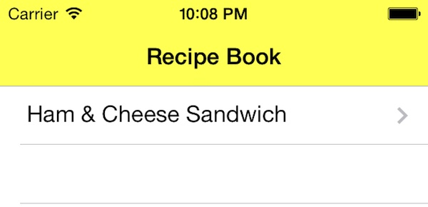
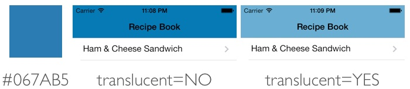
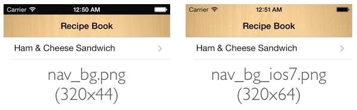

<title>Status Bar and Navigation Bar</title>

iOS 6 和 iOS 7 中默认的状态栏和导航栏。



# Status Bar #

iOS 7 之前只能调整状态栏的颜色，而 iOS 7 中的状态栏是透明的，故若不使用 UINavigationController, 则状态栏所占用的 20 点空间就可以被利用起来。

**注：我发现有 UINavigationController 存在时，`preferredStatusBarStyle` 和 `prefersStatusBarHidden` 等方法依然有效。**

## If a UINavigationController Presents ##

若 UINavigationController 存在，则 UINavigationBar 会被自动置于状态栏下方，状态栏的背景会被修改得与 UINavigationBar 相匹配：

- 状态栏将继承 UINavigationBar 的颜色和透明度；
- 状态栏的文字颜色和内容将根据 UINavigationBar.barStyle 而调整 `self.navigationController?.navigationBar.barStyle`

此时修改状态栏外观的唯一方式是修改 UINavigationBar.

## If a UINavigationController Does Not Present ##

未使用 UINavigationController 时状态栏就成为一个设计和开发的任务，因为你可以控制状态栏（Z 轴）之后的内容。

若程序针对的是 iOS 7+, 则处理起来较容易：在状态栏之后放置一个 20 点高的 view 即可，或者保持原样不动。还可修改状态栏的样式，目前仅有深色（默认）和浅色两种样式。

### Status Bar Style Entire App Wide ###

若要在整个程序范围内修改状态栏的样式，有两种方式：

- 表态方式，在 Info.plist 里把 `UIStatusBarStyle` 键的值设为 `UIStatusBarStyleLightContent` 或 `UIStatusBarStyleLightContent`.
- 动态方式，在 Info.plist 里把 `UIViewControllerBasedStatusBarAppearance` 键的值设为 `NO`, 调用 `UIApplication.sharedApplication().setStatusBarStyle(.LightContent, animated: true);` 或 `UIApplication.sharedApplication().statusBarStyle = .LightContent;`
Note: 一说该键的名字是 `View controller-based status bar appearance`.

### Status Bar Style Per View Controller ###

若要针对每个 view controller 修改状态栏的样式，请在 Info.plist 里把 `UIViewControllerBasedStatusBarAppearance` 键的值设为 `YES`, 调用

``` Swift
    override func preferredStatusBarStyle() -> UIStatusBarStyle {
        return .LightContent;
    }
```

info.plist 文件中，View controller-based status bar appearance 项设为 YES，则 view controller 对状态栏的设置优先级高于 application 的设置。为 NO 则以 application 的设置为准，view controller 的 prefersStatusBarHidden 方法无效，是根本不会被调用的。

## Hidden ##

隐藏状态栏，可 override view controller 的以下方法：

``` Swift
    override func prefersStatusBarHidden() -> Bool {
        return true;
    }
```

似乎还有一个全局的方式：`UIApplication.sharedApplication().setStatusBarHidden(true, withAnimation: .Fade);`

# Navigation Bar #

## Background Color ##

iOS 6 使用 `tintColor` 属性指定导航栏的背景色。iOS 7 使用 `barTintColor` 属性指定导航栏的背景色，使用 `tintColor` 指定 bar button items 的颜色。

``` Swift
// App Delegate, didFinishLaunchingWithOptions:
UINavigationBar.appearance().barTintColor = UIColor.yellowColor();
```

效果：



By default, the `translucent` property of navigation bar is set to `YES`. Additionally, there is a system blur applied to all navigation bars. Under this setting, iOS 7 tends to desaturate the color of the bar. Here are the sample navigation bars with different translucent setting.

注：在 Interface Builder 中选中 Navigation Bar 后可通过 Attributes Inspector 修改导航栏的 `translucent` 属性。




## Background Image ##

If your app uses a custom image as the background of the bar, you’ll need to provide a “taller” image so that it extends up behind the status bar. The height of navigation bar is changed from 44 points (88 pixels) to 64 points (128 pixels).
要为导航栏设置背景图，请使用一个略高的图像，这样它会向上延伸到状态栏的堆叠层次（Z 轴）之下，这样导航栏的高度也从 44 点增加到了 64 点（因为状态栏的高度是 20 点）。

``` Objective-C
[[UINavigationBar appearance] setBackgroundImage:[UIImage imageNamed:@"nav_bg.png"] forBarMetrics:UIBarMetricsDefault];
```



## Title ##

``` Swift
        var shadow = NSShadow();
        shadow.shadowColor = UIColor.lightGrayColor();
        shadow.shadowOffset = CGSizeMake(0, 1);
        UINavigationBar.appearance().titleTextAttributes = [
            NSForegroundColorAttributeName: UIColor.purpleColor(),
            NSShadowAttributeName: shadow];
```

赋给 `titleTextAttributes` 属性的字典中可包含以下 key:

- UITextAttributeFont – Key to the font
- UITextAttributeTextColor – Key to the text color
- UITextAttributeTextShadowColor – Key to the text shadow color
- UITextAttributeTextShadowOffset – Key to the offset used for the text shadow

注：还可在 Interface Builder 中选中 Navigation Bar 后可通过 Attributes Inspector 修改导航栏标题的这些属性。

还可以让标题显示为图片而不是文字：

```self.navigationItem.titleView = [[UIImageView alloc] initWithImage:[UIImage imageNamed:@"appcoda-logo.png"]];```

## The Back Button ##

修改返回按钮的文字颜色：

`UINavigationBar.appearance().tintColor = UIColor.whiteColor();`

上面已经说过，iOS 7 使用 `tintColor` 指定 bar button items 的颜色，故也影响到了返回按钮的颜色。

If you want to use a custom image to replace the default chevron (the default BACK shape), you also need to create a custom mask image. iOS 7 uses the mask to make the previous screen's title appear to emerge from—or disappear into—the chevron during navigation transitions. To learn about the properties that control the Back button and mask image, see UINavigationBar Class Reference.
 
iOS 7 默认的返回按钮是 "<" 形状，可将其替换为自定义的图像：

``` Objective-C
[[UINavigationBar appearance] setBackIndicatorImage:[UIImage imageNamed:@"back_btn.png"]];
[[UINavigationBar appearance] setBackIndicatorTransitionMaskImage:[UIImage imageNamed:@"back_btn.png"]];
```

## Multiple Bar Button Items ##

``` Swift
        self.navigationItem.rightBarButtonItems = [
            UIBarButtonItem(barButtonSystemItem: .Camera, target: self, action: nil),
            UIBarButtonItem(barButtonSystemItem: .Refresh, target: self, action: nil),
        ];
```

`leftBarButtonItems` 属性同理。

注意仅当有足够的空间时，这些 bar button items 才会显示出来。

# References #

[http://www.appcoda.com/customize-navigation-status-bar-ios-7/](http://www.appcoda.com/customize-navigation-status-bar-ios-7/)

http://possiblemobile.com/2013/09/developers-guide-to-the-ios-7-status-bar/

http://stackoverflow.com/questions/19063365/how-to-change-the-status-bar-background-color-and-text-color-on-ios-7