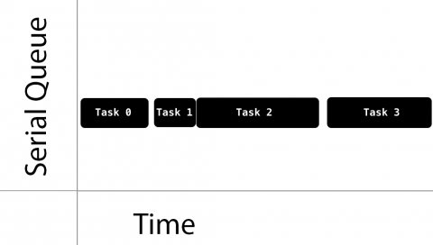
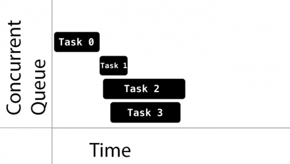
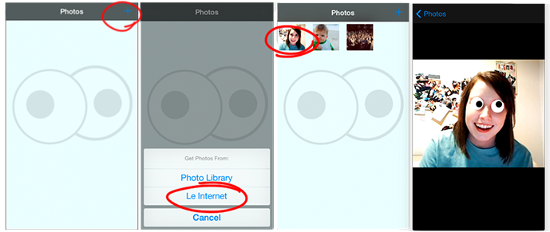
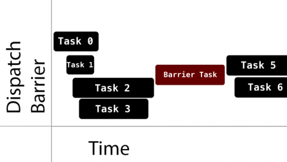
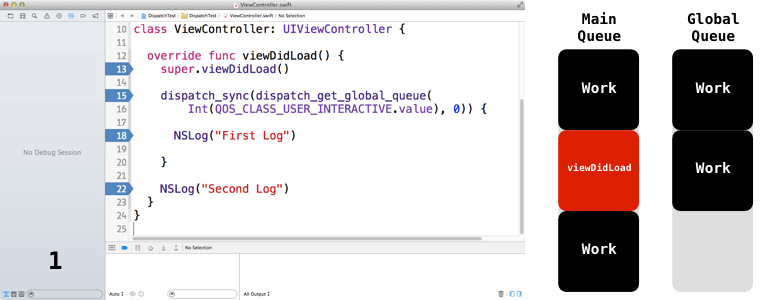
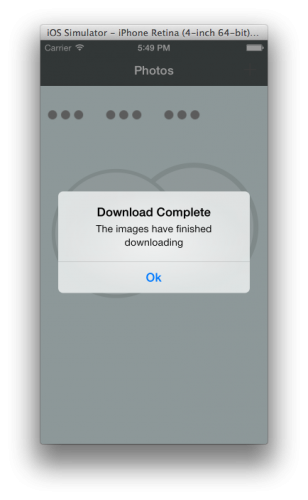
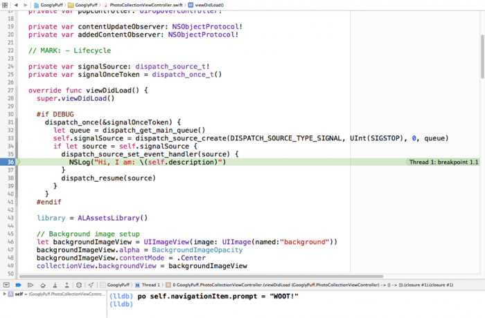
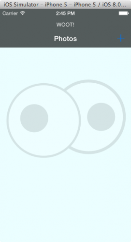

<title>Grand Central Dispatch Tutorial for Swift</title>

Source: [http://www.raywenderlich.com/79149/grand-central-dispatch-tutorial-swift-part-1](http://www.raywenderlich.com/79149/grand-central-dispatch-tutorial-swift-part-1 "http://www.raywenderlich.com/79149/grand-central-dispatch-tutorial-swift-part-1"), [http://www.raywenderlich.com/79150/grand-central-dispatch-tutorial-swift-part-2](http://www.raywenderlich.com/79150/grand-central-dispatch-tutorial-swift-part-2 "http://www.raywenderlich.com/79150/grand-central-dispatch-tutorial-swift-part-2")

Translation: [http://www.cocoachina.com/swift/20150129/11057.html](http://www.cocoachina.com/swift/20150129/11057.html "http://www.cocoachina.com/swift/20150129/11057.html"), [http://www.cocoachina.com/swift/20150130/11054.html](http://www.cocoachina.com/swift/20150130/11054.html)

Related: Learn about concurrency in this Grand Central Dispatch in-depth tutorial series.

## Getting Started ##

GCD is the marketing name for **libdispatch**, Apple’s library that provides support for concurrent code execution on multicore hardware on iOS and OS X. It offers the following benefits:

- GCD can improve your app’s responsiveness by helping you defer computationally expensive tasks and run them in the background.
- GCD provides an easier concurrency model than locks and threads and helps to avoid concurrency bugs.
- 通过推迟计算量大的任务并将其置于后台，从而提高程序的响应力。
- 提供了一个比锁和线程简单的并发模型，利于避免并发 bug.

To understand GCD, you need to be comfortable with several concepts related to threading and concurrency. These can be both vague and subtle, so take a moment to review them briefly in the context of GCD.

### Serial vs. Concurrent ###

These terms describe when tasks are executed with respect to each other. Tasks executed serially are always executed one at a time. Tasks executed concurrently might be executed at the same time.

### Tasks ###
For the purposes of this tutorial you can consider a task to be a closure. In fact, you can also use GCD with function pointers, but in most cases this is substantially more tricky to use. Closures are just easier!

在本教程是可认为任务是闭包。实际上也可在 GCD 中使用函数指针，但闭包更简单。

Don’t know what a closure is in Swift? Closures are self-contained, callable blocks of code that can be stored and passed around. When called, they behave like functions and can have parameters and return values. In addition a closure “captures” variables it uses from outside its own scope — that is, it sees the variables from the enclosing scope and remembers their value.

Swift closures are similar to Objective-C blocks and they are almost entirely interchangeable. Their only limitation is just that you cannot, from Objective-C, interact with Swift closures that expose Swift-only language features, like tuples. But interacting with Objective-C from Swift is unhindered, so whenever you read documentation that refers to an Objective-C block then you can safely substitute a Swift closure.

Swift 的闭包类似于 Objective-C 中的块，二者几乎可互换，但闭包可使用 Swift 语言特有的特性，如 tuple.

### Synchronous vs. Asynchronous ###

These terms describe when a function will return control to the caller, and how much work will have been done by that point.

同步和异步描述函数何时把控制权返回给调用者，以及返回时完成了多少工作。

A synchronous function returns only after the completion of a task that it orders.
An asynchronous function, on the other hand, returns immediately, ordering the task to be done but not waiting for it. Thus, an asynchronous function does not block the current thread of execution from proceeding on to the next function.

Be careful — when you read that a synchronous function “blocks” the current thread, or that the function is a “blocking” function or blocking operation, don’t get confused! The verb blocks describes how a function affects its own thread and has no connection to the noun block, which describes an anonymous function literal in Objective-C. Also keep in mind that whenever the GCD documentation refers to Objective-C blocks it is interchangeable with Swift closures.

### Critical Section ###

This is a piece of code that must not be executed concurrently, that is, from two threads at once. This is usually because the code manipulates a shared resource such as a variable that can become corrupt if it’s accessed by concurrent processes.

### Race Condition ###

This is a situation where the behavior of a software system depends on a specific sequence or timing of events that execute in an uncontrolled manner, such as the exact order of execution of the program’s concurrent tasks. Race conditions can produce unpredictable behavior that aren’t immediately evident through code inspection.

### Deadlock ###

Two (or sometimes more) items — in most cases, threads — are said to be deadlocked if they all get stuck waiting for each other to complete or perform another action. The first can’t finish because it’s waiting for the second to finish. But the second can’t finish because it’s waiting for the first to finish.

### Thread Safe ###

Thread safe code can be safely called from multiple threads or concurrent tasks without causing any problems (data corruption, crashing, etc). Code that is not thread safe must only be run in one context at a time. An example of thread safe code is let a = ["thread-safe"]. This array is read-only and you can use it from multiple threads at the same time without issue. On the other hand, an array declared with var a = ["thread-unsafe"] is mutable and can be modified. That means it’s not thread-safe since several threads can access and modify the array at the same time with unpredictable results. Variables and data structures that are mutable and not inherently thread-safe should only be accessed from one thread at a time.

线程安全的代码可在多个线程或并发任务中安全地调用，而不会引起任何问题（数据损坏、崩溃等）。非线程安全的代码在某一时刻只能运行在一个上下文中。线程安全的代码如 `let a = ["thread-safe"]`. 该数组是只读的，可在多个线程中同时使用它而不会引起问题。而 `var a = ["thread-unsafe"]` 定义的是可变数组，意味着它不是线程安全的，因为多个线程可以同时修改这个数组，导致不可知的结果。变量以及可变且固有非线程安全的数据结构，同一时刻只应在一个线程内访问。

### Context Switch ###

A context switch is the process of storing and restoring execution state when you switch between executing different threads on a single process. This process is quite common when writing multitasking apps, but comes at a cost of some additional overhead.

### Concurrency vs Parallelism ###

Separate parts of concurrent code can be executed “simultaneously”. However, it’s up to the system to decide how this happens — or if it happens at all.

Multi-core devices execute multiple threads at the same time via parallelism; however, in order for single-cored devices to achieve this, they must run a thread, perform a context switch, then run another thread or process. This usually happens quickly enough as to give the illusion of parallel execution as shown by the diagram below:

多核设备可通过并行在同一时刻执行多个线程；而单核设备只能通过上下文切换来执行多个线程或进程，上下文切换的速度很快，给人并行执行的假象。


Although you may write your code to use concurrent execution under GCD, it’s up to GCD to decide how much parallelism is required. Parallelism requires concurrency, but concurrency does not guarantee parallelism.

尽管可用 GCD 编写并发执行的代码，但由 GCD 决定着需要多大程序的并行。并行需要并发，而并发却不保证并行。

The deeper point here is that concurrency is actually about structure. When you code with GCD in mind, you structure your code to expose the pieces of work that can run simultaneously, as well as the ones that must not be run simulataneously. If you want to delve more deeply into this subject, check out this excellent talk by Rob Pike.

## Queues ##

GCD provides dispatch queues to handle submitted tasks; these queues manage the tasks you provide to GCD and execute those tasks in FIFO order. This guarantees that the first task added to the queue is the first task started in the queue, the second task added will be the second to start, and so on down the line.

GCD 提供了调度队列来处理提交的任务，它们管理你提交给 GCD 的任务并以 FIFO 的顺序执行之。

All dispatch queues are themselves thread-safe in that you can access them from multiple threads simultaneously. The benefits of GCD are apparent when you understand how dispatch queues provide thread-safety to parts of your own code. The key to this is to choose the right kind of dispatch queue and the right dispatching function to submit your work to the queue.

所有的调度队列自身都是线程安全的，可在多个线程中同时访问它们。理解了调度队列如何为你的代码提供线程安全性时，GCD 的优点就很明显了。关键是选择正确的调度队列和调度函数来提交你的任务。

### Serial Queues ###

Tasks in serial queues execute one at a time, each task starting only after the preceding task has finished. As well, you won’t know the amount of time between one task ending and the next one beginning, as shown in the diagram below:

一次只执行一个任务。你无法知道一个任务结束和下一个任务开始前会间隔多少时间。



The execution timing of these tasks is under the control of GCD; the only thing you’re guaranteed to know is that GCD executes only one task at a time and that it executes the tasks in the order they were added to the queue.

执行的时序由 GCD 控制，你只知道 GCD 一次只执行一个任务，顺序是 FIFO.

Since no two tasks in a serial queue can ever run concurrently, there is no risk they might access the same critical section at the same time; that protects the critical section from race conditions with respect to those tasks only. So if the only way to access that critical section is via a task submitted to that dispatch queue, then you can be sure that the critical section is safe.

串行队列中的任务不会同时访问同一个临界区，使该临界区不会遭受来自这些任务的竞态条件。

### Concurrent Queues ###

Tasks in concurrent queues are guaranteed to start in the order they were added… and that’s about all you’re guaranteed! Items can finish in any order and you have no knowledge of the time it will take for the next task to start, nor the number of tasks that are running at any given time. Again, this is entirely up to GCD.

并发队列中的任务也是以 FIFO 的顺序开始的，这是唯一可以保证的。任务结束的顺序不可预知，下一个任务开始的时间亦不可预知，某一时刻有多少个任务在运行亦不可知，这完全取决于 GCD.

The diagram below shows a sample task execution plan of four concurrent tasks under GCD:



Notice how Task 1, 2, and 3 all ran quickly, one after another, while it took a while for Task 1 to start after Task 0 started. Also, Task 3 started after Task 2 but finished first.

The decision of when to start a task is entirely up to GCD. If the execution time of one task overlaps with another, it’s up to GCD to determine if it should run on a different core, if one is available, or instead to perform a context switch to a different task.

Just to make things interesting, GCD provides you with at least five particular queues to choose from within each queue type.

### Queue Types ###

First, the system provides you with a special serial queue known as the main queue. Like any serial queue, tasks in this queue execute one at a time. However, it’s guaranteed that all tasks will execute on the main thread, which is the only thread allowed to update your UI. This queue is the one to use for sending messages to UIView objects or posting notifications.

系统提供了一个特殊的**串行**队列，即所谓的主队列，其中所有的任务都会在主线程中执行——主线程是唯一一个允许更新 UI 的线程。

The system also provides you with several concurrent queues. These queues are linked with their own Quality of Service (QoS) class. The QoS classes are meant to express the intent of the submitted task so that GCD can determine how to best prioritize it:

- QOS_CLASS_USER_INTERACTIVE: The user interactive class represents tasks that need to be done immediately in order to provide a nice user experience. Use it for UI updates, event handling and small workloads that require low latency. The total amount of work done in this class during the execution of your app should be small.
- QOS_CLASS_USER_INITIATED: The user initiated class represents tasks that are initiated from the UI and can be performed asynchronously. It should be used when the user is waiting for immediate results, and for tasks required to continue user interaction.
- QOS_CLASS_UTILITY: The utility class represents long-running tasks, typically with a user-visible progress indicator. Use it for computations, I/O, networking, continous data feeds and similar tasks. This class is designed to be energy efficient.
- QOS_CLASS_BACKGROUND: The background class represents tasks that the user is not directly aware of. Use it for prefetching, maintenance, and other tasks that don’t require user interaction and aren’t time-sensitive.

Be aware that Apple’s APIs also uses the global dispatch queues, so any tasks you add won’t be the only ones on these queues.

系统还提供了 4 个全局的**并发**队列，它们各自关联了一个 QoS 等级。QoS 等级表述任务的意图，以便 GCD 决定其优先级。
注意 Apple 的 API 也使用全局队列，因此这些队列中并非只有你提交的任务。

Finally, you can also create your own custom serial or concurrent queues. That means you have at least five queues at your disposal: the main queue, four global dispatch queues, plus any custom queues that you add to the mix!

还可以创建自定义的串行或并发队列。

And that’s the big picture of dispatch queues!

The “art” of GCD comes down to choosing the right queue dispatching function to submit your work to the queue. The best way to experience this is to work through the examples below, where we’ve provided some general recommendations along the way.

GCD 的“艺术”可归结为选择正确的队列调度函数来提交任务。

## Sample Project ##

Since the goal of this tutorial is to optimize as well as safely call code from different threads using GCD, you’ll start with an almost-finished project named GooglyPuff.

GooglyPuff is a non-optimized, threading-unsafe app that overlays googly eyes on detected faces using Core Image’s face detection API. For the base image you can select any from the Photo Library or from a set of predefined URL images downloaded from the internet.

[GooglyPuff_Swift_Start_1](http://cdn5.raywenderlich.com/wp-content/uploads/2015/01/GooglyPuff_Swift_Start_1_Xcode61.zip "GooglyPuff_Swift_Start_1")

Once you’ve downloaded the project, extract it to a convenient location, then open it up in Xcode and build and run. The app will look like the following:



Notice when you choose the Le Internet option to download pictures, a UIAlertController alert view pops up prematurely. You’ll fix this in the second part of this series.

There are four classes of interest in this project:

- PhotoCollectionViewController: This is the first view controller that starts the app. It showcases all the selected photos through their thumbnails.
- PhotoDetailViewController: This performs the logic to add googly eyes to the image and to display the resulting image in a UIScrollView.
- Photo: This is a protocol describing the properties of a photo. It provides an image, thumbnail and a status. Two classes are provided which implement the protocol: DownloadPhoto which instantiates photos from an instance of NSURL, and AssetPhoto which instantiates a photo from an instance of ALAsset.
- PhotoManager: This manages all the Photo objects.

### Handling Background Tasks with dispatch_sync ###

Head back to the app and add some photos from your Photo Library or use the Le Internet option to download a few.

Notice how long it takes for a new PhotoDetailViewController to instantiate after tapping on a UICollectionViewCell in the PhotoCollectionViewController; there’s a noticeable lag, especially when viewing large images on slower devices.

It’s easy to overload UIViewController’s `viewDidLoad` with too much clutter; this often results in longer waits before the view controller appears. If possible, it’s best to offload some work to be done in the background if it’s not absolutely essential at load time.

This sounds like a job for `dispatch_async`!

Open PhotoDetailViewController and replace viewDidLoad with the following implementation:

``` Swift
override func viewDidLoad() {
  super.viewDidLoad()
  assert(image != nil, "Image not set; required to use view controller")
  photoImageView.image = image
 
  // Resize if neccessary to ensure it's not pixelated
  if image.size.height <= photoImageView.bounds.size.height &&
     image.size.width <= photoImageView.bounds.size.width {
    photoImageView.contentMode = .Center
  }
 
  dispatch_async(dispatch_get_global_queue(Int(QOS_CLASS_USER_INITIATED.value), 0)) { // 1
    let overlayImage = self.faceOverlayImageFromImage(self.image)
    dispatch_async(dispatch_get_main_queue()) { // 2
      self.fadeInNewImage(overlayImage) // 3
    }
  }
}
```

Here’s what’s going on in the modified code above:

1. You first move the work off of the main thread and onto a global queue. Because this is a dispatch_async call, the closure is submitted asynchronously meaning that execution of the calling thread continues. This lets viewDidLoad finish earlier on the main thread and makes the loading feel more snappy. Meanwhile, the face detection processing is started and will finish at some later time.
1. At this point, the face detection processing is complete and you’ve generated a new image. Since you want to use this new image to update your UIImageView, you add a new closure to the main queue. Remember – you must always access UIKit classes on the main thread!
1. Finally, you update the UI with fadeInNewImage which performs a fade-in transition of the new googly eyes image.

Note that you’re using Swift’s trailing closure syntax, passing closures to dispatch_async by writing them after the parentheses that contain the earlier parameter specifying the dispatch queue. That syntax can be a little cleaner looking since the closure isn’t nested inside the function’s parentheses.

Build and run your app; select an image and you’ll notice that the view controller loads up noticeably faster and adds the googly eyes after a short delay. This lends a nice effect to the app as you show the before and after photo for maximum impact. As well, if you tried to load an insanely huge image, the app wouldn’t hang in the process of loading the view controller, which allows the app to scale well.

As mentioned above, dispatch_async appends a task in the form of a closure onto a queue and returns immediately. The task will then be executed at some later time as decided by GCD. Use dispatch_async when you need to perform a network-based or CPU intensive task in the background and not block the current thread.

Here’s a quick guide of how and when to use the various queue types with dispatch_async:

- Custom Serial Queue: A good choice when you want to perform background work serially and track it. This eliminates resource contention since you know only one task at a time is executing. Note that if you need the data from a method, you must inline another closure to retrieve it or consider using dispatch_sync.
- Main Queue (Serial): This is a common choice to update the UI after completing work in a task on a concurrent queue. To do this, you’ll code one closure inside another. As well, if you’re in the main queue and call dispatch_async targeting the main queue, you can guarantee that this new task will execute sometime after the current method finishes.
- Concurrent Queue: This is a common choice to perform non-UI work in the background.

### Helper Variables for Getting Global Queues ###

You may have noticed that the QoS class parameter for dispatch_get_global_queue is a bit cumbersome to write. This is due to qos_class_t being defined as a struct with a value property of type UInt32, which must be typecast to Int. Add some global computed helper variables to Utils.swift, below the URL variables, to make getting a global queue a bit easier:

``` Swift
var GlobalMainQueue: dispatch_queue_t {
  return dispatch_get_main_queue()
}
 
var GlobalUserInteractiveQueue: dispatch_queue_t {
  return dispatch_get_global_queue(Int(QOS_CLASS_USER_INTERACTIVE.value), 0)
}
 
var GlobalUserInitiatedQueue: dispatch_queue_t {
  return dispatch_get_global_queue(Int(QOS_CLASS_USER_INITIATED.value), 0)
}
 
var GlobalUtilityQueue: dispatch_queue_t {
  return dispatch_get_global_queue(Int(QOS_CLASS_UTILITY.value), 0)
}
 
var GlobalBackgroundQueue: dispatch_queue_t {
  return dispatch_get_global_queue(Int(QOS_CLASS_BACKGROUND.value), 0)
}
```

Go back to viewDidLoad in PhotoDetailViewController and replace dispatch_get_global_queue and dispatch_get_main_queue with the helper variables:

``` Swift
dispatch_async(GlobalUserInitiatedQueue) {
  let overlayImage = self.faceOverlayImageFromImage(self.image)
  dispatch_async(GlobalMainQueue) {
    self.fadeInNewImage(overlayImage)
  }
}
```

This makes the dispatch calls much more readable and easy to see which queues are in use.

### Delaying Work with dispatch_after ###

Consider the UX of your app for a moment. It’s possible that users might be confused about what to do when they open the app for the first time — were you? :]

It would be a good idea to display a prompt to the user if there aren’t any photos in the PhotoManager class. However, you also need to think about how the user’s eyes will navigate the home screen: if you display a prompt too quickly, they might miss it as their eyes lingered on other parts of the view.

A one-second delay before displaying the prompt should be enough to catch the user’s attention as they get their first look at the app.

Add the following code to the stubbed-out implementation of showOrHideNavPrompt in PhotoCollectionViewController.swift, near the bottom of the file:

``` Swift
func showOrHideNavPrompt() {
  let delayInSeconds = 1.0
  let popTime = dispatch_time(DISPATCH_TIME_NOW,
                              Int64(delayInSeconds * Double(NSEC_PER_SEC))) // 1
  dispatch_after(popTime, GlobalMainQueue) { // 2
    let count = PhotoManager.sharedManager.photos.count
    if count > 0 {
      self.navigationItem.prompt = nil
    } else {
      self.navigationItem.prompt = "Add photos with faces to Googlyify them!"
    }
  }
}
```

showOrHideNavPrompt executes in `viewDidLoad` and anytime your UICollectionView is reloaded. Taking each numbered comment in turn:

1. You declare the variable that specifies the amount of time to delay.
1. You then wait for the amount of time given in the delayInSeconds variable and then asynchronously add the closure to the main queue.

Build and run the app. There should be a slight delay, which will hopefully grab the user’s attention and show them what to do.

`dispatch_after` works just like a delayed `dispatch_async`. You still have no control over the actual time of execution nor can you cancel this once `dispatch_after` returns.

Wondering when it’s appropriate to use `dispatch_after`?

- Custom Serial Queue: Use caution when using dispatch_after on a custom serial queue. You’re better off sticking to the main queue.
- Main Queue (Serial): This is a good choice for dispatch_after; Xcode has a nice autocomplete template for this.
- Concurrent Queue: Use caution when using dispatch_after on custom concurrent queues; it’s rare that you’ll do this. Stick to the main queue for these operations.

### Singletons and Thread Safety ###

Singletons. Love them or hate them, they’re as popular in iOS as cats are on the web. :]
One frequent concern with singletons is that often they’re not thread safe. This concern is well-justified given their use: singletons are often used from multiple controllers accessing the singleton instance at the same time. The PhotoManager class is a singleton, so you will need to consider this issue.

单例通常不是线程安全的，比如多个控制器同时访问一个单例。

There are two cases to consider, thread-safety during initialization of the singleton instance and during reads and writes to the instance.

有两种情形需要考虑，在单例初始化过程中和被读写过程中的线程安全性。

Let us consider initialization first. This turns out to be the easy case, because of how Swift initializes variables at global scope. In Swift, global variables are initialized when they are first accessed, and they are guaranteed to be initialized in an atomic fashion. That is, the code performing initialization is treated as a critical section and is guaranteed to complete before any other thread gets access to the global variable. How does Swift do this for us? Behind the scenes, Swift itself is using GCD, by using the function dispatch_once, as discussed in this Swift Blog post.

首先说初始化。由于 Swift 在全局作用域内初始化变量的方式，这是较简单的情形。Swift 中的全局变量在其首次使用时被初始化，且保证以原子方式初始化，即执行初始化的代码被视为临界区。在幕后，Swift 是使用 GCD 中的 `dispatch_once` 实现这一点的。详见[该博文](http://https://developer.apple.com/swift/blog/?id=7)。

dispatch_once executes a closure once and only once in a thread safe manner. If one thread is in the middle of executing the critical section — the task passed to dispatch_once — then other threads will just block until it completes. And once it does it complete, then those threads and other threads will not execute the section at all. And by defining the singleton as a global constant with let, we can further guarantee the variable will never be changed after initialization. In a sense, all Swift global constants are naturally born as singletons, with thread-safe initialization.

`dispatch_once` 以线程安全的方式执行且仅执行一次闭包。若一个线程正在临界区内执行——即传递给 `dispatch_once` 的任务——此时其他的线程将会阻塞，直到它完成，这样其他线程就不会再执行这一临界区了。通过 let 把单例定义为全局常量，可进一步保证变量在初始化后不会被修改。从某种意义上说，所有的 Swift 全局常量天生都是单例，且以线程安全的方式初始化。

But we still need to consider reads and writes. While Swift uses dispatch_once to ensure that we are initializing the singleton in a thread-safe manner, it does not make the data type it represents thread safe. For example if the global variable is an instance of a class, you could still have critical sections within the class that manipulate internal data. Those would need to be made thread safe in other ways, such as by synchronizing access to the data, as you’ll see in the following sections.

但还需考虑读和写。尽管 Swift 使用 `dispatch_once` 保证单例以线程安全的方式初始化，但这不能保证它所表示的数据类型也是线程安全的。如全局变量是一个类实例，在类中仍可以有操纵内部数据的临界区。这就需要用其他方式来达到线程安全了，such as by synchronizing access to the data.

### Handling the Readers and Writers Problem ###

Thread-safe instantiation is not the only issue when dealing with singletons. If a singleton property represents a mutable object, like the photos array in PhotoManager, then you need to consider whether that object is itself thread-safe.

实例化线程安全性不是单例的唯一问题。若单例属性表示的是可变 (mutable) 对象，那就要考虑该对象自身是否是线程安全的。

In Swift any variable declared with the let keyword is considered a constant and is read-only and thread-safe. Declare the variable with the var keyword however, and it becomes mutable and not thread-safe unless the data type is designed to be so. The Swift collection types like Array and Dictionary are not thread-safe when declared mutable. What about Foundation containers like NSArray? Are they thread safe? The answer is — “probably not”! Apple maintains a helpful list of the numerous Foundation classes which are not thread-safe.

Swift 中用 let 关键字声明的是常量，也是只读和线程安全的；用 var 声明的是可变的，不是线程安全的——除非该数据类型被设计成线程安全的。数据和字典等集合类型，被声明为可变时，就不是线程安全的。那么 Foundation 中如 NSArray 之类的容器呢？它们是线程安全的吗？——或许不是。Apple 维护了一个 Foundation 类的列表[列表](http://https://developer.apple.com/library/mac/documentation/Cocoa/Conceptual/Multithreading/ThreadSafetySummary/ThreadSafetySummary.html)，其中的类不是线程安全。

Although many threads can read a mutable instance of Array simultaneously without issue, it’s not safe to let one thread modify the array while another is reading it. Your singleton doesn’t prevent this condition from happening in its current state. To see the problem, have a look at addPhoto in PhotoManager.swift, which has been reproduced below:

多个线程可以同时读取可变对象而不引起问题，但不能同时既读又写。目前你的单例尚不能阻止后一种情况的发生：

``` Swift
func addPhoto(photo: Photo) {
    _photos.append(photo)
    dispatch_async(dispatch_get_main_queue()) {
        self.postContentAddedNotification()
    }
}
```

This is a **write** method as it modifies a mutable array object. Now take a look at the photos property, reproduced below:

``` Swift
private var _photos: [Photo] = []
var photos: [Photo] {
  return _photos
}
```

The getter for this property is termed a read method as it’s reading the mutable array. The caller gets a copy of the array and is protected against mutating the original array inappropriately, but none of this provides any protection against one thread calling the write method addPhoto while simultaneously another thread calls the getter for the photos property.

该属性的 getter 是一个读方法，因为它在读取一个可变数组。调用者获得的是数组的副本，且被防止误修改原数组，但这还不能防止一个线程调用写方法 addPhoto, 同时另一个线程调用该 getter 方法。

Note: In the code above, why does the caller get a copy of the photos array? In Swift parameters and return types of functions are either passed by reference or by value. Passing by reference is the same as passing a pointer in Objective-C, which means you get access to the original object and any changes to it will be seen by any other parts of the code holding a reference to the same object. Passing by value results in a copy of the object, and changes to the copy will not affect the original. By default in Swift class instances are passed by reference and structs by value.

Swift's built-in data types, like Array and Dictionary, are implemented as structs, and as a result there will seemingly be a lot of copying in your code when passing collections back and forth. Don’t worry about the memory usage implications of this. The Swift collection types are optimized to only make copies when necessary, for instance when an array passed by value is modified for the first time after being passed.

This is the classic software development Readers-Writers Problem. GCD provides an elegant solution of creating a read/write lock using dispatch barriers.

这是一个典型的[读者-写者问题](http://en.wikipedia.org/wiki/Readers%E2%80%93writers_problem "维基百科，读者-写者问题")。GCD 使用调度屏障 (dispatch barrier) 提供了一个优雅的解决方法来创建读/写锁。

Dispatch barriers are a group of functions acting as a serial-style bottleneck when working with concurrent queues. Using GCD’s barrier API ensures that the submitted closure is the only item executed on the specified queue for that particular time. This means that all items submitted to the queue prior to the dispatch barrier must complete before the closure will execute.

When the closure's turn arrives, the barrier executes the closure and ensures that the queue does not execute any other closures during that time. Once finished, the queue returns to its default implementation. GCD provides both synchronous and asynchronous barrier functions.

当轮到闭包时，屏幕执行该闭包并确保在此期间队列不会执行其他任何任务。一旦闭包完成，队列又恢复到其默认实现方式。GCD 提供了同步和异步屏幕函数。

The diagram below illustrates the effect of barrier functions on various asynchronous tasks:



Notice how in normal operation the queue acts just like a normal concurrent queue. But when the barrier is executing, it essentially acts like a serial queue. That is, the barrier is the only thing executing. After the barrier finishes, the queue goes back to being a normal concurrent queue.

没有屏幕时是一个正常的并发队列，而屏幕执行时实质上就相当于串行队列。一旦屏幕完成，又恢复成正常的并发队列。

Here’s when you would — and wouldn’t — use barrier functions:

- Custom Serial Queue: A bad choice here; barriers won’t do anything helpful since a serial queue executes one operation at a time anyway.
- Global Concurrent Queue: Use caution here; this probably isn’t the best idea since other systems might be using the queues and you don’t want to monopolize them for your own purposes.
- Custom Concurrent Queue: This is a great choice for atomic or critical areas of code. Anything you’re setting or instantiating that needs to be thread safe is a great candidate for a barrier.

何时使用/不使用屏障函数：

自定义的串行队列：糟糕的选择。屏幕不会有任务帮助，因为串行队列本来就一次只执行一个任务。
全局的并发队列：慎用，因为系统也在使用这个队列，你不应该自私地把这些队列据为己有。
自定义的串行队列：原子操作和临界区的绝佳选择。

Since the only decent choice above is the custom concurrent queue, you’ll need to create one of your own to handle your barrier function and separate the read and write functions. The concurrent queue will allow multiple read operations simultaneously.

Open PhotoManager.swift and add the following private property to the class, below the photos property:

``` Swift
private let concurrentPhotoQueue = dispatch_queue_create(
    "com.raywenderlich.GooglyPuff.photoQueue", DISPATCH_QUEUE_CONCURRENT)
```

This initializes `concurrentPhotoQueue` as a concurrent queue using `dispatch_queue_create`. The first parameter is a reversed DNS style naming convention; make sure it’s descriptive since this can be helpful when debugging. The second parameter specifies whether you want your queue to be serial or concurrent.

Note: When searching for examples on the web, you’ll often see people pass 0 or NULL as the second parameter of dispatch_queue_create. This is a dated way of creating a serial dispatch queue; it’s always better to be specific with your parameters.

Find addPhoto and replace it with the following implementation:

``` Swift
func addPhoto(photo: Photo) {
  dispatch_barrier_async(concurrentPhotoQueue) { // 1
    self._photos.append(photo) // 2
    dispatch_async(GlobalMainQueue) { // 3
      self.postContentAddedNotification()
    }
  }
}
```

Here’s how your new write function works:

1. Add the write operation using your custom queue. When the critical section executes at a later time this will be the only item in your queue to execute.
1. This is the actual code which adds the object to the array. Since it’s a barrier closure, this closure will never run simultaneously with any other closure in `concurrentPhotoQueue`.
1. Finally you post a notification that you’ve added the image. This notification should be posted from the main thread because it will do UI work, so here you dispatch another task asynchronously to the main queue for the notification.
1. 这是实际更新数组的代码。因于这是一个屏幕闭包，它永远不会与同队列中的其他任务同时运行。
1. 把写操作加入自定义的队列。稍后临界区执行时，这将是队列中唯一得以执行的任务。
1. 发出一个通知，已经增加了一个图像。该通知应从主线程中发出，因为它涉及 UI, 因此把该通知异步地加到主队列中。 

This takes care of the write, but you also need to implement the photos read method.

写操作打理完了，但还需要实现读操作。

To ensure thread safety with the writer side of matters, you need to perform the read on the concurrentPhotoQueue queue. You need to return from the function though, so you can’t dispatch asynchronously to the queue because that wouldn’t necessarily run before the reader function returns. In this case, dispatch_sync would be an excellent candidate.

为与写操作端保持线程安全，需要也在 `concurrentPhotoQueue` 队列中执行读操作（译注：这是为什么？）。不过既然要从函数中返回数据，那就不能异步地分派这个写操作，因为异步任务不能保证函数返回时能够为调用者返回数据。于是 `dispatch_sync` 就成了不二之选。

`dispatch_sync` synchronously submits work and waits for it to be completed before returning. Use `dispatch_sync` to keep track of your work with dispatch barriers, or when you need to wait for the operation to finish before you can use the data processed by the closure.

You need to be careful though. Imagine if you call `dispatch_sync` and target the current queue you’re already running on. This will result in a deadlock because the call will wait to until the closure finishes, but the closure can’t finish (it can’t even start!) until the currently executing closure is finished, which can’t! This should force you to be conscious of which queue you’re calling from — as well as which queue you’re passing in.

仍需小心。假设你正运行在 A 队列中，却又调用了 `dispatch_sync` 并将任务 taskA 提交给 A 队列，这将导致死锁，因为 `dispatch_sync` 调用将一直等待，直到 taskA 完成。但 taskA 不能完成，它甚至不会启动，因为当前闭包里的任务还未完成。

Here's a quick overview of when and where to use `dispatch_sync`:

- Custom Serial Queue: Be VERY careful in this situation; if you’re running in a queue and call `dispatch_sync` targeting the same queue, you will definitely create a deadlock.
- Main Queue (Serial): Be VERY careful for the same reasons as above; this situation also has potential for a deadlock condition.
- Concurrent Queue: This is a good candidate to sync work through dispatch barriers or when waiting for a task to complete so you can perform further processing.

Still working in PhotoManager.swift, replace the photos property with the following implementation:

``` Swift
var photos: [Photo] {
  var photosCopy: [Photo]!
  dispatch_sync(concurrentPhotoQueue) { // 1
    photosCopy = self._photos // 2
  }
  return photosCopy
}
```

Taking each numbered comment in turn, you’ll find the following:

1. Dispatch synchronously onto the concurrentPhotoQueue to perform the read.
1. Store a copy of the photo array in photosCopy and return it.

Congratulations — your PhotoManager singleton is now thread safe. No matter where or how you read or write photos, you can be confident that it will be done in a safe manner with no surprises.

## A Visual Review of Queueing ##

Still not 100% sure on the essentials of GCD? Make sure you’re comfortable with the basics by creating simple examples yourself using GCD functions using breakpoints and NSLog statements to make sure you understand what is happening.

I’ve provided two animated GIFs below to help cement your understanding of dispatch_async and dispatch_sync. The code is included above each GIF as a visual aid; pay attention to each step of the GIF showing the breakpoint in the code on the left and the related queue state on the right.

### dispatch_sync Revisited ###

``` Swift
override func viewDidLoad() {
  super.viewDidLoad()
 
  dispatch_sync(dispatch_get_global_queue(
      Int(QOS_CLASS_USER_INTERACTIVE.value), 0)) {
     NSLog("First Log")
   } 
  NSLog("Second Log")
}
```



Here’s your guide to the various states of the diagram:

1. The main queue chugs along executing tasks in order — up next is a task to instantiate UIViewController which includes viewDidLoad.
1. viewDidLoad executes on the main thread.
1. The dispatch_sync closure is added to a global queue and will execute at a later time. Processes are halted on the main thread until the closure completes. Meanwhile, the global queue is concurrently processing tasks; recall that closures will be dequeued in FIFO order on a global queue but can be executed concurrently. The global queue processes the tasks that were already present on the queue before the dispatch_sync closure was added.
1. Finally, the dispatch_sync closure has its turn.
1. The closure is done so the tasks on the main thread can resume.
1. viewDidLoad method is done, and the main queue carries on processing other tasks.

dispatch_sync adds a task to a queue and waits until that task completes. dispatch_async does the exact same thing, but the only exception is that it doesn’t wait for the task to complete before proceeding onwards from the calling thread.

### dispatch_async Revisited ###

``` Swift
    override func viewDidLoad() {
      super.viewDidLoad()     
      dispatch_async(dispatch_get_global_queue(
      Int(QOS_CLASS_USER_INTERACTIVE.value), 0)) { 
    NSLog("First Log") 
      } 
      NSLog("Second Log")
    }
```


1. The main queue chugs along executing tasks in order — up next is a task to instantiate UIViewController which includes viewDidLoad.
1. viewDidLoad executes on the main thread.
1. The dispatch_async closure is added to a global queue and will execute at a later time.
1. viewDidLoad continues to move on after adding dispatch_async to the global queue and the main thread turns its attention to the remaining tasks. Meanwhile, the global queue is concurrently processing its outstanding tasks. Remember that closures will be dequeued in a FIFO order on a global queue but can be executed concurrently.
1. The closure added by dispatch_async is now executing.
1. The dispatch_async closure is done and both NSLog statements have placed their output on the console.

In this particular instance, the second NSLog statement executes, followed by the first NSLog statement. This isn’t always the case — it’s dependent on what the hardware is doing at that given time, and you have no control nor knowledge as to which statement will execute first. The “first” NSLog could be the first log to execute in some invocations.

## Where to Go from Here? ##

In this tutorial, you learned how to make your code thread safe and how to maintain the responsiveness of the main thread while performing CPU intensive tasks.

You can download the GooglyPuff Project which contains all the improvements made in this tutorial so far. In the second part of this tutorial you’ll continue to improve upon this project.

If you plan on optimizing your own apps, you really should be profiling your work with the Time Profile template in Instruments. Using this utility is outside the scope of this tutorial, so check out How to Use Instruments for a excellent overview.

Also make sure that you profile with an actual device, since testing on the Simulator can give very different results that are different from what your users will experience.

In the next part of this tutorial you’ll dive even deeper into GCD’s API to do even more cool stuff.

If you have any questions or comments, feel free to join the discussion below!

## Correcting the Premature Popup ##

You may have noticed that when you try to add photos with the **Le Internet** option, an alert view pops up well before the images have finished downloading, as shown in the screenshot below:



The fault lies with PhotoManager’s `downloadPhotosWithCompletion` which has been reproduced below:

``` Swift

	func downloadPhotosWithCompletion(completion: BatchPhotoDownloadingCompletionClosure?) {
	  var storedError: NSError!
	  for address in [OverlyAttachedGirlfriendURLString,
	                  SuccessKidURLString,
	                  LotsOfFacesURLString] {
	    let url = NSURL(string: address)
	    let photo = DownloadPhoto(url: url!) {
	      image, error in
	      if error != nil {
	        storedError = error
	      }
	    }
	    PhotoManager.sharedManager.addPhoto(photo)
	  }
	 
	  if let completion = completion {
	    completion(error: storedError)
	  }
	}

```

Here you call the completion closure at the end of the method — you’re assuming all of the photo downloads have completed. But unfortunately, there’s no guarantee that all the downloads have finished by this point.

这里在方法的最后调用completion闭包——你会想当然地认为所有图片都下载完了。但不幸的是，此时尚无法保证。

The `DownloadPhoto` class’s instantiation method starts downloading a file from a URL and returns immediately before the download completes. In other words, `downloadPhotosWithCompletion` calls its own completion closure at the end, as if its own method body were all straight-line synchronous code and every method call that completed had finished its work. However, `DownloadPhoto(url:)` is asynchronous and returns immediately — so this approach won’t work. Instead, `downloadPhotosWithCompletion` should call its own completion closure only after all the image download tasks have called their own completion closures.

`DownloadPhoto` 类的实例化方法从一个URL下载图片并且不等下载完成就立即返回。换言之，`downloadPhotosWithCompletion` 在最后调用completion 闭包，像是假定它自己的方法体中都是顺序、同步的代码，并且每个方法调用后都完成了其中的工作。但 `DownloadPhoto(url:)` 是异步的，它会立即返回。所以这种方式无效。`downloadPhotosWithCompletion` 应该在所有图片下载任务都调用了各自的 completion 闭包后，才调用自己的 completion 闭包。

The question is: how do you monitor concurrent asynchronous events? You don’t know when they will complete, and they can finish in any order. Perhaps you could write some hacky code that uses multiple Bool values to keep track of each download, but that doesn’t scale well, and frankly, it makes for pretty ugly code. Fortunately, this type of multiple asynchronous completion monitoring is exactly what **dispatch groups** were designed for.

问题是：你怎么监视并发的异步事件？你无从知道它们何时完成，况且它们可以以任何顺序完成。也许你可以用多个 `Bool` 值来追踪各个下载任务，但这不易于扩展，而且坦白讲，它会使代码变得很丑。还好 **dispatch groups** 就是专为监视多个异步任务的完成情况而设计的。

### Dispatch Groups ###

Dispatch groups notify you when an entire group of tasks completes. These tasks can be either asynchronous or synchronous and can even be tracked from different queues. Dispatch groups also notify you in synchronous or asynchronous fashion when all of the group’s events are complete. Since items are being tracked on different queues, an instance of `dispatch_group_t` keeps track of the different tasks in the queues.

调度组在一组任务都完成后通知你，这些任务既可以是异步的，也可以是同步的，你甚至可以在不同的队列跟踪它们。组中的事件完成时，调度组也以同步或异步的方式通知你。因为任务在不同的队列中，`disptch_group_t` 实例用来追踪队列中的不同任务。

The GCD API provides 2 ways to be notified when all events in the group have completed.

The first one, `dispatch_group_wait`, is a function that blocks your current thread and waits until either all the tasks in the group have completed, or until a timeout occurs. This is exactly what you want in this case.

第一种是 `dispatch_group_wait` 函数，它会阻塞当前进程，直到组中所有任务都完成或等待超时。这正是我们的例子中需要的方式。

Open PhotoManager.swift and replace `downloadPhotosWithCompletion` with the following implementation:

``` Swift
func downloadPhotosWithCompletion(completion: BatchPhotoDownloadingCompletionClosure?) {
  dispatch_async(GlobalUserInitiatedQueue) { // 1
    var storedError: NSError!
    var downloadGroup = dispatch_group_create() // 2
 
    for address in [OverlyAttachedGirlfriendURLString,
                    SuccessKidURLString,
                    LotsOfFacesURLString] {
      let url = NSURL(string: address)
      dispatch_group_enter(downloadGroup) // 3
      let photo = DownloadPhoto(url: url!) {
        image, error in
        if let error = error {
          storedError = error
        }
        dispatch_group_leave(downloadGroup) // 4
      }
      PhotoManager.sharedManager.addPhoto(photo)
    }
 
    dispatch_group_wait(downloadGroup, DISPATCH_TIME_FOREVER) // 5
    dispatch_async(GlobalMainQueue) { // 6
      if let completion = completion { // 7
        completion(error: storedError)
      }
    }
  }
}
```

Taking each numbered comment in turn, you’ll see the following:

1. Since you’re using the synchronous `dispatch_group_wait` which blocks the current thread, you use `dispatch_async` to place the entire method into a background queue to ensure you don’t block the main thread.
1. This creates a new dispatch group which behaves somewhat like a counter of the number of uncompleted tasks.
1. dispatch_group_enter manually notifies a group that a task has started. You must balance out the number of dispatch_group_enter calls with the number of dispatch_group_leave calls or else your app will crash.
1. Here you manually notify the group that this work is done. Again, you’re balancing all group enters with an equal amount of group leaves.
1. dispatch_group_wait waits until either all of the tasks are complete or until the time expires. If the time expires before all events complete, the function will return a non-zero result. You could put this into a conditional closure to check if the waiting period expired; however, in this case you specified for it to wait forever by supplying DISPATCH_TIME_FOREVER. This means, unsurprisingly, it’ll wait forever! That’s fine, because the completion of the photos creation will always complete.
1. At this point, you are guaranteed that all image tasks have either completed or timed out. You then make a call back to the main queue to run your completion closure. This will append work onto the main thread to be executed at some later time.
1. Finally, run the completion closure if one was supplied.

1. 因为使用dispatch_group_wait阻塞了当前线程，要用dispatch_async将整个方法放到后台队列，才能保证主线程不被阻塞。
1. 创建一个调度组，作用好比未完成任务的计数器。
1. dispatch_group_enter通知调度组一个任务已经开始。你必须保证dispatch_group_enter和dispatch_group_leave是成对调用的，否则程序会崩溃。
1. 通知任务已经完成。同样，保持进和出相匹配。
1. dispatch_group_wait等待所有任务都完成直到超时。如果在任务完成前就超时了，函数会返回一个非零值。可以通过返回值来判断是否等待超时；不过，这里你用DISPATCH_TIME_FOREVER来表示一直等待。这意味着，它会永远等待！没关系，因为图片总是会下载完的。
1. 此时，你可以保证所有图片任务都完成或是超时了。接下来在主队列中加入完成闭包。闭包晚些时候会在主线程中执行。
1. 执行闭包。

Build and run your app, attempt to download multiple images and notice how your app behaves with the completion closure in place.
                                   
Note: If the network activities occur too quickly to discern when the completion closure should be called and you’re running the app on a device, you can make sure this really works by toggling some network settings in the Developer Section of the Settings app. Just go to the Network Link Conditioner section, enable it, and select a profile. “Very Bad Network” is a good choice.
If you are running on the Simulator, you can use the Network Link Conditioner included in the Hardware IO Tools for Xcode to change your network speed. This is a good tool to have in your arsenal because it forces you to be conscious of what happens to your apps when connection speeds are less than optimal.

Note：如果网速太快而分辨不出何时执行的闭包，你可以修改设备的设置。在 Setting 中的Developer Section 。打开 Network Link Conditioner，选择“Very Bad Network”。
如果在模拟器上，用工具变更网速。这是你武器库中一个很好的工具，它让你清楚在不佳的网络下你的app会发生什么。

This solution is good so far, but in general it’s best to avoid blocking threads if at all possible. Your next task is to rewrite the same method to notify you asynchronously when all the downloads have completed.

这个方案目前不错，但最好能避免阻塞进程。你下一步的工作是重写这个方法来异步通知下载完成。

Before we head on to another use of dispatch groups, here’s a brief guide on when and how to use dispatch groups with the various queue types:

- Custom Serial Queue: This is a good candidate for notifications when a group of tasks completes.
- Main Queue (Serial): This is a good candidate as well in this scenario. You should be wary of using this on the main queue if you are waiting synchronously for the completion of all work since you don’t want to hold up the main thread. However, the asynchronous model is an attractive way to update the UI once several long-running tasks finish, such as network calls.
- Concurrent Queue: This as well is a good candidate for dispatch groups and completion notifications.

- 自定义顺序队列：好选择。当一组任务完成时用它发送通知。
- 主队列（顺序）：在当前情景下是不错的选择。但你要谨慎地在主队列中使用，因为同步等待所有任务会阻塞主线程。然而，当一个需要较长时间的任务（比如网络请求）完成时，异步更新UI是很好的选择。
- 并发队列：好选择。用于调度组和通知。

### Dispatch Groups, Take Two ###

That’s all well and good, but it’s a bit clumsy to have to dispatch asynchronously onto another queue and then block using dispatch_group_wait. There’s another way…

做的不错，但是异步调度到另一个队列然后用 dispatch_group_wait 阻塞还是有一些笨拙。还有另一种方式…

Find downloadPhotosWithCompletion in PhotoManager.swift and replace it with this implementation:

``` Swift
func downloadPhotosWithCompletion(completion: BatchPhotoDownloadingCompletionClosure?) {
  // 1
  var storedError: NSError!
  var downloadGroup = dispatch_group_create()
 
  for address in [OverlyAttachedGirlfriendURLString,
                  SuccessKidURLString,
                  LotsOfFacesURLString] {
    let url = NSURL(string: address)
    dispatch_group_enter(downloadGroup)
    let photo = DownloadPhoto(url: url!) {
      image, error in
      if let error = error {
        storedError = error
      }
      dispatch_group_leave(downloadGroup)
    }
    PhotoManager.sharedManager.addPhoto(photo)
  }
 
  dispatch_group_notify(downloadGroup, GlobalMainQueue) { // 2
    if let completion = completion {
      completion(error: storedError)
    }
  }
}
```

Here’s how your new asynchronous method works:

1. In this new implementation you don’t need to surround the method in a dispatch_async call since you’re not blocking the main thread.
1. dispatch_group_notify serves as the asynchronous completion closure. This code executes when there are no more items left in the dispatch group and it’s the completion closure’s turn to run. You also specify on which queue to run your completion code. Here, the main queue is the one you want.

1. 新的实现不需要把方法放进dispatch_async中，因为你并没有阻塞主线程。
1. dispatch_group_notify异步执行闭包。当调度组内没有剩余任务的时候闭包才执行。同样要指明在哪个队列中执行闭包。当下，你需要在主队列中执行闭包。

This is a much cleaner way to handle this particular job and doesn’t block any threads.

这是更优雅的方法，并且不会阻塞任何进程。

## The Perils of Too Much Concurrency ##

With all of these new tools at your disposal, you should probably thread everything, right!?

Take a look at `downloadPhotosWithCompletion` in PhotoManager. You might notice that there’s a for loop in there that cycles through three iterations and downloads three separate images. Your job is to see if you can run this for loop concurrently to try and speed it up.

This is a job for `dispatch_apply`.

`dispatch_apply` acts like a for loop which executes different iterations concurrently. This function is sychronous, so just like a normal for loop, `dispatch_apply` returns only when all of the work is done.

dispatch_apply像for循环一样，只不过它会并发地执行循环过程。这个函数是同步的，所以像普通的for循环一样，dispatch_apply在所有工作都完成后才返回。

Care must be taken when figuring out the optimal amount of iterations for any given amount of work inside the closure, since many iterations and a small amount of work per iteration can create so much overhead that it negates any gains from making the calls concurrent. The technique known as striding helps you out here. This is where for each iteration you do multiple pieces of work.

要注意循环的最佳次数，如果有太多循环但每个循环内只有很小的工作量，那么额外的开销会抹杀掉并发带来的好处。 步进 (striding)可以帮助到你。它让你在每次循环中做多件工作。

When is it appropriate to use `dispatch_apply`?

- Custom Serial Queue: A serial queue would completely negate the use of dispatch_apply; you might as well just use a normal for loop.
- Main Queue (Serial): Just as above, using this on a serial queue is a bad idea. Just use a normal for loop.
- Concurrent Queue: This is a good choice for concurrent looping, especially if you need to track the progress of your tasks.

Head back to `downloadPhotosWithCompletion` and replace it with the following implementation:

``` Swift
func downloadPhotosWithCompletion(completion: BatchPhotoDownloadingCompletionClosure?) {
  var storedError: NSError!
  var downloadGroup = dispatch_group_create()
  let addresses = [OverlyAttachedGirlfriendURLString,
                   SuccessKidURLString,
                   LotsOfFacesURLString]
 
  dispatch_apply(UInt(addresses.count), GlobalUserInitiatedQueue) {
    i in
    let index = Int(i)
    let address = addresses[index]
    let url = NSURL(string: address)
    dispatch_group_enter(downloadGroup)
    let photo = DownloadPhoto(url: url!) {
      image, error in
      if let error = error {
        storedError = error
      }
      dispatch_group_leave(downloadGroup)
    }
    PhotoManager.sharedManager.addPhoto(photo)
  }
 
  dispatch_group_notify(downloadGroup, GlobalMainQueue) {
    if let completion = completion {
      completion(error: storedError)
    }
  }
}
```

Your loop is now running concurrently; in the code above, in the call to `dispatch_apply`, you supply the amount of iterations with the first parameter, the queue to perform the tasks on in the second parameter and the closure action in the third parameter.

Be aware that although you have code that will add the photos in a thread safe manner, the ordering of the images could be different depending on which thread finishes first.

Build and run, then add some photos from Le Internet. Notice anything different? Running this new code on the device will occasionally produce marginally faster results. But was all this work worth it?

Actually, it’s not worth it in this case. Here’s why:

- You’ve probably created more overhead running the threads in parallel than just running the for loop in the first place. You should use dispatch_apply for iterating over **very large sets** along with the appropriate stride length.
- Your time to create an app is limited — don’t waste time pre-optimizing code that you don’t know is broken. If you’re going to optimize something, optimize something that is noticeable and worth your time. Find the methods with the longest execution times by profiling your app in Instruments. Check out How to Use Instruments in Xcode to learn more.
- Typically, optimizing code makes your code more complicated for yourself and for other developers coming after you. Make sure the added complication is worth the benefit.

Remember, don’t go crazy with optimizations. You’ll only make it harder on yourself and others who have to wade through your code.

现在你的循环可以并发执行了；调用 dispatch_apply 时，第一个参数是循环的次数，第二个参数是执行任务的队列，第三个参数是闭包。

尽管你的代码在添加图片时是线程安全的，但是图片的顺序取决于线程完成的顺序。

运行app，用 Le Internet 添加一些图片，发现不同了吗？

在真机上运行新的代码会发现 些许 的速度提升。但是这值得吗？

实际上，在这里并不值得这么做。原因如下：

- 你很可能因为并行而花费了比for循环更多的开销。你应该结合合适的步长对 非常大 的集合使用dispatch_apply。
- 开发app的时间有限——不要花时间过早优化。如果你想优化，那么就优化那些值得优化的东西。用Instruments测试app以找到最耗时间的方法。如何使用Instruments。
- 一般说来，代码优化会让你的代码变得更复杂。你要确定带来的好处值得你增加复杂性。

记住，不要痴迷于优化。否则只会让你自己为难，也让看你代码的人抓狂。

## Cancelling Dispatch Blocks ##

New in iOS 8 and OS X Yosemite is the introduction of dispatch block objects. These are implemented as a wrapper around ordinary closures and behave just like them. Dispatch block objects can do a number of things, like set a Quality of Service class per object for internal prioritization in a queue, but most notably is the ability to cancel the execution of block objects. Be aware that a block object can only be cancelled before it reaches the head of a queue and start executing.

iOS 8 和 OS X Yosemite引入了 调度对象块 （dispatch block object）。它们实现起来就像对闭包再包装一层。调度对象块可以做到很多事情，比如为队列中的对象设置QoS等级来决定优先级，但最显著的能力是可以取消块的执行。要明白对象块只有在轮到它执行之前才可以取消（一旦开始执行就不能取消了）。

Let’s demonstrate this by starting download tasks for several copies of images from Le Internet, and then cancelling some of them. Select PhotoManager.swift and replace `downloadPhotosWithCompletion` with the following:

``` Swift

func downloadPhotosWithCompletion(completion: BatchPhotoDownloadingCompletionClosure?) {
  var storedError: NSError!
  let downloadGroup = dispatch_group_create()
  var addresses = [OverlyAttachedGirlfriendURLString,
                   SuccessKidURLString,
                   LotsOfFacesURLString]
  addresses += addresses + addresses // 1
  var blocks: [dispatch_block_t] = [] // 2
 
  for i in 0 ..< addresses.count {
    dispatch_group_enter(downloadGroup)
    let block = dispatch_block_create(DISPATCH_BLOCK_INHERIT_QOS_CLASS) { // 3
      let index = Int(i)
      let address = addresses[index]
      let url = NSURL(string: address)
      let photo = DownloadPhoto(url: url!) {
        image, error in
        if let error = error {
          storedError = error
        }
        dispatch_group_leave(downloadGroup)
      }
      PhotoManager.sharedManager.addPhoto(photo)
    }
    blocks.append(block)
    dispatch_async(GlobalMainQueue, block) // 4
  }
 
  for block in blocks[3 ..< blocks.count] { // 5
    let cancel = arc4random_uniform(2) // 6
    if cancel == 1 {
      dispatch_block_cancel(block) // 7
      dispatch_group_leave(downloadGroup) // 8
    }
  }
 
  dispatch_group_notify(downloadGroup, GlobalMainQueue) {
    if let completion = completion {
      completion(error: storedError)
    }
  }
}

```

1. The addresses array is expanded to hold three of each address.
1. This array will hold the created block objects for later use.
1. dispatch_block_create creates a new block object. The first parameter is a flag defining various block traits. The flag used here makes the block inherit its QoS class from the queue it is dispatched to. The second parameter is the block definition in the form of a closure.
1. Here the block is dispatched asynchronously to the global main queue. For this example using the main queue makes it easier to cancel select blocks since it’s a serial queue. The code that sets up the dispatch blocks is already executing on the main queue so you are guaranteed that the download blocks will execute at some later time.
1. The first three downloads are left alone, and the array is sliced to get the rest.
1. arc4random_uniform provides an integer between 0 and an upper bound (not inclusive). By using 2 for the upper bound you get either a 0 or a 1, like a coin toss.
1. If the random number is 1 the block is cancelled. That is, if the block is still in a queue and has not begun executing. Blocks can not be cancelled in the middle of execution.
1. Since all blocks are added to the dispatch group, remember to remove the cancelled ones.

1. 扩展addresses数组，将每个地址复制3份。
2. 1. 这个数组用来保存接下来创建的对象块。
1. dispatch_block_create创建一个对象块。第一个参数是一个表明了块特征的标志。此处的标志让块从它进入的队列那里继承QoS等级。第二个参数是闭包形式的块定义。
1. 块被异步的调度到全局主队列。这里用全局主队列是因为它是一个顺序队列，可以方便我们取消对象块。当前代码已经在主线程中执行着，所以你可以保证下载任务将在此之后才执行（也就是这个downloadPhotosWithCompletion返回后才轮到下载任务执行）。
1. 取数组中第三个到结尾的部分。
1. arc4random_uniform会随机返回一个0到上界之间（不含上界）的整数。以2为上界会得到0或1，像投硬币一样。
1. 如果随机数是1，则取消块。前提是，块还在队列中并且没开始。块在执行的过程中是不可以取消的。
1. 因为所有块都加入调度组了，不要忘记移除被取消的那些块。

Build and run, and add images from Le Internet. You’ll see that the app now downloads three of each image and a random extra amount. The rest have been cancelled after being dispatched to a queue. This is a pretty contrived example but it illustrates how dispatch block objects are used and cancelled nicely.

运行，从 Le Internet 添加图片。你会看到app下载3张图片，以及随机数量的额外图片。那些没下载的图片是因为在加入队列 后 被取消了。这是一个刻意设计的例子，但是很好的演示了怎样使用调度对象块以及如何取消它。

Dispatch block objects can do a lot more, so be sure to check out the documentation.

## Miscellaneous GCD Fun ##

五花八门的 GCD 趣用

But wait! There’s more! Here are some extra functions that are a little farther off the beaten path. Although you won’t use these tools nearly as frequently, they can be tremendously helpful in the right situations.

等等！还有更多！下面展示一些常规用途之外的功能。尽管你不会经常使用这些工具，但他们可能在特定情况下非常有用。

### Testing Asynchronous Code ###

This might sound like a crazy idea, but did you know that Xcode has testing functionality? :] I know, sometimes I like to pretend it’s not there, but writing and running tests is important when building complex relationships in code.

这听起来很疯狂，但是你知道Xcode拥有测试功能吗？:]我知道，有时我喜欢假装它不存在，但是编写和运行测试对构建复杂的代码很重要。

Testing in Xcode is performed on subclasses of XCTestCase and runs any method in its method signature that begins with test. Testing is measured on the main thread, so you can assume that every test happens in a serial manner.

Xcode中的测试运行在XCTestCase的子类之下，它会运行所有以test开头的方法。测试跑在主线程下，所以你可以认为测试是顺序执行的。

As soon as a given test method completes, XCTest methods will consider a test to be finished and move onto the next test. That means that any asynchronous code from the previous test will continue to run while the next test is running.

一旦给定的测试方法返回了，XCTest 会认为这个测试完成了而去做下一个测试。这就是说，在下一个测试执行过程中，前一个测试中的异步代码也在继续执行。

Networking code is usually asynchronous, since you don’t want to block the main thread while performing a network fetch. That, coupled with the fact that tests finish when the test method finishes, can make it hard to test networking code.

网路请求通常是异步的，因为你不想阻塞主线程。一旦测试方法返回，测试也就结束了，因此很难对网络请求做测试。

Let’s take a brief look at two common techniques for testing asynchronous code: one using semaphores and one using expectations.

我们简单看一下两种普遍的测试异步代码的方法：信号量（semaphores）和 期望（expectations）。

### Semaphores ###

Semaphores are an old-school threading concept introduced to the world by the ever-so-humble Edsger W. Dijkstra. Semaphores are a complex topic because they build upon the intricacies of operating system functions.

信号量是一个古老学院派的线程概念，它是由谦逊的Edsger W. Dijkstra提出的。信号量是很复杂的话题，因为它建立在错综复杂的操作系统函数之上。

If you want to learn more about semaphores, check out this link which discusses semaphore theory in more detail. If you’re the academic type, a classic software development problem that uses semaphores is the Dining Philosophers Problem.

如果你想了解更多信号量的知识，查阅细说信号量原理。如果你是学院派，有一个用到了信号量的经典软件开发问题叫做哲学家进餐问题。

Semaphores lets you control the access of multiple consumers into a finite amount of resources. For example, if you created a semaphore with a pool of two resources, at most only two threads could access the critical section at the same time. Other items that want to use the resource must wait in a FIFO queue.

信号量让你控制多个消费者对有限资源的获取。例如，如果你创建一个信号量来控制拥有2个资源的资源池，那么同一时刻最多有两个线程可以进入临界区。其它也想使用资源的线程必须在FIFO队列中等待。

Open GooglyPuffTests.swift and replace `downloadImageURLWithString` with the following implementation:

``` Swift
func downloadImageURLWithString(urlString: String) {
  let url = NSURL(string: urlString)
  let semaphore = dispatch_semaphore_create(0) // 1
  let photo = DownloadPhoto(url: url!) {
    image, error in
    if let error = error {
      XCTFail("\(urlString) failed. \(error.localizedDescription)")
    }
    dispatch_semaphore_signal(semaphore) // 2
  }
 
  let timeout = dispatch_time(DISPATCH_TIME_NOW, DefaultTimeoutLengthInNanoSeconds)
  if dispatch_semaphore_wait(semaphore, timeout) != 0 { // 3
    XCTFail("\(urlString) timed out")
  }
}
```

Here’s how the semaphore works in the code above:

1. Create the semaphore. The parameter indicates the value the semaphore starts with. This number is the number of things that can access the semaphore without having to have something increment it first (note that incrementing a semaphore is known as signalling it).
1. In the completion closure you tell the semaphore that you no longer need the resource. This increments the semaphore count and signals that the semaphore is available to other resources that want it.
1. This waits on the semaphore, with a given timeout. This call blocks the current thread until the semaphore has been signalled. A non-zero return code from this function means that the timeout was reached. In this case, the test is failed because it is deemed that the network should not take more than 10 seconds to return — a fair point!

1. 创建信号量。参数表明信号量起始值。这个值代表了起始阶段可以获取信号量的线程数目（增加信号量就是发信号，用0做初始值代表当前没有线程可以获取信号量）。 
1. 在完成闭包中，你告诉信号量不再需要资源。这会使信号量增加，同时给其他等待资源的任务发信号，通知当前信号量可用。 
1. 等待信号量并设置超时时间。这个调用会阻塞当前进程直到收到信号。非0返回表示等待已超时。在这种情况下，测试失败，因为网络请求不应该超过10秒——相当合理的假设！ 
（译者注：说下我的理解：首先创建了信号量，但此时因为信号量是0，没有线程可以获取它，注释3中对信号量的等待会阻塞。只有在图片下载好了以后，才会发送一个信号量，那么注释3对信号量的获取就成功了，并退出等待。但如果图片下载失败呢？就不会调用注释2这句触发信号的语句，那么注释3就会等待超时，从而测试失败。）

Run your tests by selecting Product / Test from the menu or use ⌘+U if you have the default key bindings. They should all succeed in a timely manner.

Disable your connection and run the tests again; if you are running on a device, put it in airplane mode. If you’re running on the simulator then simply turn off your connection. The tests complete with a fail result, after 10 seconds. Great, it worked!

断掉网络连接并再次测试；如果在真机测试，请开启飞行模式。如果在模拟器上，直接断网就好了。测试在10秒后会返回失败的结果。很好，起作用了！

These are rather trivial tests, but if you are working with a server team then these basic tests can prevent a wholesome round of finger-pointing of who is to blame for the latest network issue.

这是相当微不足道的测试，但是如果你和服务端团队一起工作，这些基础测试可以避免一些涉及网络问题的无端指责。

### Expectations ###

The XCTest framework provides another solution to the asynchronous code testing problem in the form of expectations. This feature lets you set up an expectation – something you expect will happen – and then start an asynchronous task. Then you can have the test runner wait until the asynchronous task marks the expectation as fulfilled.

XCTest框架提供了另一种使用 期望 来测试异步代码的方法。这种特性让你首先设置你的期望——你希望发生的事——然后再开始异步任务。接下来测试会一直等待，直到异步任务将期望标记为已完成 。

Navigate to GooglyPuffTests.swift and replace downloadImageURLWithString with the following code:

``` Swift
func downloadImageURLWithString(urlString: String) {
  let url = NSURL(string: urlString)
  let downloadExpectation = expectationWithDescription("Image downloaded from \(urlString)") // 1
  let photo = DownloadPhoto(url: url!) {
    image, error in
    if let error = error {
      XCTFail("\(urlString) failed. \(error.localizedDescription)")
    }
    downloadExpectation.fulfill() // 2
  }
 
  waitForExpectationsWithTimeout(10) { // 3
    error in
    if let error = error {
      XCTFail(error.localizedDescription)
    }
  }
}
```

Here is how it works:

1. Create the expectation with expectationWithDescription. The test runner will display the string parameter here in the test log upon failure, so describe what you expect to happen.
1. Call fulfill in the closure that executes asynchronously to mark it as fulfilled.
1. The calling thread waits for expectations to be fulfilled by calling waitForExpectationsWithTimeout. If the wait times out, that’s treated as an error.

1. 用expectationWithDescription生成期望。测试会在日志上显示其中的字符串参数，所以请描述你期望发生的事。 
1. 在异步执行的闭包中调用fulfill来标记期望已达成。 
1. 调用线程用waitForExpectationsWithTimeout等待期望达成。如果等待超时会视为出错。

Build and run the tests. The end result is not very different from using a semaphore, but leveraging the XCTest framework is a cleaner and more readable solution.

运行测试。结果和使用信号量没什么不同，但使用XCTest框架是更清晰易读的方案。

### Working With Dispatch Sources ###

A particularly interesting feature of GCD is Dispatch Sources, which are basically a grab-bag of low-level functionality helping you to respond to or monitor Unix signals, file descriptors, Mach ports, VFS Nodes, and other obscure stuff. All of this is far beyond the scope of this tutorial, but you’ll get a small taste of it by implementing a dispatch source object and using it in a rather peculiar way.

GCD中存在一个特别有趣的特性叫调度源，它是一个包含底层功能的百宝囊，帮助你响应或监控Unix信号，文件描述符（file descriptors），Mach端口，VFS Nodes，以及其他复杂的东西。所有这些都超出了本教程的范围，但是你可以尝试着使用一下调度源对象。

First-time users of dispatch sources can get quite lost on how to use a source, so the first thing you need to understand how dispatch_source_create works. This is the function prototype for creating a source:

第一次使用调度源的用户可能会迷失其中，所以你首先要理解dispatch_source_create的工作原理。下面是创建它的函数原型：

``` Swift
func dispatch_source_create(
  type: dispatch_source_type_t,
  handle: UInt,
  mask: UInt,
  queue: dispatch_queue_t!) -> dispatch_source_t!
```

The first parameter, type: `dispatch_source_type_t`, is the most important parameter as it dictates what the handle and mask parameters will be. You’ll need to refer to the Xcode documentation to see what options are available for each `dispatch_source_type_t` parameter.

第一个参数type: dispatch_source_type_t是最重要的参数，因为它描述了句柄（handle）和掩码（mask）参数。你需要查看Xcode文档来弄清楚dispatch_source_type_t的参数有哪些可选项。

Here you’ll be monitoring for DISPATCH_SOURCE_TYPE_SIGNAL. As the documentation says: A dispatch source that monitors the current process for signals. The handle is a signal number (int). The mask is unused (pass zero for now).

这里你会监视DISPATCH_SOURCE_TYPE_SIGNAL。如文档所述：调度源监控当前进程的信号。句柄（handle）是信号数字（int）。掩码（mask）没用到（传0）。

A list of these Unix signals can found in the header file signal.h. At the top there are a bunch of #defines. From that list of signals, you will be monitoring the SIGSTOP signal. This signal is sent when a process receives an unavoidable suspend instruction. This is the same signal that’s sent when you debug your application using the LLDB debugger.

Unix信号列表可以从signal.h找到。在顶部有一串#define。在这些信号列表中，你将要监控SIGSTOP信号。这个信号会在进程接收到不可抗拒的挂起指令时被发送。这个信号与你用LLDB debugger调试程序时发送的信号相同。

Go to PhotoCollectionViewController.swift and add the following code near `viewDidLoad`. You’ll want to add these two private properties to the class, and this new block of code at the beginning of `viewDidLoad`, after the call to the superclass but before the existing line that gets the ALAssetLibrary:

进入 PhotoCollectionViewController.swift ，在viewDidLoad附近添加下面的代码。你需要为类添加两个私有属性，并在viewDidLoad的开始处添加段代码，在调用superclass和ALAssetLibrary之间：

``` Swift

	#if DEBUG
	private var signalSource: dispatch_source_t!
	private var signalOnceToken = dispatch_once_t()
	#endif
	 
	override func viewDidLoad() {
	  super.viewDidLoad()
	 
	  #if DEBUG // 1
	  dispatch_once(&signalOnceToken) { // 2
	    let queue = dispatch_get_main_queue()
	    self.signalSource = dispatch_source_create(DISPATCH_SOURCE_TYPE_SIGNAL,
	                                               UInt(SIGSTOP), 0, queue) // 3
	    if let source = self.signalSource { // 4
	      dispatch_source_set_event_handler(source) { // 5
	        NSLog("Hi, I am: \(self.description)")
	      }
	      dispatch_resume(source) // 6
	    }
	  }
	  #endif
	 
	  // The other stuff
	}

```

The code is a little involved, so step through the code one comment at a time to see what’s going on:

1. It’s best to only compile this code while in DEBUG mode since this could give “interested parties” a lot of insight into your app. :] DEBUG is defined by adding -D DEBUG under Project Settings -> Build Settings -> Swift Compiler – Custom Flags -> Other Swift Flags -> Debug.
1. Use dispatch_once to perform the dispatch source’s one-time setup.
1. Here you instantiate the signalSource variable. You indicate that you’re interested in signal monitoring and provide the SIGSTOP signal as the second parameter. Additionally, you use the main queue for handling received events — you’ll discover why shortly.
1. A dispatch source object won’t be created if you provide malformed parameters. As a result, you should make sure you have a valid dispatch source object before working on it.
1. dispatch_source_set_event_handler registers an event handler closure that is invoked when you receive the signal you’re monitoring for.
1. By default, all sources start in the suspended state. You must tell the source object to resume when you want to start monitoring for the events.

1. 最好只在DEBUG模式下编译这段代码，因为这可能让不怀好意者洞见很多信息。:] 在 Project Settings –> Build Settings –> Swift Compiler – Custom Flags –> Other Swift Flags –> Debug 下添加 -D DEBUG 。 
2. 用dispatch_once一次性初始化调度源。 
3. 初始化signalSource变量。你指明对信号感兴趣并且提供SIGSTOP做第二个参数。除此之外，你用主队列处理接收到的事件——稍后你会发现为什么。 
4. 如果参数错误，调度源对象不会被创建。因此，你应该在使用它之前确保调度源是有效的。 
5. dispatch_source_set_event_handler注册了一个事件处理闭包，当你接收到监控的信号时会调用这个闭包。 
6. 默认情况下，所有调度源在开始都处于挂起状态。当你想监视事件时，必须让源对象继续执行。

Build and run your app; pause in the debugger and resume the app immediately. Check out the console, and you’ll see something like this in the debugger:

> 2014-08-12 12:24:00.514 GooglyPuff[24985:5481978] Hi, I am: <GooglyPuff.PhotoCollectionViewController: 0x7b765ee0>

You app is now debugging-aware! That’s pretty awesome, but how would you use this in real life?

You could use this to debug an object and display data whenever you resume the app; you could also give your app custom security logic to protect itself (or the user’s data) when malicious attackers attach a debugger to your application.

你可以用它调试一个对象并在恢复app时展示数据；你也可以自定义一些安全逻辑来保护app，当恶意攻击者在你的程序上附着调试器的时候。

An interesting idea is to use this approach as a stack trace tool to find the object you want to manipulate in the debugger.

有趣的想法是把这个方法当做堆栈追踪工具，来找到你想要在调试器中修改的对象。

Think about that situation for a second. When you stop the debugger out of the blue, you’re almost never on the desired stack frame. Now you can stop the debugger at anytime and have code execute at your desired location. This is very useful if you want to execute code at a point in your app that’s tedious to access from the debugger. Try it out!

设想一下这样的场景。当你意外地停掉调试器时，你很难处在期望的栈帧上。而现在你可以在任意时刻停止调试器并让代码执行到你期望的位置。这很有用，当你想执行一段从调试器很难达到的代码。试一试！

Put a breakpoint on the NSLog statement in viewDidLoad in the event handler you just added. Pause in the debugger, then start again; the app will then hit the breakpoint you added. You’re now deep in the depths of your PhotoCollectionViewController method. Now you can access the instance of PhotoCollectionViewController to your heart’s content. Pretty handy!

在viewDidLoad中的NSLog语句处设置断点。暂停调试器，然后再开始；app会命中你刚刚设置的断点。现在你已经深入到PhotoCollectionViewController方法中了。现在你可以随心所欲地使用PhotoCollectionViewController实例了。多么便捷！

Note: If you haven’t already noticed which threads are which in the debugger, take a look at them now. The main thread will always be the first thread followed by libdispatch, the coordinator for GCD, as the second thread. After that, the thread count and remaining threads depend on what the hardware was doing when the app hit the breakpoint.

注意：如果在调试器中你不知道哪个线程是哪个，来看一下。主线程总是第一个，libdispatch，GCD的协调器是第二个。剩下的线程要看硬件当时在做什么样的工作。

In the debugger, type the following:

```
po self.navigationItem.prompt = "WOOT!"
```

Then resume execution of the app. You’ll see the following:





With this method, you can make updates to the UI, inquire about the properties of a class, and even execute methods — all while not having to restart the app to get into that special workflow state. Pretty neat.

## Where to Go From Here? ##

You can download the final project [here](http://cdn2.raywenderlich.com/wp-content/uploads/2015/01/GooglyPuff_Swift_End_1_Xcode61_final.zip "here").

I hate to bang on this subject again, but you really should check out the [How to Use Instruments tutorial](http://www.raywenderlich.com/?p=23037). You’ll definitely need this if you plan on doing any optimization of your apps. Be aware that Instruments is good for profiling relative execution: comparing which areas of code takes longer in relation to other areas. If you’re trying to figure out the actual execution time of a method, you might need to come up with a more home-brewed solution.

我不想重提，但是你真的应该看一下怎样使用Instruments。如果你想优化app，绝对需要这个。Instruments可以概述程序中哪些代码相对其它代码执行更久。如果你想知道代码实际的执行时间，很可能需要一些自制的解决方案。

Also check out [How to Use NSOperations and NSOperationQueue Tutorial in Swift](http://www.raywenderlich.com/?p=76341), a concurrency technology that is built on top of GCD. In general, it’s best practice to use GCD if you are using simple fire-and-forget tasks. NSOperations offers better control, an implementation for handling maximum concurrent operations, and a more object-oriented paradigm at the cost of speed.

同时学习如何在Swift中使用NSOperations和NSOperationQueue，一种基于GCD的并发技术。实际上，这是使用GCD的最佳实践。NSOperations提供更好的控制，处理最多的并发操作，在牺牲一定速度的情况下更加面向对象。

Remember, unless you have a specific reason to go lower, always try and stick with a higher level API. Only venture into the dark arts of Apple if you want to learn more or to do something really, really “interesting”. :]

记住，除非你有特别的理由深入底层，你应该始终尝试并坚持使用更高层的API。只在你想学习更多或做一些非常非常“有趣”的事时才进入到Apple的“暗黑艺术”（dark art）中探险。:]
