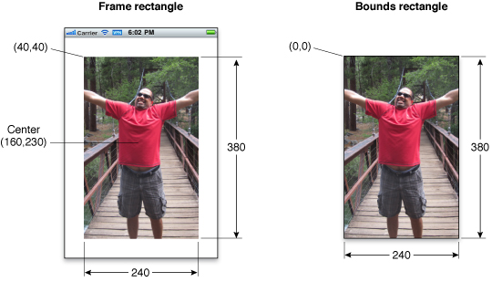

View programming Guide for iOS

Apple Official Documentation

原文最后修订日期：2014.9.17

在 iOS 中使用窗口和 view 在屏幕上展示程序的内容。窗口本身没有任何可见的内容，但为 view 提供了基本的容器；View 定义了窗口的一部分，可用以填充具体的内容。

每个程序至少有一个窗口和一个 view, 以展示其内容。UIKit 和一些其他系统框架提供了预定义好的 view, 简至按钮、文本标签，繁至表格、picker, scroll 等。若预定义的 view 不能满足你的需要，你还可以自定义 view 并自己处理绘图和事件。

## 内容一瞥 ##

### Views Manage Your App's Visual Content ###

View 是 UIView （或其子类）的实例，管理程序窗口中的一块矩形区域。View 负责绘制内容、处理多点解控事件、管理 subview 的布局：

- 绘图涉及使用诸如 Core Graphics, OpenGL ES, 或 UIKit 等图形技术在 view 的矩形区域内绘制形状、图像、或文本。
- View 通过 gesture recognizer 或直接处理触摸事件以对触摸事件作出响应。
- 在 view hierarchy 中，父级 view 负责放置 subview 及调整其大小，且可动态地实现这些操作。动态地修改 subview 可使之适应不断变化的因素，如界面旋转或动画。

可把 view 想像成构造用户界面的积木，通常需要若干个 view 来构成一个 view hierarchy, 而不是使用单个 view 来呈现内容。View hierarchy 中的每个 view 呈现一部分特定的用户界面，且通常为某种特定的内容作了优化。如 UIKit 中的 UILabel 展示小段文字、UIImageView 展示图片等。

### Windows Coordinate the Display of Your Views ###

窗口是 UIWindow 的实例，它处理程序用户界面整体的总体呈现。窗口与 view （及其所属的 view controller）一起管理（用户）与 view hierarchy 的交互、以及对其所作的修改。多数情况下，程序的窗口是不会改变的，创建后它就保持不变，变的只是由它呈现的那些 view. 每个程序至少有一个在设备主屏幕上展示程序界面的窗口。若设备外接了显示器，程序还可创建第二个窗口来展示程序内容。

### Animations Provide the User with Visible Feedback for Interface Changes ###

动画为用户提供 view hierarchy 变化的可视化反馈。虽然系统提供了呈现模块 view 及在不同 view group 间过渡的标准动画，但也可对 view 的许多 attribute 直接应用动画，如 view 的透明度、位置、大小、背景色等。若直接操纵 view 的底层 Core Animation layer 对象，还可执行更多动画。

### The Role of Interface Builder ###

Interface Builder 是一个以图形化方式构建及配置程序窗口和 view 的程序。Using Interface Builder, you assemble your views and place them in a nib file, which is a resource file that stores a freeze-dried version of your views and other objects. When you load a nib file at runtime, the objects inside it are reconstituted into actual objects that your code can then manipulate programmatically.

Related: Interface Builder User Guide. View Controller Programming Guide.

# View and Window Architecture #

不管使用系统预置的 view 还是自定义 view, 都应理解 UIView 和 UIWindow 类提供的基础设施 (infrastructure)。

## View Architecture Fundamentals ##

以可视方式完成的多数事情都是通过 UIView 的实例完成的。View 对象定义屏幕上的一块矩形区域，并处理其中的绘图和触摸事件。View 也可作为其他 view (subview) 的父级，并协调其位置和大小。

View 与 Core Animation layer 配合完成 view 内容的渲染和动画。UIKit 中的每个 view 都由一个 layer 对象（通常是 **CALayer** 对象的实例）作为后台支撑，后者管理 view 的后台存储及处理与 view 相关的动画 (manages the backing store for the view and handles view-related animations). 你执行的多数操作都应通过 UIView 编程接口，但需要对 view 的渲染和动画行为有更多控制时，则可直接操作其 layer 对象。

要理解 view 和 layer 间的关系，举一个例子会大有裨益。下图程序包含一个窗口（它也是一个 view, UIWindow 继承自 UIView）、一个通用的作为容器的 UIView 对象、一个 UIImageView 对象、一个用以显示控件的工具栏，和一个 bar button item （它自身不是一个 view, 但它内部管理着一个 view）。每个 view 都有一个相应的 layer 对象，可通过 **UIView.layer** 属性访问。（由于 bar button item 不是一个 view, 故不能直接访问其 layer）Behind those layer objects are Core Animation rendering objects and ultimately the hardware buffers used to manage the actual bits on the screen.

Core Animation layer 对象的使用对性能有重大的影响。View 对象的实际绘图代码会被尽可能少地调用，且调用时其结果会被 Core Animation 缓存，以便以后尽可能地复用。复用已渲染好的内容可省去代价高昂的绘图周期，这在动画期间尤为重要，比创建新内容要节约得多。

### View Hierarchies and Subview Management ###

除了提供内容，view 还可作为其他 view 的容器。一个 view 包含另一个 view 时，二者之间就建立了父子关系，分别为 superview 和 subview. 这种关系既影响程序的外观，也影响程序的行为。

在视觉上，subview 的内容隐晦 (obscure) 了 superview 的相应区域：

- 若 subview 完全不透明，则它完全遮罩了 superview 的相应区域；
- 若 subview 半透明，则二者的内容在呈现在屏幕上之前会被混合。

Superview 把其 subview 存储在一个有序数组中，这个顺序影响着每个 suview 的可见性。若两个兄弟 subview 互相重叠，则后加入的（或被移到数组末尾的）会显示在另一个的上层。

View 的父子关系也影响着其若干行为。更改 superview 的大小会产生涟漪效应 (ripple effect 连锁反应)，可导致任何 subview 的大小和位置也产生变化。 When you change the size of a parent view, you can control the resizing behavior of each subview by configuring the view appropriately. 其他会影响到 subview 的变化包括：隐藏 superview、更改 superview 的 alpha （透明度）、对 superview 的坐标系统施加数学变换。

View 在 view hierarchy 中的组织关系还决定着程序如何响应事件。当触摸发生在某个 view 内时，系统直接向该 view 发送一个含有触摸信息的事件，让它进行处理。View 若不处理某个特定的触摸事件，则可将其传递给自己的 superview. 若 superview 也不处理该事件，则可将其传递给自己的 superview……这样沿着 responder chain 向上传递。Specific views can also pass the event object to an intervening responder object, such as a view controller. 若没有对象处理该事件，它最终会到达 Application 对象，后者一般会将其丢弃。

### The View Drawing Cycle ###

UIView 类使用按需绘图模型来呈现内容。Vew 对象首次出现在屏幕上时，系统会要求它绘制自己的内容。系统捕获此内容的快照并将其用于该 view 的视觉呈现。若不再更改该 view 的内容，那么它的绘图代码就不会被再次调用，这个快照图像会用在关于该 view 的多数操作中。 If you do change the content, you notify the system that the view has changed. The view then repeats the process of drawing the view and capturing a snapshot of the new results.

View 的内容变化时，你不是直接重绘这些变化，而是调用 setNeedsDisplay 或 setNeedsDisplayInRect: 方法使 view 失效 (invalidate)。These methods tell the system that the contents of the view changed and need to be redrawn at the next opportunity. 系统会一直等到当前 run loop 结束，才会发出绘图操作。这样一个延迟使你得以一次性 invalidate 多个 view, 或将其从 hierarchy 中移除、隐藏之、调整其大小、归位 (reposition)。这些改变会同时反映出来。

注意：改变 view 的几何特性不会自动导致系统重绘 view 的内容。UIView.contentMode 属性决定着如何处理 view 几何特性的变化。多数 content modes 只是在 view 的 boundaries 内拉伸或归位 (reposition)已有的快照，而不是创建一个新的。请参阅 [Content Modes](#Content Modes) 一节。

渲染 view 的内容时，确切的绘图过程会因 view 及其配置而异。System view 通常实现私有绘图方法以渲染其内容，同时也会提供一些接口以使你可以配置其实际外观。对自定义的 UIView 子类，通常是 override drawRect: 方法，在这里绘制 view 的内容。还有其他一些途径可提供 view 的内容，如直接设置底层 layer 的内容，但 override drawRect: 方法是最常用的。

### Content Modes ###

每个 view 都有一个 content mode, 控制着 view 的几何特性变化时是否 recycle 其内容、怎样 recycle 其内容。View 首次显示时，它正常地渲染自己的内容，渲染的结果被捕获到一个 underlying 位图中。之后，对 view 的几何特性的更改并不总是导致该位图被重建：**contentMode** 属性的值决定着该位图应被缩放以适应新的边界、还是简单地固定在 view 的一角或一边。

The content mode of a view is applied whenever you do the following:

- Change the width or height of the view's frame or bounds rectangles.
- Assign a transform that includes a scaling factor to the view's transform property.

多数 view 的 contentMode 属性默认为 UIViewContentModeScaleToFill, 意思是缩放 view 的内容使之适应新的 frame 大小。下图展示了一些 contentMode 的结果，从中可见不是所有的 contentMode 都会导致 view 的 bounds 被完全填充。

Content modes 益于 recycle view 的内容，但你也可以将其设为 UIViewContentModeRedraw, 这会在几何特性变化时强制系统调用 drawRect: 方法重绘。一般来说，应尽可能避免使用这个值，对标准的 system views 当然就更不应使用这个值了。

### Stretchable Views ###

可把 view 的一部分指定为可拉伸的 (stretchable), 这样 view 的大小改变时，只有可拉伸部分的内容会受到影响。You typically use stretchable areas for buttons or other views where part of the view defines a repeatable pattern. The stretchable area you specify can allow for stretching along one or both axes of the view. Of course, when stretching a view along two axes, the edges of the view must also define a repeatable pattern to avoid any distortion. The figure below shows how this distortion manifests itself in a view. The color from each of the view's original pixels is replicated to fill the corresponding area in the larger view.

使用 **contentStretch** 属性指定可拉伸区域，它接受一个矩形，矩形的值被规整 (normalize) 为范围 [0.0, 1.0]. 拉伸 view 时，系统把这些规整后的值乘以 view 的当前 bounds 和 scale factor, 来决定哪些像素需要被拉伸。使用规整值减少了每次 view's bounds 变化时更新 contentStretch 属性的必要。

You specify the stretchable area of a view using the contentStretch property. This property accepts a
rectangle whose values are normalized to the range 0.0 to 1.0. When stretching the view, the system multiplies
these normalized values by the view's current bounds and scale factor to determine which pixel or pixels need
to be stretched. The use of normalized values alleviates the need for you to update the contentStretch
property every time the bounds of your view change.

View's content mode 也决定着怎样使用可拉伸区域。仅当 content mode 会导致 view 的内容被缩放时，可拉伸区域才有效。这意味着只有在 UIViewContentModeScaleToFill,
UIViewContentModeScaleAspectFit, and UIViewContentModeScaleAspectFill 内容模式下，可拉伸区域才会被支持。若指定了一个把 view 的内容固定在一角或一边的内容模式（这样就不会缩放 view 的内容），view 就会忽略可拉伸区域。

注意：指定 view 的背景时，推荐使用 contentStretch 属性，而不是创建一个可拉伸的 UIImage 对象。可拉伸的 view 完全在 Core Animation layer 中处理，这通常可获得更好的性能。

### Built-In Animation Support ###

每个 view 背后都有一个 layer 对象的一个好处是，可以轻易地以动画形式展现许多与 view 有关的变化。动画是与用户沟通的一种有用方式。UIView 类的许多属性都支持动画，即半自动支持动画地从一个变到另一个值。要对这些支持动画的属性执行动画，你需要：

1. 告诉 UIKit 你想要执行动画；
1. 修改属性值。

UIView 对象支持动画的属性：

frame - Use this to animate position and size changes for the view.
bounds - Use this to animate changes to the size of the view.
center - Use this to animate the position of the view.
transform - Use this to rotate or scale the view.
alpha - Use this to change the transparency of the view.
backgroundColor - Use this to change the background color of the view.
contentStretch - Use this to change how the view's contents stretch.

动画很重要的一个场合是，从一个 view 集合过渡到另一个 view 集合。通常使用 view controller 管理与用户界面重大改变相关的动画，如使用 navigation controller 管理从 higher-level 信息到 lower-level 信息的过渡。但也可使用动画来创建两个 view 集合之间的过渡，而不使用 view controller——标准的 view controller 动画不能满足你的需求时，就可使用这样用。

除了使用 UIKit 类创建动画，还可使用 Core Animation layer, 后者可对动画的时间和属性有更多的控制。

## View Geometry and Coordinate Systems ##

UIKit 的默认坐标系统中，原点位于左上角。坐标值用浮点数表示，这允许对内容精确布局和定位，而无关底层屏幕分辨率。屏幕、窗口和 view 都定义了自己的局部 (local) 坐标系统，允许相对于 view 原点或窗口原点指定坐标，而不仅是相对于屏幕原点。

由于 view 的窗口都定义了自己的局部坐标系统，在 view 中绘图或更改其几何特性时，都是相对于某个坐标系统的，因此你需要明确任何情况下哪个坐标系统有效。几何变化的坐标是相对于 superview 的坐标系统指定的。UIWindow 和 UIView 都提供了从一个坐标系统转换到另一个坐标系统的方法。

重要：有些 iOS 技术的坐标原点和正方向与 UIKIt 的不同，如 Core Graphics 和 OpenGL ES 的坐标原点位于左下角。

### The Relationship of the Frame, Bounds, and Center Properties ###

UIView 对象使用 frame, bounds 和 center 属性跟踪自己的大小和位置：

- frame 属性包含矩形框 (frame rectangle), 后者以 superview 的坐标系统指定 view 的大小和位置。
- bounds 属性包含边界矩形 (bounds rectangle), 后者以 view 自己的局部坐标系统指定 view 的大小及其内容原点，默认原点坐标为 (0, 0).
- center 属性以 superview 的坐标系统表示 view 的中心点。

center 和 frame 属性主要用于操纵 view 的几何特性，如在运行时更改 view 的位置和大小。若只更改位置而不更改大小，则优选 center 属性。

- center 属性的值总是有效的——即使在 UIView.transform 中加入了缩放或旋转。
- frame 属性就不然了，if the view's transform is not equal to the identity transform (恒等变换), frame 属性的值就被认为是无效的。

bounds 属性主要用于绘图。其默认大小与 frame rectangle 相符。

下图展示了一个 UIImageView 的 frame 和 bounds 间的关系。UIImageView 的左上角通过 superview 坐标系统的 (40, 40) 点定位，大小为 240 x 380. 对于 bounds rectangle, 其原点为 (0, 0), 大小亦为 240 x 380.

尽管可单独修改 frame, bounds 和 center 属性，但对其中一个的修改也会以以下方式影响到另一个：

- 设置 frame 属性时，bounds.size 会随之变化以匹配 frame rectangle 的新尺寸，center 属性也会随之更新以反映 frame rectangle 的新中心点。
- 设置 center 属性时，frame.origin 会相应地变化。
- 设置 bounds.size 时，frame.size 会随之变化以匹配 bounds rectangle 的新尺寸。

默认情况下，view's frame 不会被裁剪到其 superview's frame 之内，即超出 superview's frame 的部分仍可完整显示。而如果设置 UIView.clipsToBounds = YES 则超出边界的部分将不会显示。不管 subview 在视觉上是否被裁，Regardless of whether or not subviews are clipped visually, touch events always respect the bounds rectangle of the target view's superview. In other words, touch events occurring in a part of a view that lies outside of its superview's bounds rectangle are not delivered to that view.

### Coordinate System Transformations ###

坐标系统变换提供了一种快速、简便地修改 view （及其内容）的方式。仿射变换 (affine transform) 是一个数学矩阵，它指定怎样把一个坐标系统中的点映射到另一个坐标系统。可把一个仿射变换施加到整个 view 上以改变其尺寸、位置及相对于 superview 的方向。也可在绘图代码中使用仿射变换以对部分内容执行同类操作。

Coordinate system transformations offer a way to alter your view (or its contents) quickly and easily. An affine
transform is a mathematical matrix that specifies how points in one coordinate system map to points in a
different coordinate system. You can apply affine transforms to your entire view to change the size, location,
or orientation of the view relative to its superview. You can also use affine transforms in your drawing code to
perform the same types of manipulations to individual pieces of rendered content. How you apply the affine
transform therefore depends on context:
● To modify your entire view, modify the affine transform in the transform property of your view.
● To modify specific pieces of content in your view’s drawRect: method, modify the affine transform
associated with the active graphics context.
You typically modify the transform property of a view when you want to implement animations. For example,
you could use this property to create an animation of your view rotating around its center point. You would
not use this property to make permanent changes to your view, such as modifying its position or size a view
within its superview’s coordinate space. For that type of change, you should modify the frame rectangle of
your view instead.
Note: When modifying the transform property of your view, all transformations are performed
relative to the center point of the view.
In your view’s drawRect: method, you use affine transforms to position and orient the items you plan to
draw. Rather than fix the position of an object at some location in your view, it is simpler to create each object
relative to a fixed point, typically (0, 0), and use a transform to position the object immediately prior to drawing.
That way, if the position of the object changes in your view, all you have to do is modify the transform, which
is much faster and less expensive than recreating the object at its new location. You can retrieve the affine
transform associated with a graphics context using the CGContextGetCTM function and you can use the
related Core Graphics functions to set or modify this transform during drawing.
The current transformation matrix (CTM) is the affine transform in use at any given time. When manipulating
the geometry of your entire view, the CTM is the affine transform stored in your view’s transform property.
Inside your drawRect: method, the CTM is the affine transform associated with the active graphics context.
The coordinate system of each subview builds upon the coordinate systems of its ancestors. So when you
modify a view’s transform property, that change affects the view and all of its subviews. However, these
changes affect only the final rendering of the views on the screen. Because each view draws its content and
lays out its subviews relative to its own bounds, it can ignore its superview’s transform during drawing and
layout.

### Points Versus Pixels ###

## The Runtime Interaction Model for Views ##

## Tips for Using Views Effectively ##

# Windows #

# Views #

# Animations #
本章讲的动画技术都是 Core Animation 内置的，你要做的就是触发动画，对每一帧的渲染就是 Core Animation 的事了。

## What Can Be Animated? ##
UIKit 和 Core Animation 都提供了对动画的支持，但二者所支持的 level 不同。UIkit 中的动画是使用 UIView 对象执行的，view 支持一些基本、常用的动画。如你可以用动画呈现对 view 的属性的改变，或以 transition animation 的形式替换一部分 view.

UIView 类可以施加动画效果的属性，即对动画有内置支持的属性：

- frame: 修改 view 的位置和大小（相对于 superview 的坐标系统）；
- bounds: 修改 view 的大小；
- center: 修改 view 的位置（相对于 superview 的坐标系统）；
- transform: scale, rotate, or translate the view relative to its center point. 使用该属性的 transformations 总是在 2D 空间内执行，要执行 3D transformations, 必须使用 Core Animation 操纵 view 的 layer object.
- alpha: 修改 view 的透明度；
- backgroundColor: 修改 view 的背景色；
- contentStretch: 修改 view 的内容以怎样的方式填充可用空间。

可施加动画并不意味着动画会自动发生，对这些属性的普通修改仅仅是立即更新了这些属性而无动画效果。要产生动画效果，需要在 animation block 中修改这些属性值。

要执行更复杂的动画，或 UIView 类不支持的动画，就要使用 Core Animation 及 view's underlying layer 了。 View 和 layer 对象紧密关联，对 view's layer 的修改会影响支 view 自身。使用 Core Animation 可对 view's layer 执行以下类型的动画：

- Layer 的大小和位置；
- 执行 transformations 时所使用的中心点；
- 在 3D 空间内对 layer 或其 sub layers 执行 transformations;
- 从 layer hierarchy 中增加或删除一个 layer;
- Layer 相对于其他 sibling layers 的 Z-index;
- Layer's shadow;
- Layer's border (including whether the layer's corners are rounded);
- The portion of the layer that stretches during resizing operations
- The layer's opacity
- The clipping behavior for sub layers that lie outside the layer's bounds
- Layer 的当前内容
- The rasterization behavior of the layer

Note: If your view hosts custom layer objects—that is, layer objects without an associated view—you must use Core Animation to animate any changes to them.

## Animating Property Changes in a View ##
把对 UIView 属性的改变放在 animation block 中。The term animation block is used in the generic sense to refer to any code that designates animatable changes. 在 iOS 4 + 中使用 block 对象创建 animation block, 在较早版本中则用 UIView 的特殊类方法 (+beginAnimations:context:, +commitAnimations) 标记 animation block 的开始和结束。

注：Apple 推荐使用块对象来创建 animation block, 故本章省略 +beginAnimations:context:, +commitAnimations 类方法。

### Starting Animations Using the Block-Based Mehthods ###

Class methods for iOS 4 +:

- animateWithDuration:animations:
- animateWithDuration:animations:completion:
- animateWithDuration:delay:options:animations:completion:

以上动画方法是在另一个独立的线程上执行的，这样可避免阻塞当前线程或主线程。可以在 completion handler 参数中通知程序动画已完成，或串联另一个动画。

若动画修改了属性 A 的值且正在执行中，此时又再修改属性 A 的值不会使动画停止，而是把属性 A 动画呈现到新赋的值。 

Important: Changing the value of a property while an animation involving that property is already in progress does not stop the current animation. Instead, the current animation continues and animates to the new value you just assigned to the property.

### Nesting Animation Blocks ###

嵌套动画 vs. 串联动画：嵌套动画把新定义的动画放在 animations: 参数中，而串联动画把新定义的动画放在 completion 参数中。

串联的动画与它所在的父级动画同时开始，且继承了父级动画的配置参数，但这些参数可以被 overridden. 如：

    [UIView animateWithDuration:1.0
                          delay:0.3
                        options:UIViewAnimationOptionCurveEaseOut
                     animations:^{
                                   aView.alpha = 0.0;     
                                   // Create a nested animation that has a different
                                   // duration, timing curve, and configuration.
                                   [UIView animateWithDuration:0.20
                                                         delay:0.0
                                                       options:UIViewAnimationOptionOverrideInheritedCurve |
                                                               UIViewAnimationOptionCurveLinear |
                                                               UIViewAnimationOptionOverrideInheritedDuration |
                                                               UIViewAnimationOptionRepeat |
                                                               UIViewAnimationOptionAutoreverse
                                                    animations:^{
                                                                 [UIView setAnimationRepeatCount:2.5];
                                                                 anotherView.alpha = 0.0;
                                                                }
                                                    completion:nil];     
                                 }
                     completion:nil];

### Implementing Animations That Reverse Themselves ###

When creating reversible animations in conjunction with a repeat count, consider specifying a non integer value for the repeat count. For an auto-reversing animation, each complete cycle of the animation involves animating from the original value to the new value and back again. If you want your animation to end on the new value, adding 0.5 to the repeat count causes the animation to complete the extra half cycle needed to end at the new value. If you do not include this half step, your animation will animate to the original value and then snap quickly to the new value, which may not be the visual effect you want.

## Creating Animated Transitions Between Views ##

Animated view transitions are a way for you to make changes to your view hierarchy beyond those offered by view controllers. Although you should use view controllers to manage succinct view hierarchies, there may be times when you want to replace all or part of a view hierarchy. In those situations, you can use view-based transitions to animate the addition and removal of your views.

View transitions help you hide sudden changes associated with adding, removing, hiding, or showing views in your view hierarchy. You use view transitions to implement the following types of changes:

- **Change the visible subviews of an existing view.** You typically choose this option when you want to make relatively small changes to an existing view.
- **Replace one view in your view hierarchy with a different view.** You typically choose this option when you want to replace a view hierarchy that spans all or most of the screen.

不要把 view transitions 与 view controller 发起的 (initiated) transitions 混淆，后者如 modal view controller 展示内容，或新的 view controller 推入 navigation stack. View transitions 只影响 view hierarchy, 而 view controller transitions 还改变当前活跃的 view controller.

### Changing the Subviews of a View ###

    class func transitionWithView(_ view: UIView,
                         duration duration: NSTimeInterval,
                          options options: UIViewAnimationOptions,
                       animations animations: () -> Void,
                       completion completion: ((Bool) -> Void)?)

TBC...

### Replacing a View with a Different View ###

欲使界面有显著变化时，可尝试替换 views. 该技术仅交换 views 而不交换 view controllers, 故你需负责适当地设计程序的 controller 对象。该技术是使用一些标准 transitions 快速呈现新 views 的方法。

    // iOS 4 +, to transition between two views
    class func transitionFromView(_ fromView: UIView,
                           toView toView: UIView,
                         duration duration: NSTimeInterval,
                          options options: UIViewAnimationOptions,
                       completion completion: ((Bool) -> Void)?)

该方法实际会把第一个 view 从 hierarchy 中移除、并插入第二个，故若要保留第一个，则要确保拥有对其引用。若只是想把 view 隐藏而不是将其从 hierarchy 中移除，请在 options 参数中加入 UIViewAnimationOptionShowHideTransitionViews.

以下代码在单个 view controller 的两个 subviews (primaryView, secondaryView) 之间切换（注：除了切换，view controller 还需管理这两个 subviews 的加载与卸载）： 

    - (IBAction)toggleMainViews:(id)sender {
        [UIView transitionFromView:(displayingPrimary ? primaryView : secondaryView)
                            toView:(displayingPrimary ? secondaryView : primaryView)
                          duration:1.0
                           options:(displayingPrimary ? UIViewAnimationOptionTransitionFlipFromRight :
                                   UIViewAnimationOptionTransitionFlipFromLeft)
                        completion:^(BOOL finished) {
                                      if (finished)
                                          displayingPrimary = !displayingPrimary;                                      
                                   }];
    }

## Animating View and Layer Changes Together ##

可自由地混合基于 view 和 基于 layer 的动画代码，但配置动画参数的过程取决于 layer 的拥有者。
更改 view-owned layer 与更改 view 自身一样，且施加于 layer' properties 的动画遵循当前 view-based animation block 的动画参数。但这对自己创建的 layer 不成立，自定义的 layer 对象会忽略 view-based animation block 参数并使用默认的 Core Animation 参数。

Applications can freely mix view-based and layer-based animation code as needed but the process for configuring your animation parameters depends on who owns the layer. Changing a view-owned layer is the same as changing the view itself, and any animations you apply to the layer’s properties respect the animation parameters of the current view-based animation block. The same is not true for layers that you create yourself. Custom layer objects ignore view-based animation block parameters and use the default Core Animation parameters instead.

若要为自己创建的 layer 自定义动画参数，必须直接使用 Core Animation. 使用 Core Animation 通常要创建 CAAnimation 的子类对象，然后将其加到相应的 layer. 可以在 view-based animation block 之内或之外施加这样的动画。

以下代码同时对一个 view 和一个自定义 layer 施加动画。
Listing 4-9 shows an animation that modifies a view and a custom layer at the same time. The view in this example contains a custom CALayer object at the center of its bounds. The animation rotates the view counter clockwise while rotating the layer clockwise. Because the rotations are in opposite directions, the layer maintains its original orientation relative to the screen and does not appear to rotate significantly. However, the view beneath that layer spins 360 degrees and returns to its original orientation. This example is presented primarily to demonstrate how you can mix view and layer animations. This type of mixing should not be used in situations where precise timing is needed.

    [UIView animateWithDuration:1.0
                          delay:0.0
                        options: UIViewAnimationOptionCurveLinear
                     animations:^{
                        // Animate the first half of the view rotation.
                        CGAffineTransform  xform = CGAffineTransformMakeRotation(DEGREES_TO_RADIANS(-180));
                        backingView.transform = xform;
     
                        // Rotate the embedded CALayer in the opposite direction.
                        CABasicAnimation*layerAnimation = [CABasicAnimation animationWithKeyPath:@"transform"];
                        layerAnimation.duration = 2.0;
                        layerAnimation.beginTime = 0; //CACurrentMediaTime() + 1;
                        layerAnimation.valueFunction = [CAValueFunction functionWithName:kCAValueFunctionRotateZ];
                        layerAnimation.timingFunction = [CAMediaTimingFunction
                        functionWithName:kCAMediaTimingFunctionLinear];
                        layerAnimation.fromValue = [NSNumber numberWithFloat:0.0];
                        layerAnimation.toValue = [NSNumber numberWithFloat:DEGREES_TO_RADIANS(360.0)];
                        layerAnimation.byValue = [NSNumber numberWithFloat:DEGREES_TO_RADIANS(180.0)];
                        [manLayer addAnimation:layerAnimation forKey:@"layerAnimation"];
                     }
                   completion:^(BOOL finished){
                   // Now do the second half of the view rotation.
                   [UIView animateWithDuration:1.0
                                         delay: 0.0
                                       options: UIViewAnimationOptionCurveLinear
                                    animations:^{
                                                 CGAffineTransform  xform = CGAffineTransformMakeRotation(DEGREES_TO_RADIANS(-359));
                                                 backingView.transform = xform;
                                             }
                                    completion:^(BOOL finished)
                                       backingView.transform = CGAffineTransformIdentity;
                   ];
    }];

You could also create and apply the CABasicAnimation object outside of the view-based animation block to achieve the same results. All of the animations ultimately rely on Core Animation for their execution. Thus, if they are submitted at approximately the same time, they run together.

If precise timing between your view and layer based animations is required, it is recommended that you create all of the animations using Core Animation. You may find that some animations are easier to perform using Core Animation anyway. For example, the view-based rotation in Listing 4-9 requires a multistep sequence for rotations of more than 180 degrees, whereas the Core Animation portion uses a rotation value function that rotates from start to finish through a middle value.